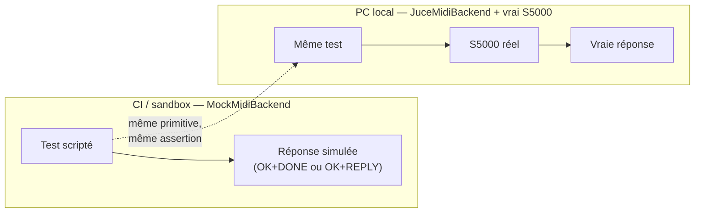
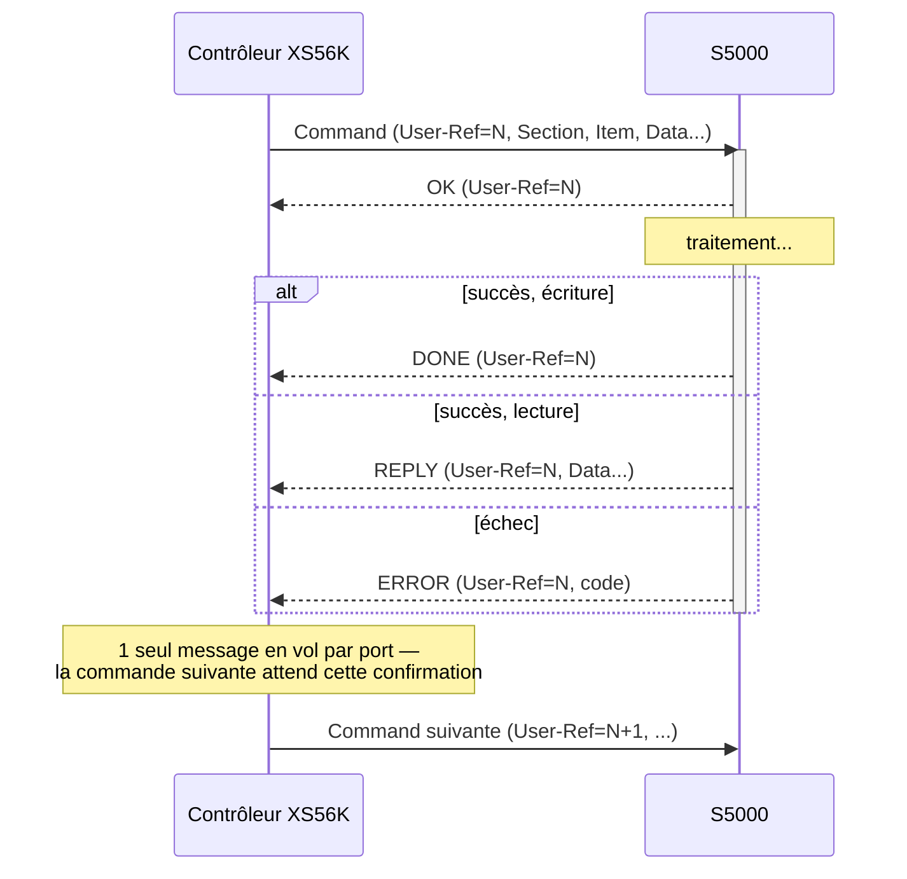
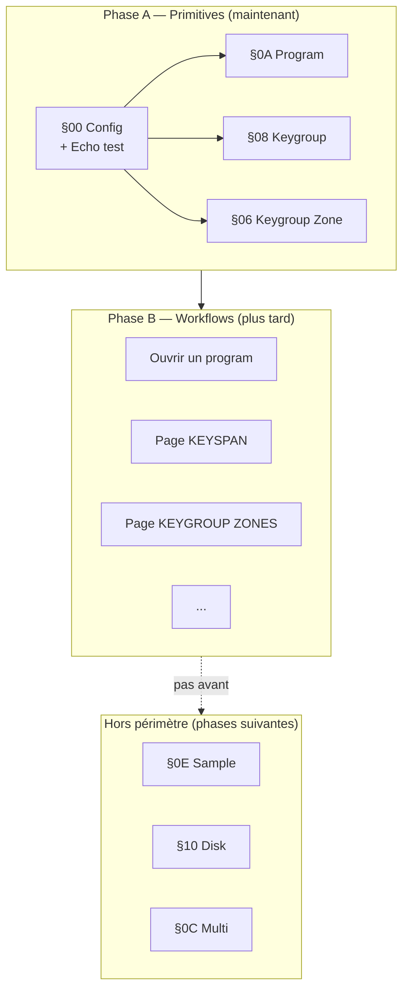
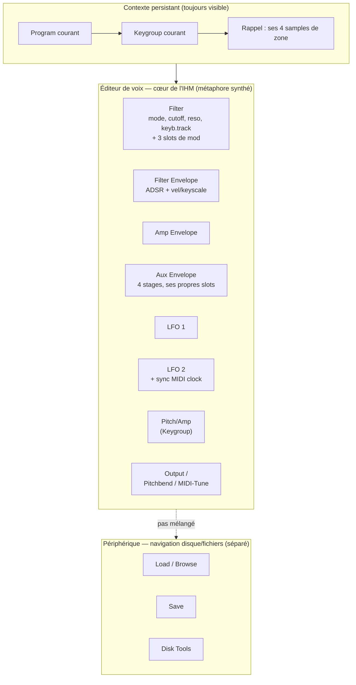
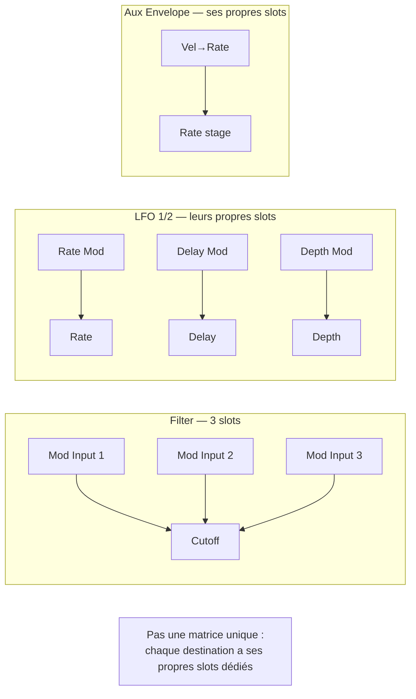

# DRAFT — Plan de pilotage MIDI du S5000 : primitives d'abord, workflows ensuite

> **Statut : brouillon de discussion, pas un artefact AGNOS formel.**
> Pas de TRI assigné, pas de RQ/ADR/PLAN/TASK avec identifiants — ce document sert de base à la
> rédaction des exigences (`process/1.requirements/`) et des ADR correspondants, à faire dans une
> session ultérieure une fois ce plan relu et validé.

## Principe directeur

Deux phases nettement séparées, avec une frontière claire :

- **Phase A — Primitives** : prouver que chaque item SysEx (Get/Set) du périmètre choisi
  fonctionne, individuellement, avec un vrai accusé de réception vérifié — contre mock ET contre
  le S5000 réel.
- **Phase B — Workflows** : composer ces primitives pour reproduire les fonctionnalités d'édition
  telles que décrites dans le manuel utilisateur (pages KEYSPAN, KEYGROUP ZONES, ENVELOPE, etc.).

Rien en Phase B ne doit inventer un comportement — chaque workflow orchestre des primitives déjà
validées en Phase A.

## Contexte : pourquoi ce périmètre (Program/Keygroup/Zone d'abord)

Décidé en discussion : on se limite d'abord à la gestion des **Programs** (Program → Keygroup →
Zone), avant d'attaquer Sample et Disk. Raisons :

- Le modèle de données du S5000 est hiérarchique (Multi → Program → Keygroup[≤99] → Zone[4], plus
  Sample et Disk en arbres séparés) — très différent du modèle plat "une Tone = une map de
  paramètres" déjà porté depuis XplorerEditor (`juce/framework`, conçu pour l'Oberheim Xpander).
- Program/Keygroup/Zone forment un sous-ensemble cohérent et testable de bout en bout, sans
  dépendre de Multi (assemblage de plusieurs programs), Sample (édition audio) ou Disk (chargement
  de fichiers).
- **Limite pratique assumée** : sans Disk (§10), on ne peut travailler que sur les programs déjà en
  mémoire du sampler (chargés via face avant) — pas de chargement de fichier program depuis un
  disque tant que Disk n'est pas implémenté.
- **Point ouvert, pas tranché** : `Set Zone Sample` (§06/&01) assigne un sample par son **nom**
  (string). Deux options pour la Phase A : (a) saisie manuelle du nom par l'utilisateur (zéro
  dépendance au domaine Sample), ou (b) ajouter en lecture seule `§0E/&12` (Get names of all
  samples in memory) pour un picker — sans ouvrir l'édition Sample. À décider avant de rédiger les
  exigences correspondantes.

## Ce que l'architecture existante impose (vérifié dans le code porté)

- **`xpl_midi`** (backend MIDI générique, `MidiMessage`/`SysexStreamIterator`/`MidiPorts`) est
  réutilisable tel quel — indépendant de tout synthé.
- **`AbstractController`** (porté de XplorerEditor) pace ses envois avec un **délai fixe en ms**
  (`_parameterTransmitDelay = 20` par défaut) et n'a aucune gestion de `OK`/`DONE`/`REPLY`/`ERROR`
  — modèle conçu pour l'Xpander (qui a besoin d'~30 ms entre messages, sans accusé de réception).
  Le S5000 fonctionne à l'inverse : un accusé de réception explicite remplace le délai arbitraire
  (voir la spec, citée plus bas). Un contrôleur S5000 dédié est nécessaire plutôt que de forcer
  l'héritage de cette classe.
- **`MockMidiBackend`** (loopback en mémoire, `RQ-MID-041`) et **`JuceMidiBackend`** (vrais ports
  MIDI du système, adressage par nom) existent déjà tous les deux — la séparation
  mock-pour-CI / hardware-réel-en-local n'est pas à inventer, juste à exploiter.

## Ce que dit la spec sur le rythme d'envoi (citations exactes)

> "The SysEx messages received by the samplers are buffered, so it is possible to send several
> messages without pauses. However, if this is done, it is possible that the internal buffers of
> the samplers will fill up, resulting in lost data. Therefore, it is recommended that the
> confirmation messages are used to ensure that data was received and processed correctly."
> — `documents/akai_s5000_s6000_sysex_spec_2.10.pdf.md`, Introduction

> "If only one SysEx message (per MIDI port) is sent at a time, using the DONE/REPLY/ERROR
> messages to synchronise transmission, it is now guaranteed that musical data will not be
> disturbed."
> — même document, Modification History, version 2.10

Donc : pas de délai en ms arbitraire côté S5000 — un message en vol par port, la confirmation fait
office de flow control.

---

## Phase A — Primitives MIDI

### A0. Fondations transport (avant tout item de section)

Indépendantes du domaine (Program/Keygroup/Zone) — doivent exister avant qu'aucun item ne soit
testable :

| Primitive | Rôle |
|---|---|
| Codec de trame | Construire/parser `F0 47 5E <dev> <uref...> <section> <item> <data...> [chk] F7` |
| Calcul/vérif checksum | Somme 8 bits wrap, `& 0x7F`, depuis le 1er User-Ref jusqu'à la dernière donnée |
| Parseur de confirmation | Décoder `Reply ID` (`4F` OK / `44` DONE / `52` REPLY / `45` ERROR) + Section/Item/Data |
| Matching User-Ref | Associer une confirmation reçue à la commande qui l'a déclenchée |
| Send-and-wait | Envoyer 1 commande, attendre sa confirmation, avec timeout (la spec ne donne **aucune** borne temporelle garantie — sauf le mécanisme Still-Alive pour les opérations longues) |
| Décodeur d'erreur | Mapper `Data1×128+Data2` sur la table d'erreurs (`documents/_index/sysex_spec.kb.md`) |

**Premier test hardware naturel — l'Echo Message** (`§00/&06`) :
> "Echo Message: a special test function which will echo all 4 data bytes by returning them as a
> Reply. This is useful when debugging a controlling program."

Conçu par Akai précisément pour valider une implémentation de contrôleur — premier test à faire
tourner contre le vrai S5000, avant même Program/Keygroup/Zone.

### A1. Section §00 — SysEx Configuration (prérequis transverse)

| Item | Fonction | Requis avant A2/A3/A4 |
|---|---|---|
| `&00` Query | Découverte (DeviceID=0 → OK+DONE de chaque sampler) | Oui |
| `&01` Notification OK | ON/OFF | Oui |
| `&03` Sync LCD | ON/OFF | Oui (déterministe pendant les tests) |
| `&04` Checksum | ON/OFF | Oui (tester les deux modes) |
| `&05` Auto screen update | ON/OFF | Non bloquant |
| `&06` Echo Message | Test round-trip | **Premier test** |
| `&07` Still Alive | ON/OFF | Non bloquant pour A2-A4 |

### A2. Section §0A — Program (primitives)

Créer/sélectionner/renommer/supprimer, lire les infos générales (nombre, index, nom courant), puis
chaque paramètre de mise en forme (loudness, mod sources, pitch bend, LFO, tune) — un item = un
test Get + un test Set + vérification par relecture.

### A3. Section §08 — Keygroup (primitives)

Sélection de keygroup, keyspan (Low/High Note), mute group, FX override, pitch/amp, filtre,
enveloppes (filter/amp/aux).

### A4. Section §06 — Keygroup Zone (primitives)

Assignation de sample par zone (nom, saisi manuellement en Phase A — voir point ouvert ci-dessus),
level, pan, filtre, tune, playback mode, plage de vélocité, mute/solo.

### Méthode de validation, par primitive

Chaque primitive suit le même gabarit de test, disponible en deux variantes :

Le mock valide la **logique** du contrôleur (parsing, state machine, gestion d'erreur) ; le
hardware réel valide le **comportement effectif du firmware** — timing, limites de buffer, cas
limites que la spec décrit sans les garantir.

**Contrainte méthodologique** : un test contre le vrai S5000 modifie l'état réel de sa mémoire
(renommer/supprimer un program est irréversible sans sauvegarde). Pas idempotent comme le mock —
soit se limiter à des tests en lecture, soit prévoir un program/multi de test dédié et
réinitialisable.

### Séquence d'un round-trip primitive (le cœur du mécanisme)

### Critère de sortie de Phase A

Toutes les primitives §00/§0A/§08/§06 listées ci-dessus ont un test qui passe **à la fois** en mock
et contre le S5000 réel, avec relecture (Get après Set) confirmant la valeur effectivement
appliquée.

---

## Phase B — Workflows contrôleur (plus tard, esquissé seulement)

Une fois A validée, chaque **page du manuel utilisateur** devient un workflow qui orchestre des
primitives déjà prouvées — rien de nouveau au niveau protocole, seulement de la composition et de
la synchronisation d'état :

| Page manuel | Workflow (composition de primitives A2-A4) |
|---|---|
| Ouvrir un program | Get liste programs (§0A) → Select by name → Get info générale → pour chaque keygroup : Select (§08) → Get params → Get ses 4 zones (§06) |
| KEYSPAN | Select keygroup → Set Low/High Note, en boucle sur tous les keygroups du program |
| KEYGROUP ZONES | Select keygroup → pour chaque zone 1-4 : Get/Set en fonction de l'UI |
| KEYGROUP CROSSFADE | Lecture keyspans adjacents (calcul côté client) + Set Zone Crossfade |

---

## IHM — vision orientée édition sonore (Phase B, esquisse)

Discuté en session : le S5000 peut se lire comme un **synthétiseur soustractif dont les samples
remplacent les VCO** — filtres, enveloppes (filter/amp/aux), LFO, sources de modulation. C'est ce
côté-là qu'on veut mettre en avant dans l'IHM, avec la navigation disque/fichiers **autour**, pas
mélangée dedans.

Cette section n'était pas déductible du texte seul — vérifié en regardant réellement des pages du
manuel (`poppler-utils` installé pour l'occasion, voir Sources) plutôt qu'en devinant depuis le
texte extrait.

**Ce que montre la vraie page FILTER (p.118)** : `Filter Mode`, `Cutoff Freq`, `Resonance`,
`Keyboard Track`, `Attenuation`, un lien direct vers `FILT ENVELOPE`, et **3 slots de modulation**
dédiés (chacun `source + profondeur`) — plus un petit rappel des 4 samples de zone du keygroup
courant, et un sélecteur `KEYGRP: 1` **toujours visible** en haut de l'écran quel que soit l'onglet.
Tous les modules "voix" (filtre, enveloppes, LFO) sont scopés au **Keygroup courant**, pas au
Program entier.

**Nuance importante** : ce n'est pas une matrice de modulation unifiée façon synthé logiciel
moderne (une table où n'importe quelle source va vers n'importe quelle destination). Ce sont
**plusieurs petits slots de mod indépendants, dédiés chacun à une destination précise** — le
Filtre a ses 3 slots, chaque LFO les siens, l'Aux Envelope les siens. À ne pas survendre si ça
devient une exigence.

### Ouvert, pas tranché

- **Widget de valeur** — la contrainte hardware (curseur chiffre par chiffre à la molette DATA) ne
  s'applique plus sur desktop ; reste à choisir slider/knob/spinner, pas décidé ici.
- **Forme du sélecteur de contexte** (Program/Keygroup/Zone) — arbre latéral permanent, fil
  d'Ariane, ou autre — le manuel montre un sélecteur simple (`KEYGRP: 1`) parce que le hardware n'a
  qu'un écran ; le desktop permet mieux mais rien n'est choisi.
- **Où s'arrête "voix"** — Output/Pitchbend/MIDI-Tune sont listés côté cœur ci-dessus par défaut
  mais sont plus limitrophes (routing/MIDI) que Filter/Envelopes/LFO ; à confirmer.

---

## Ce que ce plan ne tranche pas

- **Timeout de `Send-and-wait`** — valeur à déterminer empiriquement contre le vrai matériel
  (pendant la Phase A elle-même, pas avant).
- **Emplacement du codec AKAI** dans l'architecture (nouvelle lib `xpl_akai` à côté de `xpl_midi`,
  ou extension directe) — question de structure de code, pas de protocole.
- **Assignation de sample en Zone (point ouvert ci-dessus)** — saisie manuelle vs picker
  read-only sur `§0E/&12`.
- **Formalisation AGNOS** — ce plan peut devenir un vrai `RQ-<TRI>`/`ADR-<TRI>`/`PLAN-<TRI>-001`
  une fois relu et un trigramme choisi.

## Sources

- `documents/akai_s5000_s6000_user_manual.1.21.pdf.md` — section STRUCTURE (program/keygroup/zone,
  keyspan), pages KEYSPAN / KEYGROUP ZONES / KEYGROUP CROSSFADE
- `documents/akai_s5000_s6000_sysex_spec_2.10.pdf.md` + `documents/_index/sysex_spec.kb.md` —
  framing, confirmations, sections §00/§06/§08/§0A
- `juce/framework/include/midiapp/controller/AbstractController.hpp`,
  `juce/framework/include/midiapp/model/{AbstractParameter,AbstractTone,OrderedParameterMap}.hpp`,
  `juce/midi/include/common/midi/{MockMidiBackend,JuceMidiBackend}.hpp` — architecture héritée de
  XplorerEditor, lue avant de proposer ce plan
- `documents/akai_s5000_s6000_user_manual.1.21.pdf` — pages **vues visuellement** (`poppler-utils`
  installé en session pour cela, le `.md` extrait ne rend pas la mise en page) : p.14 (face avant
  S6000), p.25/p.15-imprimée (KEY CONVENTIONS), p.28/p.18-imprimée (POP-UP WINDOWS), p.118/
  p.108-imprimée (page FILTER — base de la section IHM ci-dessus)
