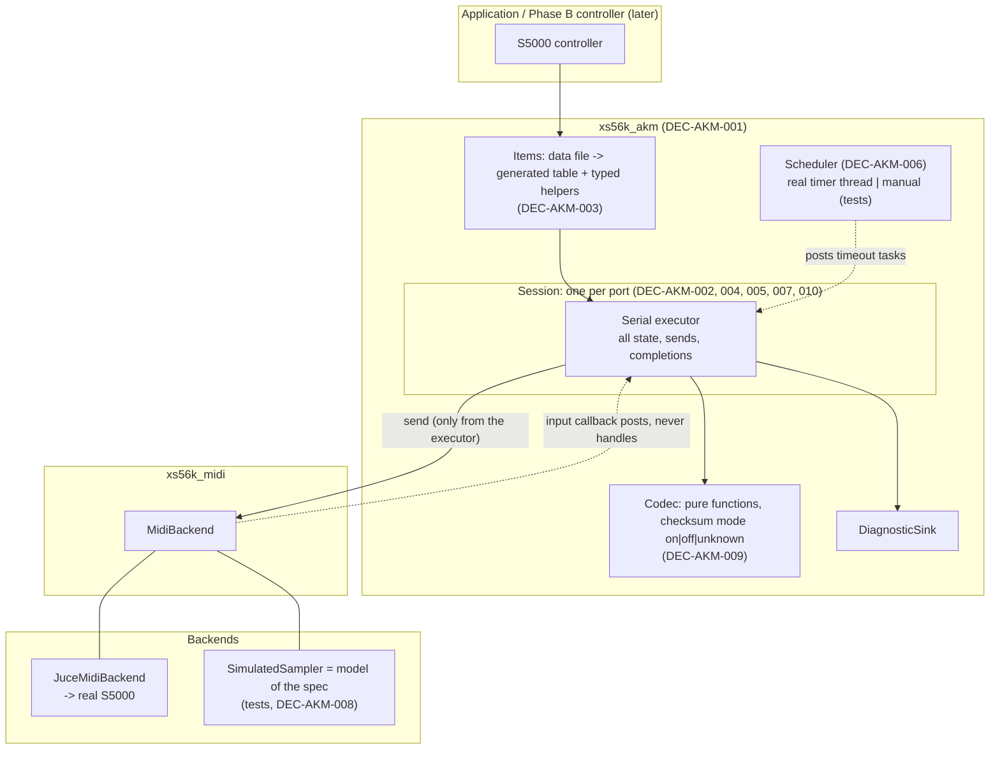

# ADR-AKM-001: AKM Transport Architecture — Library, Layers, Primitive Shape, Threading, Time and Session Opening

## Status
Accepted — reviewed and accepted by the owner (TASK-AKM-002); implementation is TASK-AKM-003 onward
(PLAN-AKM-001). The provisional values of DEC-AKM-006 and DEC-AKM-007 stay subject to the observations of
RQ-AKM-017. Motivated by FTR-AKM-001 (RQ-AKM-001 to RQ-AKM-020,
RQ-AKM-039 to RQ-AKM-043); it also fixes the primitive shape that FTR-AKM-002 to FTR-AKM-004 build on.
Amended in the session that drafted it, after an independent review by a second model: DEC-AKM-004,
DEC-AKM-005 and DEC-AKM-007 were reworked, DEC-AKM-003 and DEC-AKM-008 amended, DEC-AKM-009 and
DEC-AKM-010 added. DEC-AKM-006 is unchanged, as confirmed by the owner.

## Context

FTR-AKM-001 requires a transport for the AKAI S5000/S6000 SysEx protocol: frames, checksum,
confirmations, one command in flight per port, a timeout, and §00 primitives, testable both against a
simulated sampler in CI and against the real one. Facts of this repository and of the spec shape the
answer; those marked (read) were checked in the sources during the review.

- `xs56k_midi` is a generic, synth-independent MIDI layer whose requirements (`RQ-MID`) say it is a thin
  abstraction; its seam is `MidiBackend` (`openInput`/`openOutput` by device name, callbacks
  `onSysExMessage(const MidiMessage&)`, `send(const MidiMessage&)`), with a mock and a JUCE backend.
- `xs56k_framework` comes from the Xpander editor: its controller paces sends with a fixed delay and has
  no notion of OK / DONE / REPLY / ERROR. The S5000 works the other way round (the confirmation is the
  flow control, spec p. 1 and Modification History 2.10).
- `MockMidiBackend` delivers synchronously on the thread that calls `send()` or `injectIncoming()`, so a
  confirmation can arrive **before `send()` returns**; its `started` flag is a plain `bool`, not atomic (read).
  It has no hook to script a reply to what was sent, only capture and a plain loopback.
- The JUCE backend delivers on backend-owned callback threads, in order per device (`RQ-MID-024`; on Linux
  one ALSA thread serves all inputs). Three JUCE behaviours matter (read, JUCE 8.0.15): on Windows a SysEx
  send blocks the calling thread until the driver reports the message done, in an unbounded polling loop
  (`juce_Midi_windows.cpp`); `MidiOutput::sendMessageNow` writes into one shared member packet buffer, so
  two concurrent sends on one port race (`juce_MidiDevices.h`); and `MidiInput::stop()` takes a non-recursive
  spin lock that the input holds for the whole duration of a user callback, so stopping or destroying an input
  from inside its own callback never returns (`juce_MidiDevices.cpp`).
- Spec facts: §00 has no Get item; confirmations carry a checksum only while checksums are enabled
  (p. 5 and Modification History 1.30), so a parser must know the mode; a sampler whose DeviceID is 0
  answers every message and a message with DeviceID 0 is answered by every sampler, while a non-zero
  DeviceID is answered only by the sampler that has it (p. 3); the synchronisation option (`&03`) exists
  since OS 2.00 and Still Alive (`&07`) since OS 2.10, so an older sampler may answer ERROR `00`; the spec
  gives synchronisation ON as the sampler's default (§0A and §0E introductions).
- Section counts are large (203 command items across §0A, §08, §06) and the spec is known to contain
  slips (errata list in `documents/_index/sysex_spec.kb.md`).

## Decision

### DEC-AKM-001: A new static library `xs56k_akm`, depending on `xs56k_midi` only
Create `juce/akm/` with target `xs56k_akm` (namespace `akm`, headers under `include/akm/`), linked
`PUBLIC` to `xs56k_midi` and `PRIVATE` to `xs56k::warnings` (RQ-BLD-003), added to `juce/CMakeLists.txt`
after `midi`. It does not depend on `xs56k_framework` and no JUCE type appears in its public headers
(RQ-AKM-019). The AKAI protocol does not go into `xs56k_midi` (that layer is synth-independent by
requirement) nor into `xs56k_framework` (its controller model does not fit); a future S5000 controller
(Phase B) depends on both `xs56k_akm` and `xs56k_framework`.

### DEC-AKM-002: Three layers inside the library
1. **Codec**: pure functions and value types — frame encoding, confirmation decoding, checksum, value
   formats, error table (RQ-AKM-001 to RQ-AKM-006, RQ-AKM-041). No I/O, no clock, no state beyond the
   arguments (the checksum mode is a parameter, DEC-AKM-009), so it is tested exhaustively without any port.
2. **Session**: the state machine of one port, run on its own serial executor (DEC-AKM-004) — target
   DeviceID, checksum mode, user-ref allocation, FIFO of commands and sequences, the single command in
   flight, completion, timeout, Still Alive, discovery window, opening and closing (RQ-AKM-007 to
   RQ-AKM-013, RQ-AKM-020, RQ-AKM-039 to RQ-AKM-043). One session per MIDI input/output pair; the
   sampler's ports A and B are two sessions, independent as in the spec.
3. **Items**: the catalogue of spec items and thin typed helpers per section. This feature delivers §00
   (RQ-AKM-012 to RQ-AKM-015); FTR-AKM-002 to FTR-AKM-004 add §0A, §08 and §06 without touching the
   two layers below.

### DEC-AKM-003: Items are data — a reviewed data file, a generated table and a generic executor
Each spec item is one record of a human-reviewed data file kept in the repository (section, item code,
direction Set or Get, argument formats with their ranges, REPLY format). A script generates from it the
`constexpr` descriptor table that is checked in, and compares the data file with
`documents/_index/sysex_spec.items.tsv` (RQ-AKM-026, RQ-AKM-032, RQ-AKM-037); no script runs at build time,
and a check that the checked-in table matches its data file guards against drift. One generic encoder, range
validator (which refuses an out-of-range value without sending, RQ-AKM-001, RQ-AKM-014, RQ-AKM-015) and
REPLY decoder serve every record; the typed per-section helpers are thin wrappers over it. The table is not
generated from the TSV itself: its range columns are free text extracted from a PDF and the spec has known
errata. This lot has 7 records (§00), none needing more than plain arguments; the schema must later express
conditional arguments (§0A `&0A`), ranges on combined values, replies whose set count depends on the current
keygroup or zone (RQ-AKM-031, RQ-AKM-036) and the alternative and blocked layouts (§2A, §38 to §3E). That
extension is designed when FTR-AKM-002 is refined, with the first items that need it, not before.

### DEC-AKM-004: One serial executor per session; callback completion; explicit close
A session owns one serial executor: tasks run one at a time, in the order they were posted. Everything that
reads or changes session state, writes a frame to the output port, or invokes a completion or a diagnostic is
a task on it. Three kinds of thread only post tasks and never block or process anything inline: the backend's
input callback, the scheduler's timer thread, and callers of `submit()`.
- `Session::submit(command, completion)` returns immediately; `completion` receives one of `Done`,
  `Reply{data}`, `Error{number}`, `Timeout`, `Refused{reason}` or `Cancelled`, on the session thread, in
  completion order, including for an immediate refusal (never from `submit`'s own thread). Callers marshal to
  their own thread (RQ-AKM-020). A blocking helper for tests lives in the test tree only.
- Each command in flight carries a generation token; a timer task that finds another generation is a no-op,
  and cancelling a timer never blocks.
- `Session::close()` may be called from any thread except the session thread (destroying or closing a
  session from one of its own completions is forbidden and asserted): it stops the input port and cancels the
  timers outside any session lock, then posts a final task that completes the command in flight and every
  queued command as `Cancelled`, and joins the executor (RQ-AKM-042).
- The executor is an interface with two implementations: a worker thread (production) and a manual one,
  drained by the test (`runUntilIdle()`), so that deterministic single-thread tests and real-thread tests share
  the same session code.
Diagnostics of RQ-AKM-006 go to an injected `DiagnosticSink`, so the library depends on no logger.

### DEC-AKM-005: Frames are sent only from the executor; confirmations are enqueued, never handled inline
The frame is passed to `MidiOutputPort::send` only from the session's executor; the input callback copies the
message and posts a "received" task. Consequences: a confirmation delivered synchronously inside `send()`
(mock, or a fast backend) is processed after the sending task returns, so there is no re-entrancy and no
recursion whatever the queue depth; JUCE's blocking SysEx send blocks only the session's own thread, never the
backend's input callback (which keeps receiving, and posting), and two sends can never overlap on one
`MidiOutput`. The command in flight is still recorded before its frame is sent, as a cheap second invariant.
The timeout of a command starts when `send()` returns, since a send takes as long as the message takes to
leave at MIDI speed. The input port is started before the first send.

### DEC-AKM-006: Time is injected through a `Scheduler`
The session never reads a clock or starts a timer itself. It uses a `Scheduler` interface (`now()`,
`scheduleAfter(duration, task)` returning a cancellable handle) with two implementations: a real one
(a timer thread built on the standard library — not `juce::Timer`, which needs the JUCE message thread and
would put a JUCE type in the interface) and a manual one, advanced by tests. The timeout (RQ-AKM-010), the
discovery window (RQ-AKM-012) and the Still Alive restart (RQ-AKM-011) all go through it, so that the
timeout scenarios of RQ-AKM-016 run in well under a second of test time. The default timeout and window
are named constants, provisional until RQ-AKM-017 has measured them.

### DEC-AKM-007: Session opening — discovery first, DeviceID binding, then §00 established explicitly
`Session::open(config, …)` is asynchronous and runs, in order (RQ-AKM-039, RQ-AKM-040):
1. start the input port;
2. **broadcast discovery**: a Query with DeviceID 0, checksum appended (the mode is unknown, DEC-AKM-009),
   collecting answers during the discovery window; an ERROR answer counts as "a sampler is present";
3. **verify**: the target DeviceID (from the configuration, default `0`; the layer neither stores nor edits
   it, the application's settings do) must be among the responders, otherwise the open fails with "no sampler
   at DeviceID N" and the list of responders; and the open also fails as ambiguous when more than one sampler
   is present and either the target is `0` or any responder has DeviceID `0` (that sampler would answer, and
   execute, every command addressed to another);
4. bind the target: from here on every command carries it;
5. **establish §00**: checksum mode first, with a checksum appended, and its DONE moves the mode from unknown
   to known; then the other settings of the configuration, each explicitly. A setting the sampler answers with
   ERROR `00` (not supported) — `&03` and `&07` do not exist before OS 2.00 and 2.10 — leaves the session
   open in a degraded mode, listed in the session's report; any other failure or timeout fails the open;
6. report ready only after all of it has completed.
Each §00 setting of the configuration is a tri-state: on, off, or left unchanged (not sent). Provisional
defaults, each with its reason: **checksum off** (the spec's default; the reply format with checksum on is not
yet observed, a sampler reboot mid-session would silently return to off, and other programs sharing the port
would be disturbed — it can be switched on by configuration once RQ-AKM-017 has run); **Sync LCD off** (the
spec's advice, Table 5 note, so that another port's selection cannot change ours; the sampler's own default is
on, restored on close); **Still Alive on** (avoids false timeouts on long operations); **Notification and Auto
screen update unchanged** (no documented reason to change either). The values are confirmed or changed by the
observations of RQ-AKM-017.

### DEC-AKM-008: Test seams — a simulated sampler modelled on the spec, and a scenario driver
The simulated sampler of RQ-AKM-016 is a `MidiBackend` implementation in the test tree, built as a small model
of the sampler rather than as per-test scripts: addressing (including DeviceID 0 and mismatching DeviceIDs),
§00 state kept per port and across sessions, checksum handling and ERROR `81`, the OK / DONE / REPLY / ERROR
flows including a REPLY followed by an ERROR, unsupported items (an OS-version knob), and knobs to answer
late, never, twice, foreign, malformed or with `F0 F7`. It delivers either on the sending thread or from
another thread, in both cases possibly before `send()` returns. The MIDI layer and its mock are left unchanged.
Scenarios are written against `MidiBackend&` and a `ScenarioDriver` that hides how time and idleness are waited
for (manual scheduler and executor: `advance`, `runUntilIdle`; real ones: waiting), so the same scenario source
runs on the simulated sampler in CI and on `JuceMidiBackend` against the real S5000 (RQ-AKM-019). The
real-sampler suite is opt-in (not run by default CI), configured by the DeviceID, the two port names and an
optional sample name (RQ-AKM-038), and ends by restoring a known state (RQ-AKM-018). The tests use Catch2 under
`juce/tests/`, as `ADR-BLD-001` anticipated for `BUILD_TESTS`.

### DEC-AKM-009: The checksum mode is a tri-state — on, off or unknown
The codec takes a checksum mode of `On`, `Off` or `Unknown` (RQ-AKM-003, RQ-AKM-041). Sending: a checksum is
appended when the mode is `On` or `Unknown` (the sampler ignores it when checksums are off, p. 4) and omitted
when it is `Off`; it is computed when the frame is sent, not when the command is submitted, since the mode may
change in between. Receiving: `On` verifies and strips the last byte; `Off` treats every byte as data;
`Unknown` decodes by the item's expected data length (OK and DONE none, ERROR two, Echo four) and accepts one
extra trailing byte only if it is a valid checksum; a command whose REPLY has a variable length is refused
(`Refused{ChecksumModeUnknown}`) until the mode is known. The mode is `Unknown` when a session starts, after a
checksum-mode command that failed or timed out, and after a run of consecutive confirmations failing
verification (a sampler reboot); each such change is reported.

### DEC-AKM-010: Command sequences abort on failure
Besides single commands, `Session::submitSequence(commands, completion)` runs its commands in order with none
of the queue interleaved, and when one fails (`Error`, `Timeout` or `Refused`) completes the remaining ones as
`Cancelled`, reporting the index of the failure. Reason: §0A, §08 and §06 act on the *current* program and
keygroup (spec state model), so "select, then set" is one unit; a select that times out followed by a set
would edit the wrong item. A sequence does not protect against another port changing the selection, which
turning Sync LCD off addresses (DEC-AKM-007).

## Consequences

**Easier.** The codec and the session are independently testable; a new section is a record in a data file; a
timeout scenario costs no wall-clock time; the same scenario proves the logic on the simulated sampler and the
firmware on the real one; no session code runs concurrently with itself, so there are no locks to order around
`send()` or a completion.

**Harder.** Every completion is asynchronous and arrives on the session's own thread, so callers marshal to
theirs (RQ-AKM-020); each open session costs one thread; the data file needs human review against the spec
(guarded by the coverage script) and its schema will grow with FTR-AKM-002; a second library, the
`Scheduler`, the `Executor` and the test tree are new build surface (Catch2 becomes a dependency once
`BUILD_TESTS` is on, a Tier L change in its own task).

**Risks to check on the real sampler.** Which DeviceID a confirmation carries (as sent, or the sampler's own);
the shape of the DONE of the checksum-mode command and whether confirmations carry a checksum while it is on;
whether the JUCE backend delivers the two-byte `F0 F7` of Still Alive on Windows, whatever the driver does
(the code classifies it as SysEx); how a sampler on an older OS answers `&03`, `&05` and `&07`; whether §00
settings survive a power cycle; and how often an ERROR follows a REPLY (it is reported as a late-error
diagnostic, since the command has already completed with its data).

**Unchanged.** `xs56k_midi`, `MockMidiBackend`, `xs56k_framework` and the placeholder application.

## Alternatives Considered

- **Extend `AbstractController`** (the ported framework): rejected — fixed-delay pacing, no
  confirmations, and a flat "tone = parameter map" model that does not fit the hierarchy Program →
  Keygroup → Zone.
- **Put the protocol in `xs56k_midi`**: rejected — that layer is synth-independent by requirement.
- **Handle confirmations and send the next command inside the backend's input callback, under a lock**:
  rejected — on Windows a send blocks until the driver is done, which would stall the input callback; a
  timeout task could then send concurrently with it on the shared packet buffer; and closing from a callback
  deadlocks (DEC-AKM-004, DEC-AKM-005).
- **One executor shared by all sessions**: rejected — one port's blocking send would stall the other.
- **One hand-written function per item**: rejected — over 200 functions to keep consistent, and no
  mechanical check of completeness.
- **Generate the descriptor table from the TSV**: rejected — free-text ranges, known spec errata; the TSV
  stays a checking aid.
- **Generate the table at build time from the data file**: rejected — it would add a Python step to every
  build; a checked-in table with a drift check costs less.
- **Blocking send-and-wait as the main API**: rejected — it would block a UI thread or the backend's callback
  thread (RQ-AKM-020); a blocking wrapper exists for tests only.
- **`juce::Timer` for timeouts**: rejected — needs the JUCE message thread and would leak a JUCE type
  (RQ-AKM-019).
- **Extend `MockMidiBackend` with a send hook to script the sampler**: viable, but it changes the MIDI layer
  for a need of this one; a standalone simulated backend keeps it untouched and gives full control of timing.
- **Always append a checksum, in every mode**: rejected as the general rule — the spec says the trailing byte
  is ignored when checksums are off, but that is a claim about fixed-length items; it is used only while the
  mode is unknown (DEC-AKM-009).
- **A fixed delay between commands**: rejected — the spec's own recommendation is confirmation-based
  synchronisation (RQ-AKM-008).

## Diagram

