# ADR-AKM-001: AKM Transport Architecture — Library, Layers, Primitive Shape, Threading, Time and Session Opening

## Status
Accepted — reviewed and accepted by the owner (TASK-AKM-002); implementation is TASK-AKM-003 onward
(PLAN-AKM-001). The provisional values of DEC-AKM-006 and DEC-AKM-007 stay subject to the observations of
RQ-AKM-017. Motivated by FTR-AKM-001 (RQ-AKM-001 to RQ-AKM-020,
RQ-AKM-039 to RQ-AKM-043); it also fixes the primitive shape that FTR-AKM-002 to FTR-AKM-004 build on.
Amended in the session that drafted it, after an independent review by a second model: DEC-AKM-004,
DEC-AKM-005 and DEC-AKM-007 were reworked, DEC-AKM-003 and DEC-AKM-008 amended, DEC-AKM-009 and
DEC-AKM-010 added. DEC-AKM-006 is unchanged, as confirmed by the owner. After the first contact with the
S5000 (TASK-AKM-012, `OBSERVATIONS-RQ-AKM-017-first-contact.md`), DEC-AKM-006, DEC-AKM-007 and DEC-AKM-009 record what
was observed. The session core (TASK-AKM-006) added DEC-AKM-011, and the item catalogue (TASK-AKM-008)
DEC-AKM-012, which completes DEC-AKM-003 and amends DEC-AKM-009 where they say so. The session smoke test on the
real sampler (TASK-AKM-013, `OBSERVATIONS-RQ-AKM-017-session-smoke-test.md`) confirmed DEC-AKM-007 and DEC-AKM-009
through the session itself and changed none of the decisions; it is noted in DEC-AKM-006, DEC-AKM-007 and DEC-AKM-009.
The session opening (TASK-AKM-009) and closing (TASK-AKM-011) are recorded "as built" in DEC-AKM-007 and DEC-AKM-004, and
the real-sampler suite (TASK-AKM-010) in DEC-AKM-008. The owner's run of that suite on the S5000
(2026-09-27, `OBSERVATIONS-RQ-AKM-017-real-sampler-suite.md`) confirms the provisional values of DEC-AKM-006 at their
provisional values and found the risk to `--slow-operation` recorded there and in the Risks paragraph; DEC-AKM-007
needed no change. The item catalogue's first String item (TASK-AKM-014, for FTR-AKM-002) added DEC-AKM-013,
which completes DEC-AKM-003's deferral of strings and DEC-AKM-012's schema; it changed no other decision.
The Diagram section holds the global architecture, the class diagrams,
the sequence diagrams of the key use cases, and ends with a domain dictionary.

## Context

FTR-AKM-001 requires a transport for the AKAI S5000/S6000 SysEx protocol: frames, checksum,
confirmations, one command in flight per port, a timeout, and §00 primitives, testable both against a
simulated sampler in CI and against the real one. Facts of this repository and of the spec shape the
answer; those marked (read) were checked in the sources during the review.

- `xs56k_midi` is a generic, synth-independent MIDI layer whose requirements (`RQ-MID`) say it is a thin
  abstraction; its seam is `MidiBackend` (`openInput`/`openOutput` by device name, callbacks
  `onSysExMessage(const MidiMessage&)`, `send(const MidiMessage&)`), with a mock and a JUCE backend.
- `xs56k_framework` comes from the Xpander editor: its controller paces sends with a fixed delay and has
  no notion of OK / DONE / REPLY / ERROR. The S5000 works the other way round (the confirmation is the
  flow control, spec p. 1 and Modification History 2.10).
- `MockMidiBackend` delivers synchronously on the thread that calls `send()` or `injectIncoming()`, so a
  confirmation can arrive **before `send()` returns**; its `started` flag is a plain `bool`, not atomic (read).
  It has no hook to script a reply to what was sent, only capture and a plain loopback.
- The JUCE backend delivers on backend-owned callback threads, in order per device (`RQ-MID-024`; on Linux
  one ALSA thread serves all inputs). Three JUCE behaviours matter (read, JUCE 8.0.15): on Windows a SysEx
  send blocks the calling thread until the driver reports the message done, in an unbounded polling loop
  (`juce_Midi_windows.cpp`); `MidiOutput::sendMessageNow` writes into one shared member packet buffer, so
  two concurrent sends on one port race (`juce_MidiDevices.h`); and `MidiInput::stop()` takes a non-recursive
  spin lock that the input holds for the whole duration of a user callback, so stopping or destroying an input
  from inside its own callback never returns (`juce_MidiDevices.cpp`).
- Spec facts: §00 has no Get item; confirmations carry a checksum only while checksums are enabled
  (p. 5 and Modification History 1.30), so a parser must know the mode; a sampler whose DeviceID is 0
  answers every message and a message with DeviceID 0 is answered by every sampler, while a non-zero
  DeviceID is answered only by the sampler that has it (p. 3); the synchronisation option (`&03`) exists
  since OS 2.00 and Still Alive (`&07`) since OS 2.10, so an older sampler may answer ERROR `00`; the spec
  gives synchronisation ON as the sampler's default (§0A and §0E introductions).
- Section counts are large (203 command items across §0A, §08, §06) and the spec is known to contain
  slips (errata list in `documents/_index/sysex_spec.kb.md`).

## Decision

### DEC-AKM-001: A new static library `xs56k_akm`, depending on `xs56k_midi` only
Create `juce/akm/` with target `xs56k_akm` (namespace `akm`, headers under `include/akm/`), linked
`PUBLIC` to `xs56k_midi` and `PRIVATE` to `xs56k::warnings` (RQ-BLD-003), added to `juce/CMakeLists.txt`
after `midi`. It does not depend on `xs56k_framework` and no JUCE type appears in its public headers
(RQ-AKM-019). The AKAI protocol does not go into `xs56k_midi` (that layer is synth-independent by
requirement) nor into `xs56k_framework` (its controller model does not fit); a future S5000 controller
(Phase B) depends on both `xs56k_akm` and `xs56k_framework`.

### DEC-AKM-002: Three layers inside the library
1. **Codec**: pure functions and value types — frame encoding, confirmation decoding, checksum, value
   formats, error table (RQ-AKM-001 to RQ-AKM-006, RQ-AKM-041). No I/O, no clock, no state beyond the
   arguments (the checksum mode is a parameter, DEC-AKM-009), so it is tested exhaustively without any port.
2. **Session**: the state machine of one port, run on its own serial executor (DEC-AKM-004) — target
   DeviceID, checksum mode, user-ref allocation, FIFO of commands and sequences, the single command in
   flight, completion, timeout, Still Alive, discovery window, opening and closing (RQ-AKM-007 to
   RQ-AKM-013, RQ-AKM-020, RQ-AKM-039 to RQ-AKM-043). One session per MIDI input/output pair; the
   sampler's ports A and B are two sessions, independent as in the spec.
3. **Items**: the catalogue of spec items and thin typed helpers per section. This feature delivers §00
   (RQ-AKM-012 to RQ-AKM-015); FTR-AKM-002 to FTR-AKM-004 add §0A, §08 and §06 without touching the
   two layers below.

### DEC-AKM-003: Items are data — a reviewed data file, a generated table and a generic executor
Each spec item is one record of a human-reviewed data file kept in the repository (section, item code,
direction Set or Get, argument formats with their ranges, REPLY format). A script generates from it the
`constexpr` descriptor table that is checked in, and compares the data file with
`documents/_index/sysex_spec.items.tsv` (RQ-AKM-026, RQ-AKM-032, RQ-AKM-037); no script runs at build time,
and a check that the checked-in table matches its data file guards against drift. One generic encoder, range
validator (which refuses an out-of-range value without sending, RQ-AKM-001, RQ-AKM-014, RQ-AKM-015) and
REPLY decoder serve every record; the typed per-section helpers are thin wrappers over it. The table is not
generated from the TSV itself: its range columns are free text extracted from a PDF and the spec has known
errata. This lot has 9 records — the 7 of §00 and the two version items of §02 (RQ-AKM-044) — none needing
more than plain arguments; the schema must later express
conditional arguments (§0A `&0A`), ranges on combined values, replies whose set count depends on the current
keygroup or zone (RQ-AKM-031, RQ-AKM-036) and the alternative and blocked layouts (§2A, §38 to §3E). That
extension is designed when FTR-AKM-002 is refined, with the first items that need it, not before. The schema
and the mechanism as built are DEC-AKM-012.

### DEC-AKM-004: One serial executor per session; callback completion; explicit close
A session owns one serial executor: tasks run one at a time, in the order they were posted. Everything that
reads or changes session state, writes a frame to the output port, or invokes a completion or a diagnostic is
a task on it. Three kinds of thread only post tasks and never block or process anything inline: the backend's
input callback, the scheduler's timer thread, and callers of `submit()`.
- `Session::submit(command, completion)` returns immediately; `completion` receives one of `Done`,
  `Reply{data}`, `Error{number}`, `Timeout`, `Refused{reason}` or `Cancelled`, on the session thread, in
  completion order, including for an immediate refusal (never from `submit`'s own thread). Callers marshal to
  their own thread (RQ-AKM-020). A blocking helper for tests lives in the test tree only.
- Each command in flight carries a generation token; a timer task that finds another generation is a no-op,
  and cancelling a timer never blocks.
- `Session::close()` may be called from any thread except the session thread (destroying or closing a
  session from one of its own completions is forbidden and asserted): it stops the input port and cancels the
  timers outside any session lock, then posts a final task that completes the command in flight and every
  queued command as `Cancelled`, and joins the executor (RQ-AKM-042).
- The executor is an interface with two implementations: a worker thread (production) and a manual one,
  drained by the test (`runUntilIdle()`), so that deterministic single-thread tests and real-thread tests share
  the same session code.
Diagnostics of RQ-AKM-006 go to an injected `DiagnosticSink`, so the library depends on no logger.

As built (TASK-AKM-011). `close(CloseCompletion)` no longer stops the input on the caller's thread: the input stays
started until the settings are back, since the restoring commands need their confirmations, and it is stopped
by the last task, on the session thread and never on the backend's callback thread. The session remembers every
§00 setting it *tried* to change — by the opening and by the primitives of section 00, through
`CommandOptions::changesSetting`, when the command is sent and whether or not it is confirmed, since a command that
timed out may have been carried out — and forgets one the sampler answered ERROR 00 to. A command that changes a
setting without saying so is not remembered. The close then puts each remembered setting back to its documented
default (`samplerDefault`: checksums off, Notification on, Sync LCD on, Auto screen update off, Still Alive off),
one command at a time, in the order checksum mode, Still Alive, Notification, Sync LCD, Auto screen update. A
restoring command that is refused or fails is reported and the next is tried; **the first one that times out ends
the restoring**, and the rest are reported as not restored — a sampler that did not answer one will not answer the
others, and a close costs one timeout, not one per setting. `CloseResult` lists what was put back and what was
not. A session destroyed without a close does the same when its executor `runsOnItsOwnThread()` (a new member of
`Executor`, true for the worker thread and false for the manual executor, which only its owner drains); the
destructor waits at most two command timeouts and a second, then tears down anyway, and on a manual executor it
does not wait at all. `SessionState::Closed` follows `Closing`.

### DEC-AKM-005: Frames are sent only from the executor; confirmations are enqueued, never handled inline
The frame is passed to `MidiOutputPort::send` only from the session's executor; the input callback copies the
message and posts a "received" task. Consequences: a confirmation delivered synchronously inside `send()`
(mock, or a fast backend) is processed after the sending task returns, so there is no re-entrancy and no
recursion whatever the queue depth; JUCE's blocking SysEx send blocks only the session's own thread, never the
backend's input callback (which keeps receiving, and posting), and two sends can never overlap on one
`MidiOutput`. The command in flight is still recorded before its frame is sent, as a cheap second invariant.
The timeout of a command starts when `send()` returns, since a send takes as long as the message takes to
leave at MIDI speed. The input port is started before the first send.

### DEC-AKM-006: Time is injected through a `Scheduler`
The session never reads a clock or starts a timer itself. It uses a `Scheduler` interface (`now()`,
`scheduleAfter(duration, task)` returning a cancellable handle) with two implementations: a real one
(a timer thread built on the standard library — not `juce::Timer`, which needs the JUCE message thread and
would put a JUCE type in the interface) and a manual one, advanced by tests. The timeout (RQ-AKM-010), the
discovery window (RQ-AKM-012) and the Still Alive restart (RQ-AKM-011) all go through it, so that the
timeout scenarios of RQ-AKM-016 run in well under a second of test time. The default timeout and window
are named constants. Measured on an S5000 (OS 2.14) through a USB MIDI interface, for Query, Echo and the §00 and
§02 items tried: the OK arrives 6 to 8 ms after the command is sent, the DONE or REPLY 9 to 12 ms after. Provisional
defaults, to be revisited with the slow operations of TASK-AKM-010: command timeout **2 s** (about 170 times the
slowest answer seen; long operations are covered by Still Alive restarting it, RQ-AKM-011), discovery window
**500 ms** (about 40 times), maximum total wait **60 s** (not measured). The log of the session smoke test on the
same sampler (TASK-AKM-013, `OBSERVATIONS-RQ-AKM-017-session-smoke-test.md`, F10) is not a source of latency: the
log itself slowed the exchanges it recorded, so the figures above stand.

As observed (TASK-AKM-010, `OBSERVATIONS-RQ-AKM-017-real-sampler-suite.md`, 2026-09-27). The suite's own buffered log
(its checks 1–7) confirms the first contact's figures with the log no longer in the way, as TASK-AKM-013's F10
predicted: OK 7 to 8 ms after the command, DONE or REPLY 12 to 13 ms after; 50 timed Echo round trips gave minimum
12 ms, median 12 ms, 95th percentile 13 ms, maximum 13 ms. The command timeout of **2 s** and the discovery window
of **500 ms** are confirmed at their provisional values (a margin of about 150 and 40 times respectively over what
was measured); every open in the suite bound DeviceID 0 within the window (537 ms measured: the window plus the
establishment commands). The maximum total wait of **60 s** is not set by this run: the one slow operation tried,
"update the list of disks" (§10/&01, no §00 or §02 item), was accepted with an OK and then answered nothing at all —
no DONE, no ERROR and **no `F0 F7`** — within the 3 s command timeout the suite used for that check, and the sampler
then answered no further SysEx of any kind, discovery included, until the owner power-cycled it by hand. Whether this
sampler simply does not send Still Alive during this operation, or was stuck below its SysEx handler before it
could, cannot be told from the wire; either way RQ-AKM-011's rationale — that `&07` covers a long operation — is
**not confirmed for §10/&01 without media attached**, and 60 s is left as it was rather than raised or lowered from
one inconclusive data point.

### DEC-AKM-007: Session opening — discovery first, DeviceID binding, then §00 established explicitly
`Session::open(config, …)` is asynchronous and runs, in order (RQ-AKM-039, RQ-AKM-040):
1. start the input port;
2. **broadcast discovery**: a Query with DeviceID 0, checksum appended (the mode is unknown, DEC-AKM-009),
   collecting answers during the discovery window; an ERROR answer counts as "a sampler is present";
3. **verify**: the target DeviceID (from the configuration, default `0`; the layer neither stores nor edits
   it, the application's settings do) must be among the responders, otherwise the open fails with "no sampler
   at DeviceID N" and the list of responders; and the open also fails as ambiguous when more than one sampler
   is present and either the target is `0` or any responder has DeviceID `0` (that sampler would answer, and
   execute, every command addressed to another);
4. bind the target: from here on every command carries it;
5. **establish §00**: checksum mode first, with a checksum appended, and its DONE moves the mode from unknown
   to known (that command's confirmations are decoded in mode unknown: its OK follows the previous mode and its
   DONE the new one, DEC-AKM-009); then the other settings of the configuration, each explicitly. A setting the sampler answers with
   ERROR `00` (not supported) — `&03` and `&07` do not exist before OS 2.00 and 2.10 — leaves the session
   open in a degraded mode, listed in the session's report; any other failure or timeout fails the open;
6. report ready only after all of it has completed.
Each §00 setting of the configuration is a tri-state: on, off, or left unchanged (not sent). Provisional
defaults, each with its reason: **checksum off** (the spec's default, found on the S5000 at first contact; the reply format with checksum on is
now known, but a sampler reboot mid-session would silently return to off, and other programs sharing the port
would be disturbed — it can be switched on by configuration); **Sync LCD off** (the
spec's advice, Table 5 note, so that another port's selection cannot change ours; the sampler's own default is
on, restored on close); **Still Alive on** (avoids false timeouts on long operations); **Notification and Auto
screen update unchanged** (no documented reason to change either). The values are confirmed or changed by the
observations of RQ-AKM-017.
Run by hand on the real S5000 (TASK-AKM-013; `Session::open` automates it, TASK-AKM-009): a Query to DeviceID 0
with a checksum appended is accepted while checksums are off; the sampler answered with its own DeviceID, which
is the target that was verified and bound; and the settings then established one command at a time — the checksum
mode first — were all accepted, Sync LCD and Auto screen update included, which OS 2.14 has.

As built (TASK-AKM-009). `Session::open(SessionConfig, OpenCompletion)` runs the steps above on the session thread,
each command on a turn of its own, and delivers its result there, never from `open()`'s own thread. The input is
started by the constructor, so step 1 is done before `open()` is called. The discovery is a broadcast Query with a
collection window (`SessionTiming::discoveryWindow`, 500 ms by default) and every confirmation of the window, an
ERROR included, adds its DeviceID. The verification tests **ambiguity before absence**: with more than one
responder and either a target of 0 or a responder answering as 0, the open is `AmbiguousSamplers`, whichever
DeviceIDs answered; otherwise a target that is not among the responders is `NoSamplerAtTarget`, reported with the
list of responders (empty when nobody answered); a target above 31 is `InvalidDeviceId`, before any frame. The
target is bound only once verified. The establishment sends the checksum mode first, with a checksum appended, then
the settings of the configuration that are not `Unchanged`, in the order Notification, Sync LCD, Auto screen
update, Still Alive; ERROR 00 to Sync LCD, Auto screen update or Still Alive lists the setting in
`OpenResult::unsupported` and goes on (`ReadyDegraded`); any other outcome to any setting, ERROR 00 to the checksum
mode or to Notification included, ends the open as `SettingFailed` naming the setting and its result.
`SessionConfig` holds the checksum mode as a boolean, since the session must know it, and the four other settings as
on, off or unchanged, with the defaults above. **Until the open has succeeded, and after one that failed, the
application's commands are refused with `RefusalReason::SessionNotOpen`**; the opening's own commands pass. That is
how "no command other than the discovery before the open has succeeded" (RQ-AKM-039) holds, the establishment
commands being part of the open. A session on which `open()` is never called runs commands as before, the target
bound by hand: the tests of the session core and the probes depend on it. A failed open can be retried; a second
`open()` on an opening or open session is refused (`AlreadyOpen`); a `close()` during the open ends it as
`Cancelled`. The settings the open changed are kept, for the closing to put back (TASK-AKM-011).

### DEC-AKM-008: Test seams — a simulated sampler modelled on the spec, and a scenario driver
The simulated sampler of RQ-AKM-016 is a `MidiBackend` implementation in the test tree, built as a small model
of the sampler rather than as per-test scripts: addressing (including DeviceID 0 and mismatching DeviceIDs),
§00 state kept per port and across sessions, checksum handling and ERROR `81`, the OK / DONE / REPLY / ERROR
flows including a REPLY followed by an ERROR, unsupported items (an OS-version knob), and knobs to answer
late, never, twice, foreign, malformed or with `F0 F7`. It delivers either on the sending thread or from
another thread, in both cases possibly before `send()` returns. The MIDI layer and its mock are left unchanged.
Scenarios are written against `MidiBackend&` and a `ScenarioDriver` that hides how time and idleness are waited
for (manual scheduler and executor: `advance`, `runUntilIdle`; real ones: waiting), so the same scenario source
runs on the simulated sampler in CI and on `JuceMidiBackend` against the real S5000 (RQ-AKM-019). The
real-sampler suite is opt-in (not run by default CI), configured by the DeviceID, the two port names and an
optional sample name (RQ-AKM-038), and ends by restoring a known state (RQ-AKM-018). The tests use Catch2 under
`juce/tests/`, as `ADR-BLD-001` anticipated for `BUILD_TESTS`. A scenario that drives a real session logs every
frame through two port decorators (`LoggingInputPort`, `LoggingOutputPort`, over one `WireLog`) rather than through
the session: the log holds what is on the wire, in the format of the first-contact probe, on either backend and
without the session knowing (TASK-AKM-013, `runSessionSmokeTest`, run against the real sampler by
`xs56k_akm_probe --session`).

As built (TASK-AKM-010). The real-sampler suite is a function of the test-support library, like the first-contact probe
and the smoke test, not a second Catch2 executable: `akm::harness::runRealSamplerSuite(backend, driver, options, log)`.
The owner runs it against the S5000 with `xs56k_akm_probe --suite` (opt-in, ports and DeviceID on the command line), and
`ctest` runs the same function against the simulated sampler (tag `[suite]`), on manual time and, once, on the real
scheduler with a sampler answering from its own thread — so that a failure on the hardware is an observation about the
sampler, not a defect of the suite. It is a list of checks, each on a session of its own opened with `Session::open` and
closed with `Session::close`, the first users of the real opening and closing on hardware: open and close; Echo returns
the bytes sent; 50 timed Echo round trips (minimum, median, 95th percentile and maximum, and a check that the maximum is
shorter than the command timeout in use); the OS version; checksums on and off through the session; a close that puts
back every setting after all of them were switched; and a check that fails half way. RQ-AKM-018 is met by
construction and proved by that last check: every session of a check is held by a guard whose destructor closes
it, so a check that throws (which is what a failed assertion does) leaves the sampler as the close leaves it, and
the check throws on purpose with the checksums on and asserts that the guard's close sent checksums off and got its
DONE. Two more checks are opt-in because they need the owner or reach outside §00 and §02: `--power-cycle` asks the owner
to switch the sampler off and on while a session with checksums on and Notification off is open, then Echoes until the
sampler answers — which shows whether the settings survive a power cycle and, when they do not, exercises on the real
sampler the recovery of DEC-AKM-009 (three confirmations that fail verification make the mode unknown); and
`--slow-operation` sends one command outside §00 and §02, "update the list of disks" (§10/&01), with Still Alive on, to see
whether `F0 F7` reaches the host and whether the session waits. That command reads and changes nothing that is stored,
and it is the only one; every other frame of the suite is a §00 item or one of the two version items of §02, which a test
asserts on the simulated sampler. A check that finds no sampler at the target ends the suite with nothing more sent. The
log is the one of the smoke test (buffered wire log, written between steps, an observations block) with one line per
check. The optional sample name of RQ-AKM-038 belongs to the tests of FTR-AKM-004, the first to create anything on the
sampler; this suite takes none, since it changes only §00 settings.

Observed on the S5000 (2026-09-27, `OBSERVATIONS-RQ-AKM-017-real-sampler-suite.md`): `--slow-operation` left the
sampler answering no SysEx at all, a fresh discovery included, well past its timeout, with zero `F0 F7` received;
run together with `--power-cycle` in the same suite, the power-cycle check's own opening then fails before it can
ask the owner anything, which is correct (a session that never opened has nothing to close) but means the two
options should not be relied on together to read persistence across a restart — `--power-cycle` alone, once the
sampler answers again, is the way to test that.

### DEC-AKM-009: The checksum mode is a tri-state — on, off or unknown
The codec takes a checksum mode of `On`, `Off` or `Unknown` (RQ-AKM-003, RQ-AKM-041). Sending: a checksum is
appended when the mode is `On` or `Unknown` (the sampler ignores it when checksums are off, p. 4) and omitted
when it is `Off`; it is computed when the frame is sent, not when the command is submitted, since the mode may
change in between. Receiving: `On` verifies and strips the last byte; `Off` treats every byte as data;
`Unknown` decodes by the item's expected data length (OK and DONE none, ERROR two, a REPLY the length its item
has in the catalogue — the Echo's four bytes, the version items' two and one; DEC-AKM-012) and accepts one
extra trailing byte only if it is a valid checksum; a command whose REPLY has a variable length is refused
(`Refused{ChecksumModeUnknown}`) until the mode is known. The mode is `Unknown` when a session starts, after a
checksum-mode command that failed or timed out, and after a run of consecutive confirmations failing
verification (a sampler reboot); each such change is reported.
Observed on the S5000 (OS 2.14, first contact): with the mode on, every confirmation carries a checksum — OK, DONE, REPLY
and ERROR — over the bytes from the first user-ref to the last data byte, the Reply ID included; the OK is formed
with the mode in force when the command arrived and the DONE with the mode after it ran, so the two confirmations of
the checksum-mode command itself differ (switching on: OK without, DONE with a checksum; switching off: the
reverse), which is why the session decodes that command's confirmations in mode `Unknown`; a command whose checksum
is missing or wrong while the mode is on gets an OK and then ERROR `81` (129), both with a checksum; a checksum
appended while the mode is off is ignored. Reproduced through the session on the real S5000 (TASK-AKM-013): the
session decoded the confirmations of the checksum-mode command in mode `Unknown`, in both directions, and its mode
followed the sampler — unknown, off, on, off — with every later command framed accordingly; the REPLYs of the Echo
and of the OS version items were read with the checksum on, and the same rule (an OK follows the setting in force
when the command arrived) was seen for Notification.

### DEC-AKM-010: Command sequences abort on failure
Besides single commands, `Session::submitSequence(commands, completion)` runs its commands in order with none
of the queue interleaved, and when one fails (`Error`, `Timeout` or `Refused`) completes the remaining ones as
`Cancelled`, reporting the index of the failure. Reason: §0A, §08 and §06 act on the *current* program and
keygroup (spec state model), so "select, then set" is one unit; a select that times out followed by a set
would edit the wrong item. A sequence does not protect against another port changing the selection, which
turning Sync LCD off addresses (DEC-AKM-007).

### DEC-AKM-011: A command carries options — what the session cannot read back or infer
A submitted command is a `CommandRequest`: the `Command` itself (section, item, data) and a `CommandOptions`
whose every field has a default that suits a plain Set addressed to the bound target. The Items layer fills
them per spec item (DEC-AKM-003); the Session layer never special-cases an item code. Added in TASK-AKM-006,
the fields are:
- **`timeout` and `maxTotalWait`**, per command, over the session's own values (RQ-AKM-010);
- **`addressing`**: the bound target, or broadcast for discovery — a broadcast command accepts a confirmation
  from any DeviceID, since each sampler answers with its own (DEC-AKM-007, RQ-AKM-012);
- **`expectedReply`**: whether the codec can delimit this command's reply while the checksum mode is unknown
  (a DONE, or the Echo REPLY) or not (every other Get), the second being refused with
  `Refused{ChecksumModeUnknown}` until the mode is known (RQ-AKM-041, DEC-AKM-009);
- **`checksumModeAfterDone` and `stillAliveAfterDone`**: §00 cannot be read back (there is no Get), so a
  setting's new value travels with the command that sets it and is applied by its own DONE. Carrying them on
  the command rather than through a separate setter is what makes the change atomic with the completion: a
  command already queued behind it is encoded after the switch, never before. A checksum-mode command is also
  sent with a checksum whatever the mode in force, and its own confirmations are decoded in mode `Unknown`
  (RQ-AKM-013);
- **`collectionWindow` and `onConfirmation`**: a command may collect every matching confirmation for a window
  and complete as `Done` when it ends — the shape discovery needs (RQ-AKM-012). An empty window is not an
  error, and this keeps the six results of DEC-AKM-004 as they are: the caller accumulates what it needs
  from the observer instead of a seventh result kind carrying a list.

`Session::close(onClosed)` is asynchronous for the same reason the completions are: the executor is injected
and shared with the driver, so the session cannot join it; its tasks cancel what is left, put the settings back
and stop the input port (DEC-AKM-004, as built in TASK-AKM-011), and the last one calls back on the session
thread. It returns `false`, changing nothing,
when called from the session thread — DEC-AKM-004 forbids closing from a completion, and a returned refusal is
testable where an assertion would abort the test process.

### DEC-AKM-012: The item catalogue — one data file, one generated table, read by the encoder, the decoder and the codec
Decided in TASK-AKM-008, completing DEC-AKM-003.
- **Data file.** `juce/akm/data/items.json`, JSON so that the generating script needs no dependency. It
  declares the sections in scope, each `complete` or `partial` with the spec table it comes from, and one
  record per item: a PascalCase `id`, section and item as two hexadecimal digits, a `name`, a `kind` (`set`,
  answered by DONE, or `get`, answered by a REPLY), the `args` a command carries and the `reply` a Get returns
  — each a name, a format (byte, word, dword or a signed one) and an inclusive range — and the requirement IDs
  it serves, so that a search for an RQ finds its records. FTR-AKM-001 holds nine: the seven of §00 and the two
  version items of §02. Strings, qwords, conditional arguments and the layouts of §2A and §38 to §3E are added
  with the first item that needs one; the script refuses a record that uses a format it does not know.
- **Generated table.** `juce/tools/generate_akm_items.py` writes
  `juce/akm/include/akm/ItemTable.generated.hpp`: an `ItemId` enumeration, one enumerator per record in file
  order, and a `constexpr` `ITEM_TABLE` of `ItemDescriptor` indexed by it. `--check` fails when the checked-in
  table differs from what the data file generates. `--coverage` compares the data file with the spec's item
  list (`sysex_spec.items.tsv`): every command row of a section declared complete must have a record, every
  record a row, and the argument count and the ranges that can be read from the row's text must agree; what
  cannot be compared (free text, a reply the spec lists in no separate row) is reported, never guessed. The
  script runs by hand and as three ctest entries when Python 3 is found, and never during the build.
- **Who reads the table.** The generic encoder and range validator (`makeRequest`) and REPLY decoder
  (`decodeReply`) serve every record; the typed helpers — `discover`, `setChecksumMode`, the four toggles,
  `echo`, `queryOsVersion` — are thin wrappers over them. So does the codec: in checksum mode `Unknown` it reads
  the length of a REPLY from the catalogue (`ItemDescriptor::fixedReplyLength`), which replaces the Echo case
  that DEC-AKM-009 had hard-coded. A REPLY naming an item the catalogue does not list, or a Set, still has no
  length that can be read and is rejected. The session keeps refusing with `ChecksumModeUnknown` a command
  whose reply the codec cannot delimit (`ExpectedReply`, DEC-AKM-011); no catalogued item needs it yet.
- **Refusing without sending.** `makeRequest` checks the number of values and each value against its range;
  when one fails it returns a request whose `refusal` is set (`WrongArgumentCount` or `ArgumentOutOfRange`)
  and whose data is empty, rather than reporting the failure on the calling thread. The session sends
  nothing and completes it as `Refused` like any other refusal: on its own thread, in its turn in the queue,
  cancelling the rest of a sequence (DEC-AKM-004, DEC-AKM-010). The typed helpers take a `bool` for the
  toggles, so a value other than 0 or 1 cannot be written through them; the refusal of `2` that RQ-AKM-014
  asks for is proved on the generic path.

### DEC-AKM-013: A `String` value format, encoded and decoded outside the generic `int64_t` path
Decided in TASK-AKM-014, completing DEC-AKM-003's deferral of strings and DEC-AKM-012's schema, for
FTR-AKM-002 (RQ-AKM-002): the first items to be catalogued that carry an ASCII name (Create, Select by
name, Rename and Get Name of a Program).
- **A new `ValueFormat::String`.** Its width is not fixed (`valueWidth` returns `UNDEFINED_VALUE_WIDTH`);
  `ItemDescriptor::fixedReplyLength()` returns nothing for a REPLY that carries one, exactly as it already
  did for a REPLY the catalogue does not list — so a String REPLY is refused as `ChecksumModeUnknown` while
  the port's mode is unknown, with no change to `Confirmation.cpp`. For `ValueSpec`, `min`/`max` become the
  allowed character count instead of a numeric range; the spec itself gives none, but real hardware can: the
  Program name is capped at 20 characters, observed by the owner on an S5000, 2026-09-27
  (`documents/_index/sysex_spec.kb.md`, "Common value codes") — not yet confirmed for the other name fields
  (Sample, Multi, Disk file/folder), which keep their own bound when their lot catalogues them.
- **Encoded and decoded through dedicated functions, not `makeRequest`/`decodeReply`.** Those two stay
  `std::span<const std::int64_t>`-only: widening their signature to a value that can also be text would touch
  every existing call site and every future numeric item for a need only the String items have. Instead
  `makeStringRequest` and `decodeStringReply` serve exactly the items whose args or reply is one `String`
  value, built on `ByteWriter::appendString` / `ByteReader::readString`, which already existed (added ahead
  of need, DEC-AKM-002) — this task is the catalogue and generic-request layer catching up to them, not a
  new codec capability. `appendValue`/`readValue`'s switches gained a `String` case returning failure, so an
  item is never silently misread if it is ever passed to the numeric path by mistake.
- **Left for a later item.** A REPLY that repeats a record or a string an a priori unknown number of times
  (Program `&18`/`&19`) is a second, separate gap in the one-value-per-`ValueSpec` decode contract; it is
  deferred to the task that first needs it (FTR-AKM-002's general program information), not resolved here.

## Consequences

**Easier.** The codec and the session are independently testable; a new section is a record in a data file; a
timeout scenario costs no wall-clock time; the same scenario proves the logic on the simulated sampler and the
firmware on the real one; no session code runs concurrently with itself, so there are no locks to order around
`send()` or a completion.

**Harder.** Every completion is asynchronous and arrives on the session's own thread, so callers marshal to
theirs (RQ-AKM-020); each open session costs one thread; the data file needs human review against the spec
(guarded by the coverage script) and its schema will grow with FTR-AKM-002; a second library, the
`Scheduler`, the `Executor` and the test tree are new build surface (Catch2 becomes a dependency once
`BUILD_TESTS` is on, a Tier L change in its own task).

**Risks to check on the real sampler.** Settled by the first contact (TASK-AKM-012,
`OBSERVATIONS-RQ-AKM-017-first-contact.md`): a confirmation carries the sampler's own DeviceID; with the mode
on every confirmation carries a checksum, the Reply ID included; the OK of the checksum-mode command follows
the old mode and its DONE the new one. Settled by the session smoke test (TASK-AKM-013,
`OBSERVATIONS-RQ-AKM-017-session-smoke-test.md`): the session core ran 75 commands on the JUCE backend and its
own threads without one message rejected, lost or unmatched, JUCE delivered every SysEx whole, and Sync LCD and Auto
screen update are accepted by OS 2.14. TASK-AKM-010 built the suite and ran it on the S5000 (2026-09-27,
`OBSERVATIONS-RQ-AKM-017-real-sampler-suite.md`): the seven automatic checks confirm the session core, the closing
and its error recovery (RQ-AKM-018) on real hardware, and the latencies over 50 repeated Echo round trips, measured
with the log no longer in the way (12 to 13 ms), confirm the timeout and discovery window of DEC-AKM-006. Settled,
negatively: whether `F0 F7` is delivered stays unknown, because none was sent for the one slow operation tried, and
that same run left the sampler answering no SysEx at all until power-cycled by hand — so the maximum total wait is
not set, and RQ-AKM-011's assumption that Still Alive covers a long operation is not confirmed for it. Still open:
how a sampler on an older OS answers `&03`, `&05` and `&07`; whether §00 settings survive a *graceful* power cycle
(the check meant to observe this never opened, the sampler already being unresponsive from the operation above);
how often an ERROR follows a REPLY (it is reported as a late-error diagnostic, since the command has already
completed with its data); and the same slow operation with disk media attached.

**Unchanged.** `xs56k_midi`, `MockMidiBackend`, `xs56k_framework` and the placeholder application.

## Alternatives Considered

- **Extend `AbstractController`** (the ported framework): rejected — fixed-delay pacing, no
  confirmations, and a flat "tone = parameter map" model that does not fit the hierarchy Program →
  Keygroup → Zone.
- **Put the protocol in `xs56k_midi`**: rejected — that layer is synth-independent by requirement.
- **Handle confirmations and send the next command inside the backend's input callback, under a lock**:
  rejected — on Windows a send blocks until the driver is done, which would stall the input callback; a
  timeout task could then send concurrently with it on the shared packet buffer; and closing from a callback
  deadlocks (DEC-AKM-004, DEC-AKM-005).
- **One executor shared by all sessions**: rejected — one port's blocking send would stall the other.
- **One hand-written function per item**: rejected — over 200 functions to keep consistent, and no
  mechanical check of completeness.
- **Generate the descriptor table from the TSV**: rejected — free-text ranges, known spec errata; the TSV
  stays a checking aid.
- **Generate the table at build time from the data file**: rejected — it would add a Python step to every
  build; a checked-in table with a drift check costs less.
- **Blocking send-and-wait as the main API**: rejected — it would block a UI thread or the backend's callback
  thread (RQ-AKM-020); a blocking wrapper exists for tests only.
- **`juce::Timer` for timeouts**: rejected — needs the JUCE message thread and would leak a JUCE type
  (RQ-AKM-019).
- **Extend `MockMidiBackend` with a send hook to script the sampler**: viable, but it changes the MIDI layer
  for a need of this one; a standalone simulated backend keeps it untouched and gives full control of timing.
- **Always append a checksum, in every mode**: rejected as the general rule — the spec says the trailing byte
  is ignored when checksums are off, but that is a claim about fixed-length items; it is used only while the
  mode is unknown (DEC-AKM-009).
- **A fixed delay between commands**: rejected — the spec's own recommendation is confirmation-based
  synchronisation (RQ-AKM-008).
- **A list of fixed-length REPLYs kept in the codec** (the Echo, then each item as it appears): rejected — it
  would be a second truth about item lengths beside the catalogue, and would drift (DEC-AKM-012).
- **YAML or a hand-written table for the data file**: rejected for now — YAML needs a dependency for the
  script, and a C++ table cannot be compared with the spec without a parser; JSON is read by the standard
  library and diffs line by line.

## Diagram

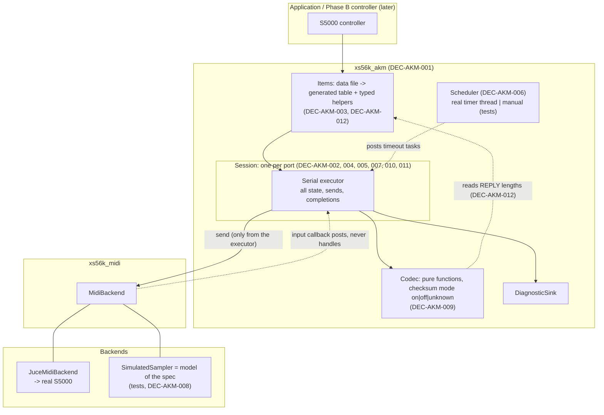
```mermaid
flowchart TB
    subgraph app["Application / Phase B controller (later)"]
        CTRL["S5000 controller"]
    end
    subgraph akm["xs56k_akm (DEC-AKM-001)"]
        ITEMS["Items: data file -> generated table + typed helpers\n(DEC-AKM-003, DEC-AKM-012)"]
        subgraph sess["Session: one per port (DEC-AKM-002, 004, 005, 007, 010, 011)"]
            EXE["Serial executor\nall state, sends, completions"]
        end
        COD["Codec: pure functions, checksum mode on|off|unknown\n(DEC-AKM-009)"]
        SCH["Scheduler (DEC-AKM-006)\nreal timer thread | manual (tests)"]
        DIAG["DiagnosticSink"]
    end
    subgraph midi["xs56k_midi"]
        BE["MidiBackend"]
    end
    subgraph impls["Backends"]
        JUCEB["JuceMidiBackend\n-> real S5000"]
        SIM["SimulatedSampler = model of the spec\n(tests, DEC-AKM-008)"]
    end
    CTRL --> ITEMS --> EXE --> COD
    COD -. "reads REPLY lengths (DEC-AKM-012)" .-> ITEMS
    SCH -. "posts timeout tasks" .-> EXE
    BE -. "input callback posts, never handles" .-> EXE
    EXE --> DIAG
    EXE -->|"send (only from the executor)"| BE
    BE --- JUCEB
    BE --- SIM
```

The diagram above is the decision in one picture. The sections below are the same architecture, as built up to TASK-AKM-011, seen four
ways: the layers and what depends on what, the threads, the classes and value types, and the key use cases in
sequence; the validation set-up follows the layers. A domain dictionary ends the document. Names are the names of the
code (`juce/akm/include/akm/`, `juce/tests/support/`).

### Global architecture

**Layers and dependencies.** Arrows read "uses". Nothing in `xs56k_akm` includes a JUCE header (RQ-AKM-019, DEC-AKM-001),
and the codec at the bottom has no I/O, no clock and no state (DEC-AKM-002, DEC-AKM-009).

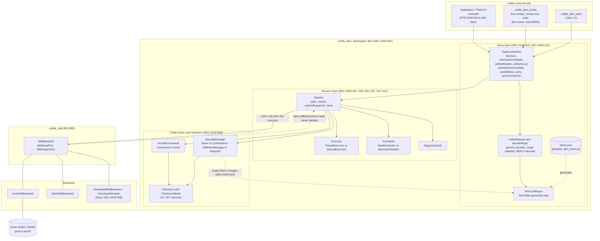
```mermaid
flowchart TB
    subgraph callers["Callers (any thread)"]
        APP["Application / Phase B controller<br/>(FTR-AKM-002 to 004, later)"]
        PROBE["xs56k_akm_probe<br/>first contact, smoke test, suite<br/>(the owner, real S5000)"]
        TESTS["xs56k_akm_tests<br/>(ctest, CI)"]
    end
    subgraph akm["xs56k_akm, namespace akm (DEC-AKM-001)"]
        subgraph items["Items layer (DEC-AKM-003, DEC-AKM-012)"]
            PRIM["Typed primitives<br/>discover, setChecksumMode, setNotification, setSyncLcd,<br/>setAutoScreenUpdate, setStillAlive, echo, queryOsVersion"]
            REQ["makeRequest and decodeReply<br/>generic encoder, range validator, REPLY decoder"]
            CAT["ItemCatalogue<br/>ItemTable.generated.hpp"]
            DATA[("items.json<br/>generate_akm_items.py")]
        end
        subgraph sesslayer["Session layer (DEC-AKM-002, 004, 005, 007, 010, 011)"]
            SES["Session<br/>open, submit, submitSequence, close"]
            EXE["Executor<br/>ThreadExecutor or ManualExecutor"]
            SCH["Scheduler<br/>RealScheduler or ManualScheduler"]
            DIAG["DiagnosticSink"]
        end
        subgraph codec["Codec layer, pure functions (DEC-AKM-009)"]
            ENC["encodeCommand<br/>Command to frame"]
            DEC["decodeMessage<br/>frame to Confirmation, StillAliveMessage or Rejected"]
            CHK["checksum and ChecksumMode<br/>On, Off, Unknown"]
        end
    end
    subgraph midi["xs56k_midi (RQ-MID)"]
        BE["MidiBackend<br/>MidiInputPort, MidiOutputPort"]
    end
    subgraph impls["Backends"]
        JUCEB["JuceMidiBackend"]
        MOCK["MockMidiBackend"]
        SIMB["SimulatedMidiBackend + SimulatedSampler<br/>(tests, DEC-AKM-008)"]
    end
    S5000[("AKAI S5000 / S6000<br/>ports A and B")]
    APP --> PRIM
    PROBE --> PRIM
    TESTS --> PRIM
    PRIM --> REQ --> CAT
    DATA -. "generates" .-> CAT
    PRIM --> SES
    SES --> EXE
    SES --> SCH
    SES --> DIAG
    SES --> ENC
    SES --> DEC
    ENC --> CHK
    DEC --> CHK
    DEC -. "reads REPLY lengths (DEC-AKM-012)" .-> CAT
    SES -->|"send, only from the executor"| BE
    BE -. "input callback posts a task, never handles" .-> SES
    BE --- JUCEB
    BE --- MOCK
    BE --- SIMB
    JUCEB --- S5000
```

**Threads.** One session has one serial executor. Three kinds of thread only post tasks; everything that reads or changes the
session, sends a frame or calls a completion runs on the session thread (DEC-AKM-004, DEC-AKM-005). In the tests the
executor and the scheduler are manual and are drained by the scenario's own thread (DEC-AKM-008).

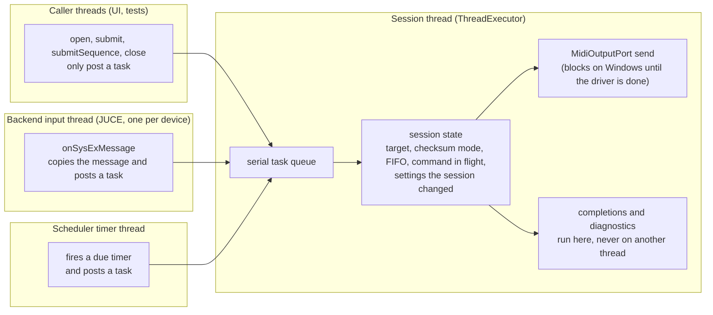
```mermaid
flowchart LR
    subgraph callerthreads["Caller threads (UI, tests)"]
        CALL["open, submit, submitSequence, close<br/>only post a task"]
    end
    subgraph backendthread["Backend input thread (JUCE, one per device)"]
        CB["onSysExMessage<br/>copies the message and posts a task"]
    end
    subgraph timerthread["Scheduler timer thread"]
        TMR["fires a due timer<br/>and posts a task"]
    end
    subgraph sessionthread["Session thread (ThreadExecutor)"]
        Q["serial task queue"]
        ST["session state<br/>target, checksum mode, FIFO, command in flight,<br/>settings the session changed"]
        SEND["MidiOutputPort send<br/>(blocks on Windows until the driver is done)"]
        CMP["completions and diagnostics<br/>run here, never on another thread"]
    end
    CALL --> Q
    CB --> Q
    TMR --> Q
    Q --> ST
    ST --> SEND
    ST --> CMP
```

**Validation.** The same scenario source runs against the simulated sampler in CI and against the real S5000 through
`xs56k_akm_probe` (RQ-AKM-016, RQ-AKM-017, RQ-AKM-019, DEC-AKM-008). The log is written between the steps, never while a
command is in flight, so that writing it cannot slow what it records.

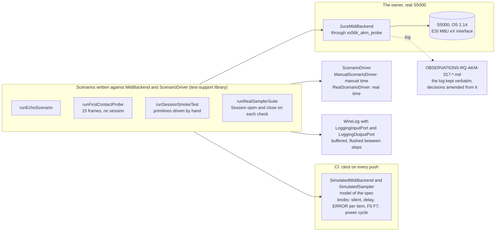
```mermaid
flowchart LR
    subgraph scenarios["Scenarios written against MidiBackend and ScenarioDriver (test-support library)"]
        ECHO["runEchoScenario"]
        FCP["runFirstContactProbe<br/>15 frames, no session"]
        SMK["runSessionSmokeTest<br/>primitives driven by hand"]
        SUITE["runRealSamplerSuite<br/>Session open and close on each check"]
    end
    DRV["ScenarioDriver<br/>ManualScenarioDriver: manual time<br/>RealScenarioDriver: real time"]
    WL["WireLog with LoggingInputPort and LoggingOutputPort<br/>buffered, flushed between steps"]
    subgraph ci["CI: ctest on every push"]
        SIMB2["SimulatedMidiBackend and SimulatedSampler<br/>model of the spec<br/>knobs: silent, delay, ERROR per item, F0 F7, power cycle"]
    end
    subgraph ownerrun["The owner, real S5000"]
        JB["JuceMidiBackend<br/>through xs56k_akm_probe"]
        HW[("S5000, OS 2.14<br/>ESI M8U eX interface")]
    end
    OBS["OBSERVATIONS-RQ-AKM-017-*.md<br/>the log kept verbatim,<br/>decisions amended from it"]
    scenarios --> DRV
    scenarios --> WL
    scenarios --> SIMB2
    scenarios --> JB
    JB --> HW
    JB -. "log" .-> OBS
```

### Class diagram

Four views of the entities this ADR creates. The interfaces at the top of the first one are the seams: everything
the session touches from outside arrives through one of them (DEC-AKM-004, DEC-AKM-006, DEC-AKM-008).

**The session and what it is given** (DEC-AKM-001, 004, 005, 006):

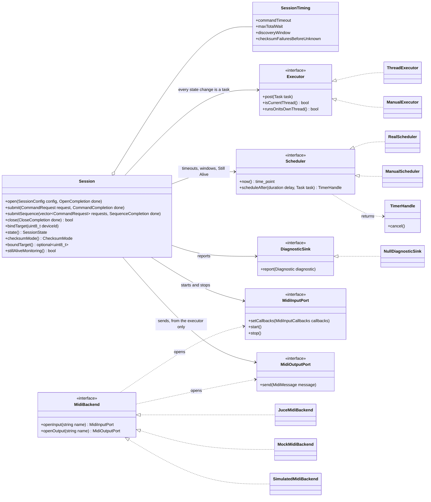
```mermaid
classDiagram
    direction LR
    class Session {
        +open(SessionConfig config, OpenCompletion done)
        +submit(CommandRequest request, CommandCompletion done)
        +submitSequence(vector~CommandRequest~ requests, SequenceCompletion done)
        +close(CloseCompletion done) bool
        +bindTarget(uint8_t deviceId)
        +state() SessionState
        +checksumMode() ChecksumMode
        +boundTarget() optional~uint8_t~
        +stillAliveMonitoring() bool
    }
    class SessionTiming {
        +commandTimeout
        +maxTotalWait
        +discoveryWindow
        +checksumFailuresBeforeUnknown
    }
    class Executor {
        <<interface>>
        +post(Task task)
        +isCurrentThread() bool
        +runsOnItsOwnThread() bool
    }
    class ThreadExecutor
    class ManualExecutor
    class Scheduler {
        <<interface>>
        +now() time_point
        +scheduleAfter(duration delay, Task task) TimerHandle
    }
    class RealScheduler
    class ManualScheduler
    class TimerHandle {
        +cancel()
    }
    class DiagnosticSink {
        <<interface>>
        +report(Diagnostic diagnostic)
    }
    class NullDiagnosticSink
    class MidiBackend {
        <<interface>>
        +openInput(string name) MidiInputPort
        +openOutput(string name) MidiOutputPort
    }
    class MidiInputPort {
        <<interface>>
        +setCallbacks(MidiInputCallbacks callbacks)
        +start()
        +stop()
    }
    class MidiOutputPort {
        <<interface>>
        +send(MidiMessage message)
    }
    class JuceMidiBackend
    class MockMidiBackend
    class SimulatedMidiBackend
    Session o-- SessionTiming
    Session --> Executor : every state change is a task
    Session --> Scheduler : timeouts, windows, Still Alive
    Session --> DiagnosticSink : reports
    Session --> MidiInputPort : starts and stops
    Session --> MidiOutputPort : sends, from the executor only
    Executor <|.. ThreadExecutor
    Executor <|.. ManualExecutor
    Scheduler <|.. RealScheduler
    Scheduler <|.. ManualScheduler
    Scheduler ..> TimerHandle : returns
    DiagnosticSink <|.. NullDiagnosticSink
    MidiBackend <|.. JuceMidiBackend
    MidiBackend <|.. MockMidiBackend
    MidiBackend <|.. SimulatedMidiBackend
    MidiBackend ..> MidiInputPort : opens
    MidiBackend ..> MidiOutputPort : opens
```

**What crosses the session's API** (DEC-AKM-004, 007, 010, 011): a request in, a result out, a configuration for the opening.

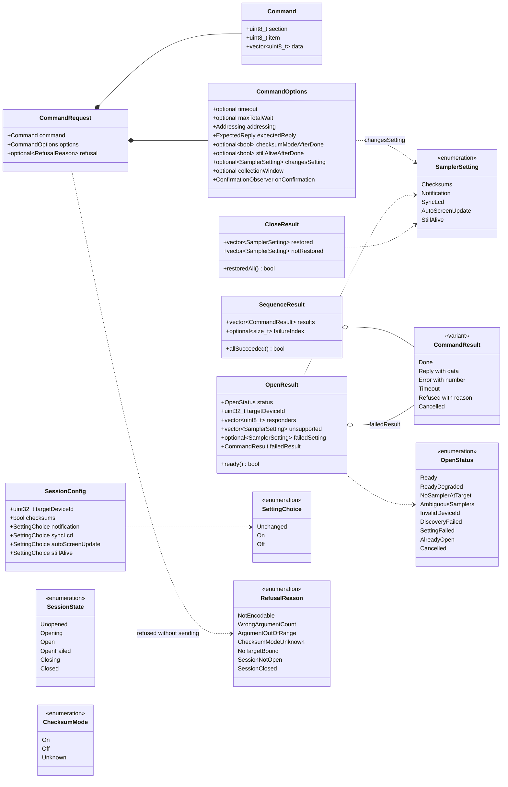
```mermaid
classDiagram
    direction LR
    class CommandRequest {
        +Command command
        +CommandOptions options
        +optional~RefusalReason~ refusal
    }
    class Command {
        +uint8_t section
        +uint8_t item
        +vector~uint8_t~ data
    }
    class CommandOptions {
        +optional timeout
        +optional maxTotalWait
        +Addressing addressing
        +ExpectedReply expectedReply
        +optional~bool~ checksumModeAfterDone
        +optional~bool~ stillAliveAfterDone
        +optional~SamplerSetting~ changesSetting
        +optional collectionWindow
        +ConfirmationObserver onConfirmation
    }
    class CommandResult {
        <<variant>>
        Done
        Reply with data
        Error with number
        Timeout
        Refused with reason
        Cancelled
    }
    class SequenceResult {
        +vector~CommandResult~ results
        +optional~size_t~ failureIndex
        +allSucceeded() bool
    }
    class SessionConfig {
        +uint32_t targetDeviceId
        +bool checksums
        +SettingChoice notification
        +SettingChoice syncLcd
        +SettingChoice autoScreenUpdate
        +SettingChoice stillAlive
    }
    class OpenResult {
        +OpenStatus status
        +uint32_t targetDeviceId
        +vector~uint8_t~ responders
        +vector~SamplerSetting~ unsupported
        +optional~SamplerSetting~ failedSetting
        +CommandResult failedResult
        +ready() bool
    }
    class CloseResult {
        +vector~SamplerSetting~ restored
        +vector~SamplerSetting~ notRestored
        +restoredAll() bool
    }
    class SessionState {
        <<enumeration>>
        Unopened
        Opening
        Open
        OpenFailed
        Closing
        Closed
    }
    class OpenStatus {
        <<enumeration>>
        Ready
        ReadyDegraded
        NoSamplerAtTarget
        AmbiguousSamplers
        InvalidDeviceId
        DiscoveryFailed
        SettingFailed
        AlreadyOpen
        Cancelled
    }
    class SamplerSetting {
        <<enumeration>>
        Checksums
        Notification
        SyncLcd
        AutoScreenUpdate
        StillAlive
    }
    class SettingChoice {
        <<enumeration>>
        Unchanged
        On
        Off
    }
    class RefusalReason {
        <<enumeration>>
        NotEncodable
        WrongArgumentCount
        ArgumentOutOfRange
        ChecksumModeUnknown
        NoTargetBound
        SessionNotOpen
        SessionClosed
    }
    class ChecksumMode {
        <<enumeration>>
        On
        Off
        Unknown
    }
    CommandRequest *-- Command
    CommandRequest *-- CommandOptions
    CommandRequest ..> RefusalReason : refused without sending
    CommandOptions ..> SamplerSetting : changesSetting
    SequenceResult o-- CommandResult
    SessionConfig ..> SettingChoice
    OpenResult ..> OpenStatus
    OpenResult o-- CommandResult : failedResult
    OpenResult ..> SamplerSetting
    CloseResult ..> SamplerSetting
```

**The codec and the items** (DEC-AKM-002, 003, 009, 012): pure functions and the descriptors they read.

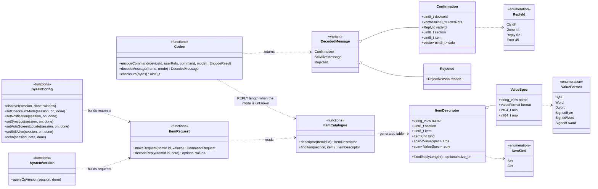
```mermaid
classDiagram
    direction LR
    class Codec {
        <<functions>>
        +encodeCommand(deviceId, userRefs, command, mode) EncodeResult
        +decodeMessage(frame, mode) DecodedMessage
        +checksum(bytes) uint8_t
    }
    class DecodedMessage {
        <<variant>>
        Confirmation
        StillAliveMessage
        Rejected
    }
    class Confirmation {
        +uint8_t deviceId
        +vector~uint8_t~ userRefs
        +ReplyId replyId
        +uint8_t section
        +uint8_t item
        +vector~uint8_t~ data
    }
    class ReplyId {
        <<enumeration>>
        Ok 4F
        Done 44
        Reply 52
        Error 45
    }
    class Rejected {
        +RejectReason reason
    }
    class ItemDescriptor {
        +string_view name
        +uint8_t section
        +uint8_t item
        +ItemKind kind
        +span~ValueSpec~ args
        +span~ValueSpec~ reply
        +fixedReplyLength() optional~size_t~
    }
    class ValueSpec {
        +string_view name
        +ValueFormat format
        +int64_t min
        +int64_t max
    }
    class ItemKind {
        <<enumeration>>
        Set
        Get
    }
    class ValueFormat {
        <<enumeration>>
        Byte
        Word
        Dword
        SignedByte
        SignedWord
        SignedDword
    }
    class ItemCatalogue {
        <<functions>>
        +descriptor(ItemId id) ItemDescriptor
        +findItem(section, item) ItemDescriptor
    }
    class ItemRequest {
        <<functions>>
        +makeRequest(ItemId id, values) CommandRequest
        +decodeReply(ItemId id, data) optional values
    }
    class SysExConfig {
        <<functions>>
        +discover(session, done, window)
        +setChecksumMode(session, on, done)
        +setNotification(session, on, done)
        +setSyncLcd(session, on, done)
        +setAutoScreenUpdate(session, on, done)
        +setStillAlive(session, on, done)
        +echo(session, data, done)
    }
    class SystemVersion {
        <<functions>>
        +queryOsVersion(session, done)
    }
    Codec ..> DecodedMessage : returns
    DecodedMessage o-- Confirmation
    DecodedMessage o-- Rejected
    Confirmation ..> ReplyId
    ItemDescriptor o-- ValueSpec
    ItemDescriptor ..> ItemKind
    ValueSpec ..> ValueFormat
    ItemCatalogue ..> ItemDescriptor : generated table
    ItemRequest ..> ItemCatalogue : reads
    Codec ..> ItemCatalogue : REPLY length when the mode is unknown
    SysExConfig ..> ItemRequest : builds requests
    SystemVersion ..> ItemRequest : builds requests
```

**The test seams** (DEC-AKM-008): what stands in for the sampler and for time, and what the owner's run adds.

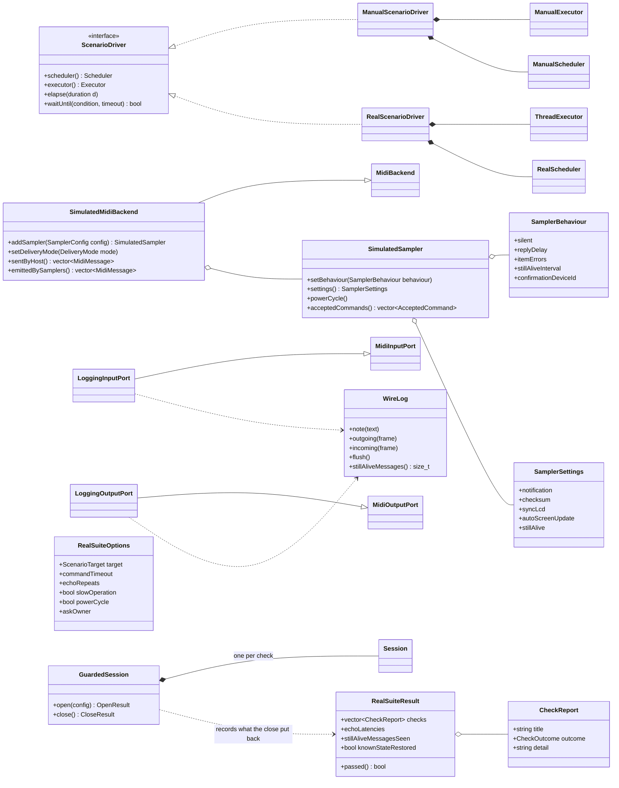
```mermaid
classDiagram
    direction LR
    class SimulatedMidiBackend {
        +addSampler(SamplerConfig config) SimulatedSampler
        +setDeliveryMode(DeliveryMode mode)
        +sentByHost() vector~MidiMessage~
        +emittedBySamplers() vector~MidiMessage~
    }
    class SimulatedSampler {
        +setBehaviour(SamplerBehaviour behaviour)
        +settings() SamplerSettings
        +powerCycle()
        +acceptedCommands() vector~AcceptedCommand~
    }
    class SamplerBehaviour {
        +silent
        +replyDelay
        +itemErrors
        +stillAliveInterval
        +confirmationDeviceId
    }
    class SamplerSettings {
        +notification
        +checksum
        +syncLcd
        +autoScreenUpdate
        +stillAlive
    }
    class ScenarioDriver {
        <<interface>>
        +scheduler() Scheduler
        +executor() Executor
        +elapse(duration d)
        +waitUntil(condition, timeout) bool
    }
    class ManualScenarioDriver
    class RealScenarioDriver
    class WireLog {
        +note(text)
        +outgoing(frame)
        +incoming(frame)
        +flush()
        +stillAliveMessages() size_t
    }
    class LoggingInputPort
    class LoggingOutputPort
    class RealSuiteOptions {
        +ScenarioTarget target
        +commandTimeout
        +echoRepeats
        +bool slowOperation
        +bool powerCycle
        +askOwner
    }
    class RealSuiteResult {
        +vector~CheckReport~ checks
        +echoLatencies
        +stillAliveMessagesSeen
        +bool knownStateRestored
        +passed() bool
    }
    class CheckReport {
        +string title
        +CheckOutcome outcome
        +string detail
    }
    class GuardedSession {
        +open(config) OpenResult
        +close() CloseResult
    }
    SimulatedMidiBackend --|> MidiBackend
    SimulatedMidiBackend o-- SimulatedSampler
    SimulatedSampler o-- SamplerBehaviour
    SimulatedSampler o-- SamplerSettings
    ScenarioDriver <|.. ManualScenarioDriver
    ScenarioDriver <|.. RealScenarioDriver
    ManualScenarioDriver *-- ManualExecutor
    ManualScenarioDriver *-- ManualScheduler
    RealScenarioDriver *-- ThreadExecutor
    RealScenarioDriver *-- RealScheduler
    LoggingInputPort --|> MidiInputPort
    LoggingOutputPort --|> MidiOutputPort
    LoggingInputPort ..> WireLog
    LoggingOutputPort ..> WireLog
    RealSuiteResult o-- CheckReport
    GuardedSession *-- Session : one per check
    GuardedSession ..> RealSuiteResult : records what the close put back
```

### Sequence diagrams

The key use cases. Every completion and every diagnostic runs on the session thread; the arrows to the caller
are completions, not returns.

**Opening a session** (RQ-AKM-039, RQ-AKM-040, DEC-AKM-007). Nothing but the discovery is sent before the target is verified, and
the application's commands are refused until the open has succeeded.

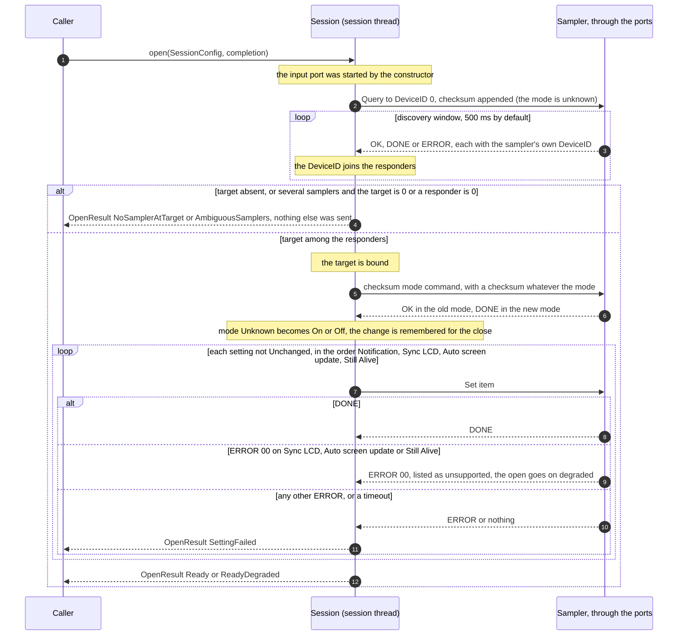
```mermaid
sequenceDiagram
    autonumber
    participant App as Caller
    participant S as Session (session thread)
    participant HW as Sampler, through the ports
    App->>S: open(SessionConfig, completion)
    Note over S: the input port was started by the constructor
    S->>HW: Query to DeviceID 0, checksum appended (the mode is unknown)
    loop discovery window, 500 ms by default
        HW-->>S: OK, DONE or ERROR, each with the sampler's own DeviceID
        Note over S: the DeviceID joins the responders
    end
    alt target absent, or several samplers and the target is 0 or a responder is 0
        S-->>App: OpenResult NoSamplerAtTarget or AmbiguousSamplers, nothing else was sent
    else target among the responders
        Note over S: the target is bound
        S->>HW: checksum mode command, with a checksum whatever the mode
        HW-->>S: OK in the old mode, DONE in the new mode
        Note over S: mode Unknown becomes On or Off, the change is remembered for the close
        loop each setting not Unchanged, in the order Notification, Sync LCD, Auto screen update, Still Alive
            S->>HW: Set item
            alt DONE
                HW-->>S: DONE
            else ERROR 00 on Sync LCD, Auto screen update or Still Alive
                HW-->>S: ERROR 00, listed as unsupported, the open goes on degraded
            else any other ERROR, or a timeout
                HW-->>S: ERROR or nothing
                S-->>App: OpenResult SettingFailed
            end
        end
        S-->>App: OpenResult Ready or ReadyDegraded
    end
```

**One command, from submit to completion** (RQ-AKM-007 to RQ-AKM-011, DEC-AKM-004, DEC-AKM-005). One command is in
flight per port; the confirmation is the flow control. The frame is sent only from the executor, and a confirmation
that arrives before `send` returns is handled after the sending task, never inline.

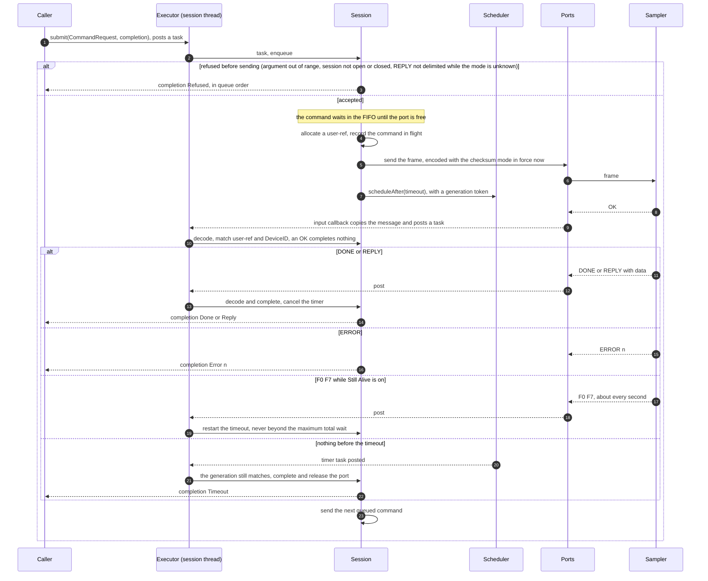
```mermaid
sequenceDiagram
    autonumber
    participant App as Caller
    participant Q as Executor (session thread)
    participant S as Session
    participant T as Scheduler
    participant B as Ports
    participant HW as Sampler
    App->>Q: submit(CommandRequest, completion), posts a task
    Q->>S: task, enqueue
    alt refused before sending (argument out of range, session not open or closed, REPLY not delimited while the mode is unknown)
        S-->>App: completion Refused, in queue order
    else accepted
        Note over S: the command waits in the FIFO until the port is free
        S->>S: allocate a user-ref, record the command in flight
        S->>B: send the frame, encoded with the checksum mode in force now
        B->>HW: frame
        S->>T: scheduleAfter(timeout), with a generation token
        HW-->>B: OK
        B-->>Q: input callback copies the message and posts a task
        Q->>S: decode, match user-ref and DeviceID, an OK completes nothing
        alt DONE or REPLY
            HW-->>B: DONE or REPLY with data
            B-->>Q: post
            Q->>S: decode and complete, cancel the timer
            S-->>App: completion Done or Reply
        else ERROR
            HW-->>B: ERROR n
            S-->>App: completion Error n
        else F0 F7 while Still Alive is on
            HW-->>B: F0 F7, about every second
            B-->>Q: post
            Q->>S: restart the timeout, never beyond the maximum total wait
        else nothing before the timeout
            T-->>Q: timer task posted
            Q->>S: the generation still matches, complete and release the port
            S-->>App: completion Timeout
        end
        S->>S: send the next queued command
    end
```

**Closing a session** (RQ-AKM-042, DEC-AKM-004 as built in TASK-AKM-011). A close from one of the session's own completions is refused
(`close` returns false and changes nothing). A close always finishes.

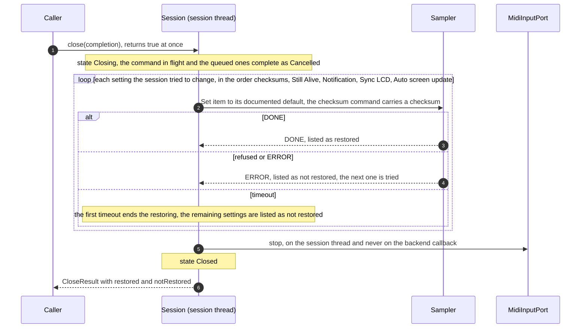
```mermaid
sequenceDiagram
    autonumber
    participant App as Caller
    participant S as Session (session thread)
    participant HW as Sampler
    participant In as MidiInputPort
    App->>S: close(completion), returns true at once
    Note over S: state Closing, the command in flight and the queued ones complete as Cancelled
    loop each setting the session tried to change, in the order checksums, Still Alive, Notification, Sync LCD, Auto screen update
        S->>HW: Set item to its documented default, the checksum command carries a checksum
        alt DONE
            HW-->>S: DONE, listed as restored
        else refused or ERROR
            HW-->>S: ERROR, listed as not restored, the next one is tried
        else timeout
            Note over S: the first timeout ends the restoring, the remaining settings are listed as not restored
        end
    end
    S->>In: stop, on the session thread and never on the backend callback
    Note over S: state Closed
    S-->>App: CloseResult with restored and notRestored
```

**A sampler that restarted under an open session** (RQ-AKM-041, DEC-AKM-009). The session assumes checksums on; the sampler came back with
checksums off. After three confirmations in a row that fail verification the session no longer trusts its mode and reads
the next confirmation by the length its item has in the catalogue. Exercised on the simulated sampler in CI; the
`--power-cycle` check of the real-sampler suite does it on the S5000.

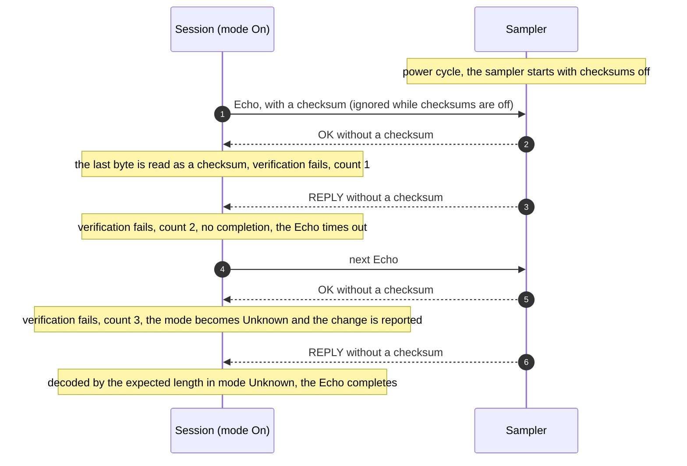
```mermaid
sequenceDiagram
    autonumber
    participant S as Session (mode On)
    participant HW as Sampler
    Note over HW: power cycle, the sampler starts with checksums off
    S->>HW: Echo, with a checksum (ignored while checksums are off)
    HW-->>S: OK without a checksum
    Note over S: the last byte is read as a checksum, verification fails, count 1
    HW-->>S: REPLY without a checksum
    Note over S: verification fails, count 2, no completion, the Echo times out
    S->>HW: next Echo
    HW-->>S: OK without a checksum
    Note over S: verification fails, count 3, the mode becomes Unknown and the change is reported
    HW-->>S: REPLY without a checksum
    Note over S: decoded by the expected length in mode Unknown, the Echo completes
```

**A run of the real-sampler suite** (RQ-AKM-017, RQ-AKM-018, DEC-AKM-008). Every check has its own session held by a guard; a
check that fails, or throws, leaves the sampler as the close leaves it.

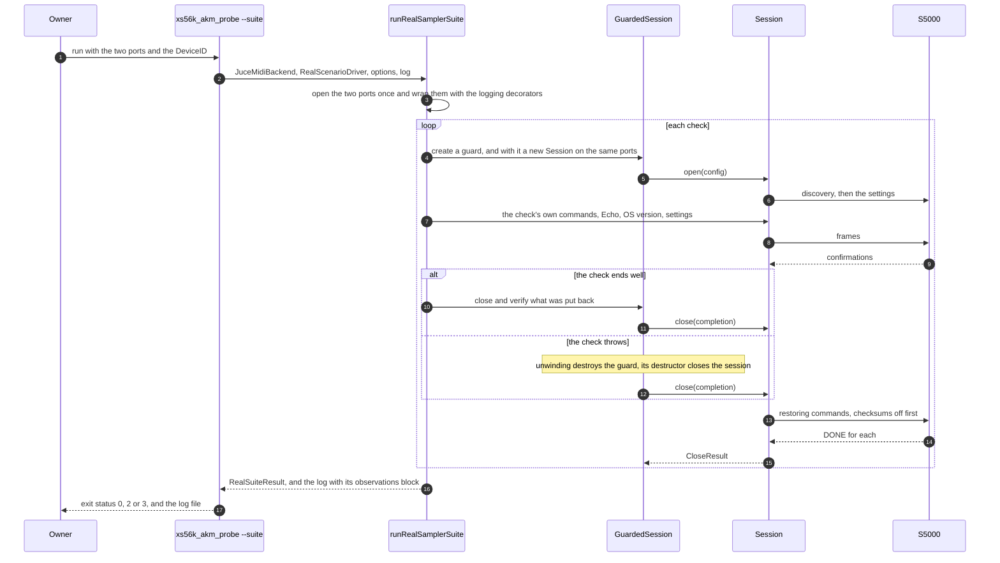
```mermaid
sequenceDiagram
    autonumber
    participant O as Owner
    participant P as xs56k_akm_probe --suite
    participant R as runRealSamplerSuite
    participant G as GuardedSession
    participant S as Session
    participant HW as S5000
    O->>P: run with the two ports and the DeviceID
    P->>R: JuceMidiBackend, RealScenarioDriver, options, log
    R->>R: open the two ports once and wrap them with the logging decorators
    loop each check
        R->>G: create a guard, and with it a new Session on the same ports
        G->>S: open(config)
        S->>HW: discovery, then the settings
        R->>S: the check's own commands, Echo, OS version, settings
        S->>HW: frames
        HW-->>S: confirmations
        alt the check ends well
            R->>G: close and verify what was put back
            G->>S: close(completion)
        else the check throws
            Note over G: unwinding destroys the guard, its destructor closes the session
            G->>S: close(completion)
        end
        S->>HW: restoring commands, checksums off first
        HW-->>S: DONE for each
        S-->>G: CloseResult
    end
    R-->>P: RealSuiteResult, and the log with its observations block
    P-->>O: exit status 0, 2 or 3, and the log file
```

## Domain dictionary

The words of the domain, in the sense the requirements and the code give them. `§` numbers are sections of the spec
(`documents/akai_s5000_s6000_sysex_spec_2.10.pdf`); a name in `code font` is a name in `juce/akm/` or `juce/tests/support/`.

| Term | Meaning | In the code and the requirements |
|---|---|---|
| Sampler | An AKAI S5000 or S6000 controlled by SysEx. Its OS version (OS 2.14 on the owner's) decides which items it has. | RQ-AKM-044, `OsVersionReport` |
| Port A / port B | The sampler's two MIDI port pairs. Each decodes and answers on its own and has its own §00 settings; one session drives one pair. | DEC-AKM-002, RQ-AKM-014 |
| SysEx frame | One System Exclusive message, `F0 47 5E <dev> <user-refs> <section> <item> <data> [checksum] F7`, every data byte at most `7F`. | RQ-AKM-001, `encodeCommand` |
| DeviceID | 0 to 31, set on the sampler itself and unreadable by SysEx. A sampler answers a frame carrying its own DeviceID or 0; a frame with DeviceID 0 is answered by every sampler, each with its own. | RQ-AKM-012, RQ-AKM-039 |
| `<dev>` byte | Carries the DeviceID in bits 0-4 and the number of user-refs minus one in bits 5-6. | `Confirmation::deviceId` |
| User-ref | One to four free bytes the host chooses, echoed in every confirmation, used to match a confirmation to its command. | RQ-AKM-007, `Confirmation::userRefs` |
| Section, item | The two bytes that name a spec item: a section (§00 SysEx configuration, §02 System, §0A Program, ...) and an item within it. | `Command::section`, `Command::item` |
| Set / Get | A command that changes a value (confirmed by DONE) or reads one (confirmed by a REPLY). | `ItemKind` |
| Command | What is sent apart from the addressing: section, item, data bytes. | `Command` |
| Command request | A command with the options the session cannot infer, and a refusal when it cannot be sent. | `CommandRequest`, `CommandOptions`, DEC-AKM-011 |
| Confirmation | A frame the sampler sends back, with a Reply ID. | `Confirmation`, `decodeMessage` |
| Reply ID | `4F` OK (received, being processed), `44` DONE (completed), `52` REPLY (completed, data follows), `45` ERROR (failed, number follows). | `ReplyId`, RQ-AKM-004 |
| Error number | Two data bytes, `d1 * 128 + d2`: 0 not supported, 1 invalid format, 2 out of range, 3 unknown, 129 checksum invalid, ... | `describeError`, RQ-AKM-005 |
| Notification | The §00 setting (`&01`) that makes the sampler send the OK. DONE, REPLY and ERROR cannot be disabled. | `SamplerSetting::Notification`, RQ-AKM-009 |
| Checksum | The 8-bit wrapping sum from the first user-ref to the last data byte, masked to 7 bits, placed before `F7`. | `checksum`, RQ-AKM-003 |
| Checksum mode | Whether the sampler adds and expects checksums on a port (§00 `&04`). It cannot be read back, so the session tracks it as On, Off or Unknown; a checksum is sent when it is On or Unknown. | `ChecksumMode`, DEC-AKM-009, RQ-AKM-041 |
| Sync LCD | §00 `&03`, since OS 2.00: the sampler's front-panel selection follows a selection made by SysEx. Advised off unless needed, since another port can change it. | `SamplerSetting::SyncLcd`, RQ-AKM-014 |
| Auto screen update | §00 `&05`: the LCD refreshes by itself when a value changes. | `SamplerSetting::AutoScreenUpdate` |
| Still Alive | §00 `&07`, since OS 2.10: while a command is pending the sampler sends the two-byte message `F0 F7` about every second, so that a slow operation is not taken for a dead sampler. | `SamplerSetting::StillAlive`, RQ-AKM-011 |
| Query | §00 `&00`. Answered by OK and DONE; sent to DeviceID 0 it is how the samplers present are found. | RQ-AKM-012 |
| Echo | §00 `&06`: four data bytes sent and returned in a REPLY; the exchange that proves the link. | `echo`, RQ-AKM-015 |
| Discovery | A broadcast Query with a collection window; the distinct DeviceIDs that answered are the responders. | `discover`, `SessionTiming::discoveryWindow` |
| Responder | A DeviceID that answered the discovery. | `OpenResult::responders` |
| Target | The DeviceID the session addresses, taken from the configuration and bound after the discovery has verified it. | `SessionConfig::targetDeviceId`, `Session::bindTarget` |
| Ambiguous | Several samplers answered and either the target is 0 or one of them has DeviceID 0, which would execute every command. | `OpenStatus::AmbiguousSamplers` |
| Session | The state machine of one port pair: target, checksum mode, queue, one command in flight, settings it changed. | `Session`, DEC-AKM-002 |
| Open / degraded | The session established the §00 settings; degraded when the sampler answered ERROR 0 to an optional setting (an older OS). | `OpenStatus::Ready`, `ReadyDegraded` |
| Close / known state | The session puts back what it changed to the documented defaults: checksums off, Still Alive off, Notification on, Sync LCD on, Auto screen update off. | `CloseResult`, `samplerDefault`, RQ-AKM-042 |
| Command in flight | The one command sent and not yet completed; the confirmation is the flow control, there is no fixed delay between commands. | RQ-AKM-008 |
| Timeout / maximum total wait | The time a command waits for its DONE, REPLY or ERROR, and the longest it may stay pending, which Still Alive cannot extend. | `SessionTiming`, RQ-AKM-010, DEC-AKM-006 |
| Completion | The callback that receives a command's result, on the session thread, exactly once. | `CommandCompletion`, RQ-AKM-020 |
| Result | `Done`, `Reply`, `Error`, `Timeout`, `Refused` or `Cancelled`. | `CommandResult`, DEC-AKM-004 |
| Refusal | A command that is not sent: an argument out of range, the session not open, a REPLY that cannot be delimited while the mode is unknown. | `RefusalReason` |
| Sequence | Commands run in order with nothing interleaved; the rest is cancelled at the first failure. | `submitSequence`, DEC-AKM-010 |
| Executor | The serial task queue of a session, on a worker thread or drained by a test. | `Executor`, DEC-AKM-004 |
| Scheduler | Injected time: the clock and one-shot timers, real or manual. | `Scheduler`, DEC-AKM-006 |
| Diagnostic | A report that is not a result: a rejected message, an unsolicited confirmation, a late ERROR after a REPLY, a change of checksum mode. | `DiagnosticSink`, RQ-AKM-006 |
| Item catalogue | The table of spec items generated from a reviewed data file; it tells the encoder how to write and the codec how long a REPLY is. | `ItemDescriptor`, DEC-AKM-003, DEC-AKM-012 |
| Simulated sampler | A model of the spec that stands in for the sampler in CI, with knobs for what a real bus does badly. | `SimulatedSampler`, DEC-AKM-008 |
| Scenario / driver | A sequence written once against `MidiBackend&` and a `ScenarioDriver` that hides how time is waited for, so it runs on the simulator and on the real sampler. | `ScenarioDriver`, RQ-AKM-016 |
| Wire log | The record of every frame in both directions with its time, kept in memory and written between steps. | `WireLog` |
| First contact / smoke test / suite | The three runs against the real sampler: fifteen frames without a session (TASK-AKM-012), a session driven by hand (TASK-AKM-013), and the checks on sessions opened and closed for real (TASK-AKM-010). | `xs56k_akm_probe` |
| Observation | A fact about the real sampler recorded from a log, which confirms or amends a decision. | RQ-AKM-017, `OBSERVATIONS-RQ-AKM-017-*.md` |
| Guard | The object around a check's session whose destructor closes it, so that a failed check leaves the sampler in the known state. | `GuardedSession`, RQ-AKM-018 |
| Phase A / Phase B | Phase A is the transport this ADR builds; Phase B is the S5000 controller that will sit on it. | DEC-AKM-001 |
