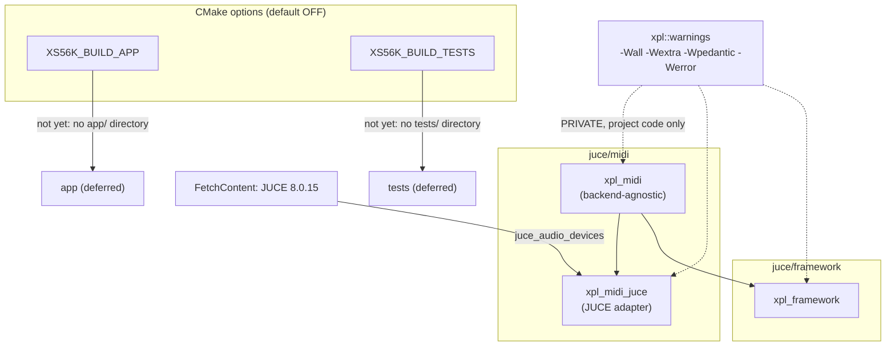

# ADR-BLD-001: JUCE CMake Build Foundation

## Status
Accepted — implemented and building (Debug and Release, verified locally).

## Context

The `juce/midi` and `juce/framework` C++ source trees were ported into this repository from
[xplorer2716/XplorerEditor](https://github.com/xplorer2716/XplorerEditor) (see `AGENTS.md`), but
arrived with no root CMake build tying them together, no pinned JUCE dependency, and no compiler
warning policy — `juce/midi/CMakeLists.txt` and `juce/framework/CMakeLists.txt` already declare
targets (`xpl_midi`, `xpl_midi_juce`, `xpl_framework`) and reference an `xpl::warnings` alias and a
`juce::juce_audio_devices` target that nothing in this repository yet defined.

XplorerEditor's own `juce/CMakeLists.txt` solves exactly this problem for the same target layout
(it is the file these two layers were originally built by), so the question was not *how* to
structure this build but *how much of that file applies* to a repository that, unlike
XplorerEditor, has no `model`, `controller`, `settings` or `app` layer yet — only `midi` and
`framework`.

## Decision

Add `juce/CMakeLists.txt`, adapted from XplorerEditor's own root build, keeping:

- **CMake ≥ 3.22, C++20, `FetchContent`-pinned JUCE.** `XS56K_JUCE_VERSION` is set to `8.0.15`
  (not XplorerEditor's `8.0.9` — the latest 8.x tag at the time this repository's project template
  was filled in, verified via `git ls-remote --tags` against the real JUCE repository rather than
  assumed; see `AGENTS.md`).
- **`xpl::warnings` interface target**: `-Wall -Wextra -Wpedantic -Werror` (`/W4 /WX` on MSVC),
  linked `PRIVATE` into project targets only — never into JUCE's own module sources — including
  the GCC-only `-Wno-error=maybe-uninitialized` carve-out for JUCE's vendored `SheenBidi.c`
  (XplorerEditor's own finding, carried over verbatim since it is about JUCE's sources, not this
  project's).
- **`XS56K_BUILD_APP` / `XS56K_BUILD_TESTS` options, both default `OFF`.** `XS56K_BUILD_APP` gates
  `JUCE_MODULES_ONLY` and the (not yet existing) `app` subdirectory; `XS56K_BUILD_TESTS` gates the
  (not yet existing) `tests` subdirectory and the Catch2 fetch. Both stay off by construction until
  those directories exist — turning them on today would fail configure, not silently no-op.
- **`add_subdirectory(midi)` and `add_subdirectory(framework)` only.** XplorerEditor's five
  `add_subdirectory` calls (`midi`, `framework`, `model`, `controller`, `settings`) are reduced to
  the two this repository actually has.

**Dropped, not carried over:** the entire product-version derivation block (`XPL_VERSION_NUMERIC`
/ `XPL_VERSION_FULL` / `XPL_VERSION_TIMESTAMP` CACHE variables, the `project(VERSION …)` call) and
the MSVC static-CRT policy comment tied to publishing a Debug binary. Both are deployment concerns
with nothing to attach to yet — see RQ-BLD-009/RQ-BLD-010 and `ADR-BLD-003` for the backlog that
picks them back up once an application exists.

**DEC-BLD-001** — Pin JUCE via `FetchContent` at the tag identified as latest-8.x (`8.0.15`),
verified against the upstream tag list rather than assumed from XplorerEditor's own (older) pin.

**DEC-BLD-002** — Scope `add_subdirectory` calls, `XS56K_BUILD_APP` and `XS56K_BUILD_TESTS` to
exactly the layers this repository has, rather than pre-declaring the full XplorerEditor layer set
with options left off — an `add_subdirectory` naming a directory that does not exist is a hard
CMake configure error, not a soft no-op, so the file must grow with the ported layers instead of
anticipating them.

**DEC-BLD-003** — Rename the version-string constants XplorerEditor names `XPL_*` to `XS56K_*`
(`XS56K_JUCE_VERSION`, `XS56K_CATCH2_VERSION`, `XS56K_BUILD_APP`, `XS56K_BUILD_TESTS`) for the
values this project itself declares, while leaving the `xpl_*`/`xpl::*` **target and namespace**
names (`xpl_midi`, `xpl_framework`, `xpl::warnings`) exactly as ported — those identifiers are
already load-bearing throughout the ported header/source tree (namespaces, include paths under
`xpl/`, CMake target names in both layers' own `CMakeLists.txt`), and renaming them is a separate,
much larger change this task does not touch.

## Consequences

**Easier.** `cmake -S juce -B juce/build && cmake --build juce/build` builds both layers headless,
with no manual JUCE install step, on any machine with a C++20 toolchain and (on Linux)
`libasound2-dev`. Warnings-as-errors on project code catches defects at the same bar XplorerEditor
holds itself to, from the first line of ported code onward.

**Harder.** The file will need real edits — not just uncommenting an option — as each of `model`,
`controller`, `settings` and `app` is ported: an `add_subdirectory` call added per layer, and only
once `app` exists does the version-derivation block from XplorerEditor's file become relevant again
(picked back up by `ADR-BLD-003` rather than re-invented then).

**Unchanged.** The `midi`/`framework` layer `CMakeLists.txt` files themselves — they already
matched XplorerEditor's, needing no edit; only the root file they were missing was added.

## Alternatives Considered

- **Carry over the full XplorerEditor root file verbatim, including the four unported
  `add_subdirectory` calls and the version-derivation block.** Rejected: an `add_subdirectory` for
  a directory that does not exist fails configure outright, and a version-derivation block with
  nothing consuming it (no `app` target, no SBOM, no About dialog) has no reader — dead
  configuration is worse than a documented gap.
- **Vendor JUCE as a git submodule instead of `FetchContent`.** Rejected for the same reason
  XplorerEditor's `RQ-BLD-001` requires `FetchContent`: a submodule still needs an explicit clone
  step contributors can forget, where `FetchContent` is transparent to `cmake --build`.
- **Skip the warnings-as-errors policy until more code exists.** Rejected: the ported `midi` and
  `framework` sources already compile clean at this level (verified — see RQ-BLD-003's acceptance
  criteria), so deferring the policy would only make a later retrofit larger, not easier.

## Diagram

