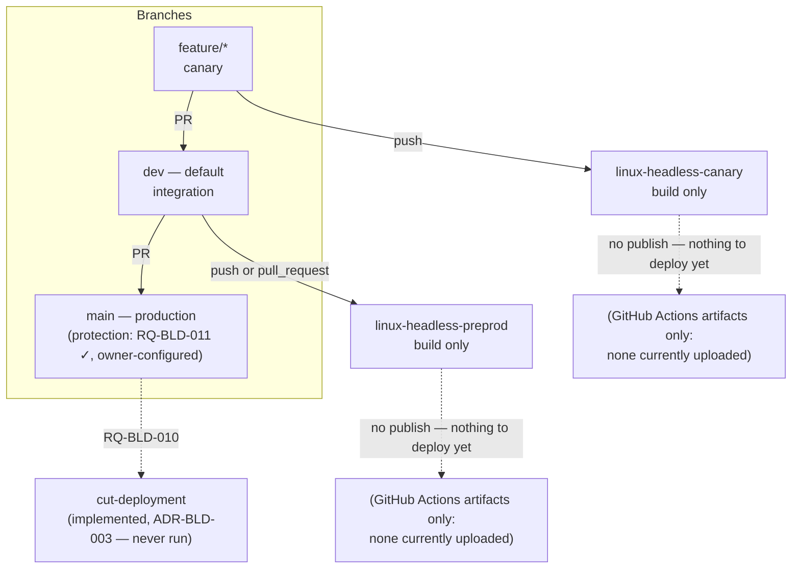

# ADR-BLD-002: Two-Branch Delivery Model and Headless CI Streams

## Status
Accepted — implemented (`dev` created and set as the repository default by the project owner;
`linux-headless-canary.yml` and `linux-headless-preprod.yml` merged and pushed).

## Context

XplorerEditor's `ADR-BLD-003` (`DEC-BLD-013`) replaced a single-branch model with two long-lived
branches — `main` (production) and `dev` (integration, default) — plus `feature/*` canary
branches, each with its own CI/deployment behaviour, and a commit-derived version travelling
through fifteen generated deployment workflows.

This repository has no GUI application yet (no `model`, `controller`, `settings` or `app`
directory — `AGENTS.md`), so most of that ADR does not apply: there is no version to derive for an
artifact that does not exist, and nothing to deploy for `main` to publish. What does transfer
directly is the *branch topology itself* — the reasoning for two long-lived branches and a canary
stream is about giving a place to integrate before reaching users, which holds regardless of
whether there is yet anything to ship — and the *naming discipline* for CI status checks
(`ADR-BLD-003`'s `DEC-BLD-016`: file name = workflow name = job name).

## Decision

**DEC-BLD-004** — Adopt XplorerEditor's branch topology exactly: `main` production/protected,
`dev` integration/default, `feature/*` canary. The project owner created `dev` on GitHub and set it
as the repository's default branch directly (not through this session's tooling).

**DEC-BLD-005** — Two CI workflows, both **headless** (build only, no GUI toolchain, no
deployment — there is nothing to package or publish yet):
- `linux-headless-canary` — triggers on `push` to any branch except `main`/`dev`
  (`branches-ignore: [main, dev]`), matching XplorerEditor's reasoning for its own canary stream
  (`DEC-BLD-024`): fast feedback on a feature branch without needing an open pull request first.
- `linux-headless-preprod` — triggers on both `push` and `pull_request` targeting `dev`, matching
  XplorerEditor's preprod-stream reasoning (`DEC-BLD-024`): `pull_request` verifies what a PR would
  produce if merged, `push` verifies what actually landed. Neither publishes anything, so the
  push-only-publishes distinction that reasoning is built around does not apply here — both runs do
  the same thing (build), which is why this workflow, unlike XplorerEditor's preprod ones, has no
  `if: github.event_name == 'push'` guard anywhere.

**DEC-BLD-006** — Naming and scope, deliberately outside XplorerEditor's
`<os>-<arch>-<config>-<stage>` scheme (its own `RQ-BLD-023`): named `linux-headless-<stream>`
instead, matching the existing precedent in XplorerEditor's own repository
(`linux-headless-release.yml`, which XplorerEditor itself keeps outside that scheme for the
identical reason — it builds no application and deploys nothing). File name = workflow `name:` =
job key is kept as the one property that does transfer.

**DEC-BLD-006a** — Both workflows' triggers carry a `paths: ['juce/**', '<own file>']` filter
(RQ-BLD-012), so a change confined to `documents/`, `process/` or top-level Markdown does not run a
build that cannot say anything about it. Verified against this repository's own CI history after
the fact, not merely asserted: both runs observed so far were triggered by a push whose full commit
range genuinely touched `juce/**`.

**Amended (owner decision, same session)** — This ADR's stream for the `dev` branch was first
named `dev` throughout (`linux-headless-dev`, version suffix `-dev`), diverging from XplorerEditor's
own naming (`preprod`) without a stated reason — an unrequested, undocumented deviation from the
"reproduce XplorerEditor's build system" task this ADR answers, caught when the owner asked why the
generated workflows did not match XplorerEditor's `preprod` naming. Corrected throughout: the
**branch** stays `dev` (that name is this repository's own, not XplorerEditor's, and is unaffected);
the **stream/stage label** built from it is `preprod`, matching XplorerEditor's `RQ-BLD-020`/
`ADR-BLD-003` exactly (`linux-headless-preprod`, version suffix `-preprod`, and `ADR-BLD-003`'s own
`DEC-BLD-008`–`012`, which this correction also propagates to).

**DEC-BLD-007** — No composite actions yet. XplorerEditor's steps live in `.github/actions/`
because fifteen near-identical workflow files make that indirection pay for itself (`RQ-BLD-023`).
Two workflows do not: the ALSA-install/configure/build steps are inlined directly in each of the
two files. Revisit once RQ-BLD-007/008 (the full platform matrix) are implemented — the point at
which XplorerEditor's own justification starts applying here too.

## Consequences

**Easier.** Every push to a feature branch gets a headless build check within minutes; a broken
`dev` merge is caught before it reaches `main`. Both workflows read as a single self-contained
procedure — no composite action to open in a second file to see what a check actually does.

**Was harder, resolved outside this session.** `main`'s protection is not automatic now that it is
not the default branch — `RQ-BLD-011`, out of reach of this session specifically
(repository-administration access, not an application-existence gap like the rest of the backlog
was). The owner configured it directly; `mcp__github__list_branches` confirms `main`'s
`protected: true`.

**Constrained.** Neither workflow can currently prove anything beyond "it compiles" — no test
suite exists yet (`juce/tests`), so a regression that compiles but behaves wrongly is not caught
here. `BUILD_TESTS` (`ADR-BLD-001`) is already wired for when one is added.

**Deferred then implemented, not rejected.** The parts of XplorerEditor's `ADR-BLD-003` this
decision itself does not adopt — commit-derived versioning, the full platform/stream deployment
matrix, the cut-deployment action, composite actions — were captured as backlog requirements
(`RQ-BLD-007`–`RQ-BLD-010`) and a forward-looking ADR (`ADR-BLD-003`), then implemented in the same
session against a minimal placeholder app (`ADR-BLD-003`, now Accepted) rather than left waiting.

## Alternatives Considered

- **Keep `main` as the only long-lived branch.** Rejected — no place to integrate and validate a
  change before it is the only thing anyone can look at, the same reasoning that motivated
  XplorerEditor's own move away from a single branch.
- **Adopt the full `<os>-<arch>-<config>-<stage>` naming and matrix now, with the non-Linux and
  non-headless combinations simply absent.** Rejected: a name states what exists, and
  `windows-x64-debug-canary` naming a job that does not build a Windows binary would be actively
  misleading, not merely incomplete — the same reasoning XplorerEditor itself applies to keep
  `linux-headless-release` outside that scheme.
- **Introduce composite actions immediately, for consistency with where this is headed.**
  Rejected as premature: two workflows sharing one clearly small procedure do not yet suffer the
  drift problem composite actions exist to solve, and an abstraction with one call site each is
  indirection without payoff.

## Diagram

