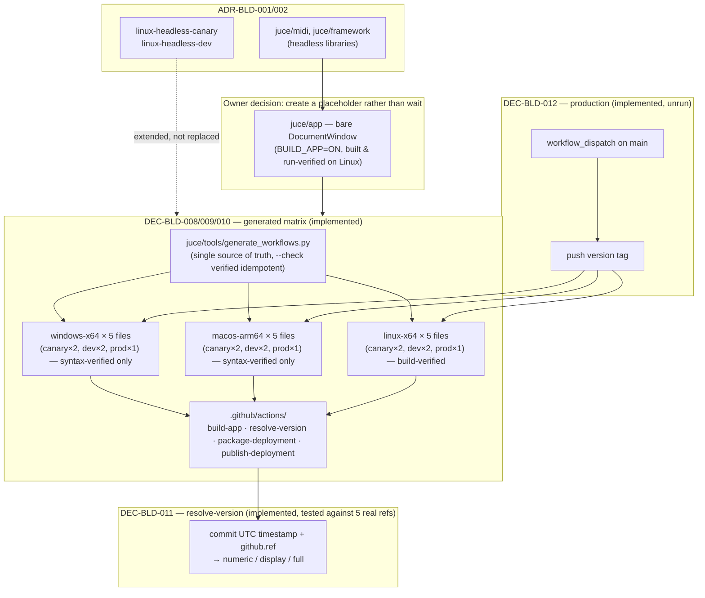

# ADR-BLD-003: Full Deployment Matrix, Generated Workflows and Commit-Derived Versioning

## Status
Accepted — implemented, against a MINIMAL PLACEHOLDER app, not the real editor UI. Originally
recorded as "Proposed" pending a real `model`/`controller`/`settings`/`app` layer; the owner
instead broke that precondition directly (TASK-BLD-005: "créer un stub minimal"), so DEC-BLD-008
through DEC-BLD-012 are implemented against a bare placeholder window rather than waited on. The
"Explicitly out of scope" list below (SBOM, icon, AppImage, attestation, screenshot check, code-
signing notice) remains genuinely out of scope — none of it applies to a window with nothing to
disclose — and stays Proposed/deferred.

## Context

XplorerEditor's `ADR-BLD-003` (two-branch delivery, commit-derived version, deployment streams) and
`ADR-BLD-004` (per-platform build and packaging) together define fifteen deployment workflows —
`windows-x64`/`macos-arm64`/`linux-x64` × (`canary`/`preprod`/`prod`, debug+release where
applicable) — generated from one matrix by `juce/tools/generate_workflows.py`, sharing their steps
through composite actions under `.github/actions/`, each stamped with a version derived purely from
the commit being built.

At the time this ADR was first drafted, none of it applied: this repository had no `model`,
`controller`, `settings` or `app` layer, so there was no GUI application to build for three
platforms, package, or version — `ADR-BLD-002` had adopted only the branch topology and two
headless Linux CI checks. **Superseded by the owner's own decision, same session:** rather than
wait for the real editor UI (a separate, undesigned product effort), create `juce/app` as a
minimal, intentionally-undesigned placeholder — a bare `juce::DocumentWindow` — solely so this
ADR's plumbing has a real target to build, version and package against.

## Decision

**Implemented against `juce/app`, a MINIMAL PLACEHOLDER** (not a `model`/`controller`/`settings`
layer, and not XplorerEditor's own UI in any form — see `juce/app/CMakeLists.txt`'s own header),
reproducing the following, each reproducing the cited XplorerEditor decision with `xpl` identifiers
already established by `ADR-BLD-001` kept as-is, no `XPL_`/project-specific prefix on any new
CMake variable either (owner decision, TASK-BLD-002 follow-up — `ADR-BLD-001`'s amended
`DEC-BLD-003`), and `Xplorer`-branded strings (executable name, archive names) replaced with
`XS56K` ones, the same substitution already applied to the ported source headers (see the "rename
Xplorer to XS56K" commits in this repository's history):

**DEC-BLD-008** — Reproduce the fifteen-workflow platform/architecture/configuration/stream matrix
(`windows-x64`, `macos-arm64`, `linux-x64`; canary/dev/prod streams; debug+release except prod
which is release-only), file name = workflow name = job name
(`<os>-<arch>-<config>-<stage>`) — XplorerEditor's `RQ-BLD-023`/`DEC-BLD-016`.

**DEC-BLD-009** — Reproduce the generator script (`juce/tools/generate_workflows.py` there;
analogous path here) as the single source of truth for the matrix, with a `--check` mode CI can run
to catch a hand-edited, now-stale workflow file — XplorerEditor's `RQ-BLD-033` finding (a missing
explicit `encoding="utf-8"` on the generator's file I/O silently mis-encoded non-ASCII header
characters on a Windows locale) is worth re-reading before writing this repository's own version,
not re-discovering independently.

**DEC-BLD-010** — Reproduce the composite-action split (`build-app`, `resolve-version`, and,
once there is something to package, `package-deployment`/`publish-deployment`) under
`.github/actions/` — XplorerEditor's `RQ-BLD-023` reasoning: shared logic in one place, so fifteen
files stay affordable to keep self-describing.

**DEC-BLD-011** — Reproduce commit-derived versioning exactly: three forms (numeric
`YYYY.M.D.HHMM`, display `YYYY.MM.DD-HHMM`, full `…-HHMM<-stage>`), taken from the commit's own
UTC committer timestamp, stage suffix from `github.ref` (`refs/heads/main` or a tag → none,
`refs/heads/dev` → `-dev`, anything else → `-canary`) — XplorerEditor's `RQ-BLD-020`
(`ADR-BLD-003`, `DEC-BLD-014`/`DEC-BLD-015`). The "why not a daily counter" reasoning recorded
there (no atomic counter primitive across concurrent independent workflows) applies here
unchanged and should not be re-litigated.

**DEC-BLD-012** — Reproduce the explicit cut-deployment action: a `workflow_dispatch` on `main`
that derives the version, pushes it as a tag, and thereby triggers the three `prod` workflows — a
plain push to `main` publishes nothing (XplorerEditor's `RQ-BLD-028`, `DEC-BLD-017`).

**Explicitly out of scope of this ADR**, left for a later decision once the application's own
shape (icon, ancillary data files, audio codec usage) is known rather than assumed from
XplorerEditor's: SBOM generation/embedding (`ADR-ABT-001`, `ADR-BLD-005`), AppImage packaging
(`RQ-BLD-025`), code-signing/first-launch notices (`RQ-BLD-027`), the application icon
(`RQ-BLD-026`), build-provenance attestation (`RQ-BLD-030`), and the macOS launch-screenshot check
(`ADR-BLD-006`). These are product-packaging decisions downstream of what the XS56K application
actually is, not build-system plumbing — reproducing them sight-unseen would be guessing at a
product this repository has not designed yet.

## Consequences

**Easier.** A pull-request check states its own os/arch/config/stream without cross-referencing; a
version uniquely identifies every build everywhere it can be stated (verified: a built binary's
`strings` output contains the exact derived full version — TASK-BLD-006); a production release is
a deliberate act (`cut-deployment`, `workflow_dispatch`-gated), never a side effect of merging.

**Harder.** Fifteen workflow files (generated, not hand-written) plus three composite actions
(`build-app`, `package-deployment`, `publish-deployment` — `resolve-version` was `ADR-BLD-002`'s
already) is materially more moving parts than the two files `ADR-BLD-002` had before this ADR —
accepted by XplorerEditor as the cost of the naming and status-check properties its own
`RQ-BLD-023` requires, for the same reasons here.

**Constrained, not blocked.** The sequencing constraint this ADR was first written under — nothing
implementable before an `app` target exists — was real, and was resolved by creating one
(`juce/app`, minimal placeholder) rather than by relaxing the constraint. Everything built against
it is only as real as the placeholder is: a production deployment today packages an empty window,
not the XS56K editor. The matrix, versioning and cut-deployment mechanics are proven; the product
they will eventually ship is not yet built.

**Verified only on Linux.** `windows-x64` and `macos-arm64` legs of the matrix have no runner
available in this session to build on — checked for YAML validity and structural correctness
(mirrors the already-Linux-verified `linux-x64` legs closely enough to expect the same result), but
not actually run. Their first real signal is their first CI run on GitHub's own runners.

## Alternatives Considered

- **Implement a reduced matrix now (e.g. Linux only) ahead of an application existing.** Rejected:
  there is nothing to build for any platform yet; a reduced deployment matrix with no application
  behind it would build nothing meaningful, no matter how many platforms it lists.
- **Design a different versioning scheme for this project instead of reproducing XplorerEditor's.**
  Rejected for now — the task this ADR answers is explicitly to reproduce XplorerEditor's build
  system, and `DEC-BLD-014`'s reasoning (derivation over a counter, forced by concurrent
  independent CI workflows) is generic to any project built the same way, not specific to
  XplorerEditor's product.
- **Adopt the SBOM/AppImage/icon/attestation pieces now too, since XplorerEditor treats them as
  part of the same build system.** Rejected — see "Explicitly out of scope" above: they depend on
  decisions about the XS56K application (does it embed ancillary data files analogous to
  XplorerEditor's default `.syx` patch? what icon?) that have not been made.

## Diagram

