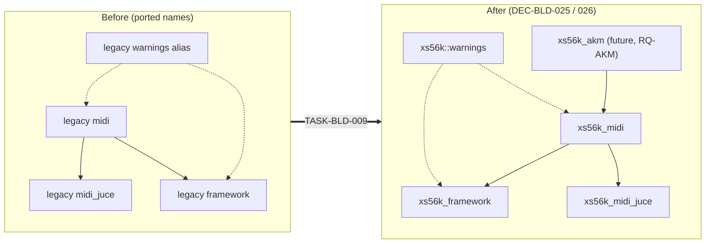

# ADR-BLD-004: Drop the Legacy Project Prefix, Use `xs56k` for Project-Wide Names

## Status
Accepted — implemented (PLAN-BLD-002, TASK-BLD-009/010); verified by a clean Release build with `BUILD_APP=ON` on Windows/MSVC. Linux and macOS legs are exercised by CI only.

## Context

The `juce/midi` and `juce/framework` layers, and the CMake files that build them, were ported from
[xplorer2716/XplorerEditor](https://github.com/xplorer2716/XplorerEditor) (see `AGENTS.md`), which
prefixes its project-wide names with `xpl` ("Xplorer"). The C++ namespaces were already renamed
away from it (commit `rename namespaces`: `common::midi`, `midiapp`); the prefix survives in CMake
target names, the warnings alias, one macro, two library-name strings, two local identifiers, and
in comments and process artifacts describing them. `ADR-BLD-001` (`DEC-BLD-003`) deliberately left
the target names as ported and called renaming them a separate, larger change. The owner has now
decided that the prefix is to be used nowhere, before the new AKM (Akai MIDI) layer adds targets of
its own (RQ-BLD-013).

## Decision

### DEC-BLD-025: CMake targets and alias take the `xs56k` prefix
Rename `xpl_midi` → `xs56k_midi`, `xpl_midi_juce` → `xs56k_midi_juce`, `xpl_framework` →
`xs56k_framework`, `xpl_warnings` → `xs56k_warnings` and its alias `xpl::warnings` →
`xs56k::warnings`. The strings returned by the two `libraryName()` functions follow the target
names. CMake targets live in one global namespace shared with the fetched JUCE, so they keep a
project prefix; this does not contradict the amended `DEC-BLD-003`, which removed the prefix only
from build-local options and cache variables (`BUILD_APP`, `JUCE_VERSION`, …), and those stay
unprefixed.

### DEC-BLD-026: The log macro and local identifiers follow
Rename the macro `XPL_LOG` → `XS56K_LOG` (macros are global, so they keep a prefix). Rename the
two local identifiers in `JuceMidiBackend.cpp`, `toXplMessage` → `toCommonMessage` and
`xplMessage` → `commonMessage`, after the `common::midi` namespace of the type they convert to;
local names need no project prefix. No other C++ symbol changes.

### DEC-BLD-027: Live descriptions follow; provenance stays
Comments, `AGENTS.md`, the CI comment and the process artifacts (`ADR-BLD-001`/`002`/`003`,
`PLAN-BLD-001`, `RQ-BLD`, the S5000 DRAFT plan) are rewritten to the new names wherever they
describe the current state. The passage of `DEC-BLD-003` that records the earlier decision to keep
the ported target names is reworded to point at this ADR without repeating the legacy names.
References crediting XplorerEditor as the origin of ported code (its name, repository URLs, the
`xplorer2716` account) are provenance, not identifiers, and are not touched. This ADR and
RQ-BLD-013 are the only places that name the legacy prefix.

## Consequences

**Easier.** New layers (AKM) start from a codebase with a single naming convention; a
case-sensitive search for the legacy prefix becomes a mechanical check (RQ-BLD-013).

**Harder.** Existing build directories (git-ignored generated output, e.g. `juce/build-win-local`)
still carry the old target names in `CMakeCache.txt` and generated projects. A clean build is
recommended over an incremental one, and is what verifies RQ-BLD-013; wiping the directory also
discards the fetched JUCE, which is downloaded and compiled again. Anyone with a local branch
referencing the old targets (`target_link_libraries` on them) must rename them.

**Unchanged.** Source layout, namespaces, include paths, the `XS56K` executable, version handling
and CI workflow names.

## Alternatives Considered

- **No prefix at all** (`midi`, `framework`, `warnings`): rejected for targets — the names are too
  generic for a global CMake namespace shared with JUCE and future layers. Kept for build-local
  variables, as `DEC-BLD-003` already decided.
- **Keep the legacy names, rename later**: rejected by the owner — the AKM layer would otherwise
  either inherit the prefix or sit beside targets named differently in the same file.
- **A shorter prefix (e.g. `s56k`)**: rejected — `xs56k` matches the product name and the
  `XS56K_*` spelling `DEC-BLD-003` had already considered.

## Diagram

