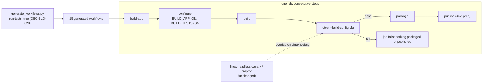

# ADR-BLD-005: Every Generated Workflow Runs the Test Suites

## Status
Accepted — owner decision ("les tests devraient être exécutés dans toutes les targets"); implemented by
TASK-BLD-011 (PLAN-BLD-003). Motivated by RQ-BLD-014. Complements ADR-BLD-003, whose generated
workflows built and packaged the placeholder app but ran no test, and ADR-BLD-002, whose two headless
workflows are the only ones that did.

## Context

`.github/actions/build-app` already knows how to test: its `run-tests` input (default `false`)
configures with `-DBUILD_TESTS=ON` and runs `ctest --build-config <cfg> --output-on-failure` after the
build and before the artefact is located. `juce/tools/generate_workflows.py`, which writes the fifteen
`<os>-<arch>-<config>-<stage>` workflows, never passes it, so no generated workflow ran a test: only
`linux-headless-canary` and `linux-headless-preprod` did, in Debug, on GCC.

Since TASK-AKM-003 a suite exists (Catch2, `juce/tests`), and it has already shown that one platform is
not enough: the codec and scheduler passed on MSVC and GCC, the simulated sampler passed on MSVC and was
rejected by GCC 11 (`-Wmissing-field-initializers`). The AKM layer is threaded and depends on timing, so
Release optimisation and the platform's thread and clock behaviour matter too.

## Decision

### DEC-BLD-028: The generator passes `run-tests: true` to `build-app` in every workflow
The generator's shared `build-app` step gains `run-tests: true`; the fifteen workflows are regenerated.
- **Where.** In the generator, once. The action is unchanged: it already runs the tests in the
  workflow's own operating system and configuration, after the build and before packaging.
- **Gate.** The build, test, package and publish steps are consecutive steps of one job, so a failing
  `ctest` stops the job before anything is packaged or published; a production tag cannot publish an
  untested build.
- **Kept.** The two headless Linux workflows stay: they need only ALSA, give the quickest signal and
  are the only Linux runs that test on a plain library build. On Linux Debug they now overlap the
  generated canary; retiring them is a separate decision.
- **Not covered.** Local developer builds (for instance a Windows build directory of one's own) run
  whatever the developer chooses; this decision is about CI.

## Consequences

**Easier.** A regression that depends on the platform, the compiler or the configuration is caught by
the workflow of that platform, before merge for a canary and before a release for prod; the threaded
tests are exercised in Release, which no Linux run did.

**Harder.** Every generated workflow builds Catch2 and the test executables and runs the suite: longer
runs. A test that fails intermittently now blocks a deployment, production included, so tests must be
deterministic; the one timing-dependent assertion known today is recorded in TASK-AKM-005's
Assumptions. `BUILD_TESTS=ON` also builds the JUCE compile check of TASK-AKM-007 on every platform.

**Unknown until run.** The Windows (MSVC 2022 in CI) and macOS (Apple Clang) legs have never compiled the
tests; their first run is the first signal.

## Alternatives Considered

- **Test on one platform and configuration only (Linux Release).** Rejected: the platforms differ in
  compiler, threads and clocks, and the shipped binary of the others would go untested.
- **Separate test workflows per platform.** Rejected: fifteen more files or a second matrix, and a second
  build of the same sources; a test that passes on a build other than the one that is packaged proves less.
- **Test everywhere except `prod`.** Rejected: publication is what the tests are for.
- **Make `run-tests` default to `true` in the action.** Rejected: the input is also a switch for callers
  that must not test; the generator is the one place that decides for the deployment matrix.

## Diagram

