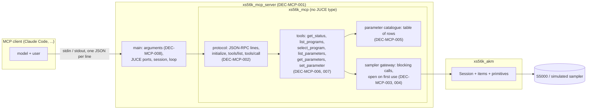
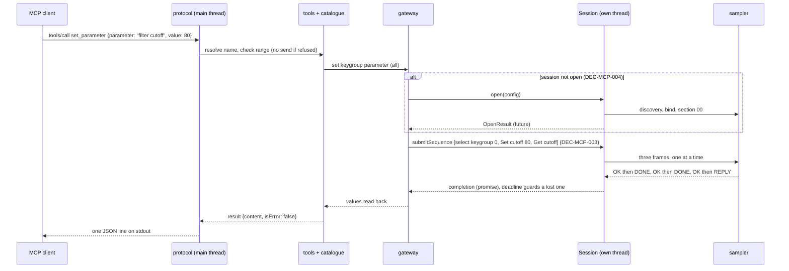

# ADR-MCP-001: MCP Server Architecture — Layers, Transport, Threading, Connection, Parameter Catalogue and Tools

## Status
Accepted — drafted in session MCP (2026-10-04) for FTR-MCP-001 (RQ-MCP-001 to RQ-MCP-012) and accepted by the owner the
same day, without the independent review by a second model that was offered for DEC-MCP-003 (a blocking bridge over an
asynchronous session).

## Context

FTR-MCP-001 asks for a server that lets an MCP client edit a program of the S5000 (filter, amplitude envelope, filter
envelope, LFOs) in the musician's vocabulary. Facts of this repository and of the protocol that shape the answer:

- `xs56k_akm` is the S5000 SysEx layer. Its `Session` is asynchronous: `submit` returns at once and the completion runs on
  the session's own thread; closing a session from one of its own completions is forbidden (ADR-AKM-001 DEC-AKM-002,
  DEC-AKM-004). Its items are data (DEC-AKM-003, DEC-AKM-012): the filter, the envelopes and the LFOs are `ItemId` pairs
  (`KeygroupSetFilterCutoff`/`KeygroupGetFilterCutoff`, `ProgramSetLfoRate`/`ProgramGetLfoRate`, ...) that the generic
  `makeRequest`/`decodeReply` encode and decode; a signed value is catalogued as a sign byte and a magnitude.
- The §08 items act on the **current keygroup of the current program**; keygroup 0 means all, and a Get with 0 current
  answers one value set per keygroup (`getForAllKeygroups`, RQ-AKM-031). The §0A items act on the current program.
- `xs56k_akm` exposes no JUCE type (DEC-AKM-001); the MIDI ports come from `xs56k_midi`'s `MidiBackend`, whose JUCE
  implementation (`xs56k_midi_juce`) is what the probe uses against the real sampler.
- MCP is JSON-RPC 2.0. For a local server, a client launches the process and exchanges messages on its standard input and
  output, one JSON message per line with no embedded newline (the `stdio` transport); standard output must carry nothing
  else. A tool call's failure that the model can act on is a result with `isError: true`, not a protocol error.
- MCP exists in **two eras** (specification pages read in session MCP, 2026-10-04: versioning, stdio transport, discover,
  tools, caching, and the 2025-11-25 lifecycle). The *modern* revision `2026-07-28` is current and stateless: there is no
  `initialize`; every request carries `_meta` with `io.modelcontextprotocol/protocolVersion` and
  `io.modelcontextprotocol/clientCapabilities`; every result carries `resultType`; `server/discover` is mandatory; the lists
  carry `ttlMs` and `cacheScope`; an unsupported version is error -32022. The *legacy* revisions (`2025-11-25` and earlier)
  open with an `initialize` handshake. A modern client probes a stdio server with `server/discover` first and falls back to
  `initialize` on any other error, so a dual-era server serves whichever way the client opens.
- The owner's decisions for this feature (session MCP): the server lives in `juce/mcp`; the MIDI ports are launch
  parameters of the server's configuration; the tools speak the musician's vocabulary ("filter cutoff", "2-pole LP+",
  "amplitude envelope attack"); the JSON library is nlohmann/json. The scope is the editing of a program as a proof of
  concept.

## Decision

### DEC-MCP-001: A library `xs56k_mcp` and an executable `xs56k_mcp_server` in `juce/mcp`, depending on `xs56k_akm` and nlohmann/json
The server's logic is a static library `xs56k_mcp`: it depends on `xs56k_akm` and on nlohmann/json, exposes no JUCE type in its
public headers (checked by a compile check, RQ-MCP-011) and has four units, each testable alone: **protocol**
(JSON-RPC framing, MCP lifecycle, tool dispatch), **parameter catalogue** (the table of human-named parameters),
**sampler gateway** (blocking calls over a `Session`) and **tools** (the six tools, mapping JSON to the gateway and back).
The executable `xs56k_mcp_server` is the only place that knows the JUCE MIDI backend (`xs56k_midi_juce`): it parses the
arguments, builds the real ports and the `Session`, and runs the protocol loop on standard input and output.
nlohmann/json (MIT, header-only) is fetched by CMake like JUCE and Catch2, from the project's release archive pinned by
version and hash (`FetchContent` with `URL` and `URL_HASH`); it is a third-party include, marked `SYSTEM`, so the strict
warnings stay for project code only (RQ-BLD-003). [RQ-MCP-001, RQ-MCP-011]

### DEC-MCP-002: Standard input and output transport; a dual-era server, modern and legacy, both read from the specification
The only transport is `stdio`: the server reads one JSON-RPC message per line from standard input and writes one per line to
standard output (compact, no embedded newline), flushing after each; every diagnostic goes to standard error. The server is
**dual-era** and chooses the era from how the client opens:
- **Modern** (`2026-07-28`): a request whose `params._meta` carries `io.modelcontextprotocol/protocolVersion` is served
  statelessly, nothing being remembered from earlier requests. An unsupported version answers -32022 with
  `data: {supported, requested}`; a missing `protocolVersion` or `clientCapabilities` answers -32602. Every result carries
  `resultType: "complete"` and `_meta["io.modelcontextprotocol/serverInfo"]`. `server/discover` answers the supported
  versions, the `tools` capability, `instructions` and the caching hints; `tools/list` carries `ttlMs` (a named constant,
  short, since the list is fixed per build) and `cacheScope: "public"`; `ping` answers an empty complete result.
- **Legacy** (`2025-11-25`, `2025-06-18`, `2025-03-26`, `2024-11-05`): an `initialize` request selects legacy semantics for
  the process; it is answered with the client's `protocolVersion` when listed, with the latest legacy revision otherwise,
  with the `tools` capability, `serverInfo` and `instructions`; `notifications/initialized` is accepted and `ping` answers
  `{}`; results carry no `resultType`. Of the legacy revisions only `2025-11-25` was read in full: the three older ones are
  listed because the messages this server uses (`initialize`, `tools/list`, `tools/call`) have the same shape in them, and
  a client that asks for one confirms it.
`tools/list` and `tools/call` are served in both eras with the same tool results (content text and `isError`); anything
else answers -32601; a request with no `_meta` before any `initialize` answers -32602, the spec's answer to a request
missing its required `_meta`. A notification gets no answer and an unknown one is ignored. A parse error answers -32700 with
a null id and the server keeps reading; valid JSON that is not a request answers -32600. Requests are handled one at a time
in arrival order (DEC-MCP-003). [RQ-MCP-001, RQ-MCP-009]

### DEC-MCP-003: One request at a time on the main thread, blocking on the session's completion through a deadline
The protocol loop runs on the process's main thread and handles one request at a time. A tool that needs the sampler calls
the gateway, which `submit`s the command(s) to the `Session` and waits for the completion on a `std::promise`/`std::future`
with a deadline slightly above the session's own worst case (command timeout plus margin), so a lost completion cannot hang
the client. The wait happens on the main thread, which is neither the session's thread nor the MIDI backend's callback
thread, so no completion is blocked by it (DEC-AKM-002: completions run on the session's executor and never block the
caller). The session's executor is a `ThreadExecutor` and its scheduler a `RealScheduler`, as in the probe. Closing the
session at the end of the input, also from the main thread, satisfies "never from the session's own thread"
(DEC-AKM-004). A tool that needs several commands (a Set then a Get, a keygroup selection then a Set) submits them as one
sequence (`submitSequence`, DEC-AKM-010) so nothing is interleaved and the first failure cancels the rest. Because requests
are serial, the server needs no lock of its own. [RQ-MCP-009, RQ-MCP-006]

### DEC-MCP-004: The connection is opened when first needed, retried when it failed, closed with the input
The server does not open the session at start: `initialize` and `tools/list` work with the sampler off. The first tool that
needs the sampler runs `Session::open` with the configuration the launch arguments gave (DEC-MCP-008; Sync LCD and Auto
screen update are left to the session's defaults unless `--no-lcd`); if the opening fails (no sampler, ambiguous, a setting
refused) the tool's result is an error with the reason, the session is discarded and the next such call tries again. A
session that opened stays open. When the input ends, or on the MCP shutdown, the server calls `Session::close` and waits for
`onClosed` (the §00 settings are put back, RQ-AKM-042) before exiting, with the same bounded wait as the probe. A MIDI port
that cannot be opened at all is reported the same way, as a tool error naming the port. [RQ-MCP-003]

### DEC-MCP-005: The parameter catalogue is a table of musician-named rows, checked against the item catalogue
Each parameter is one row of a table in the library: its name in words (`"filter cutoff"`), aliases (`"cutoff"`, `"filter
frequency"`), its group (`filter`, `amplitude envelope`, `filter envelope`, `lfo 1`, `lfo 2`), a one-line description, its
scope (**keygroup**: §08, acts on the current keygroup; **program**: §0A), the Set and Get `ItemId`s, the fixed leading
arguments (the LFO number for an LFO row), and a **value kind**: `Number` (a range in front-panel units), `Signed` (the
catalogue's sign and magnitude pair, presented as one signed number, -N to +N), `Choice` (labels as the sampler's screen
shows them, in code order: the 26 filter types, the 9 LFO waveforms, the six attenuations "0 dB"..."30 dB") or `Switch`
(off, on). The units are the sampler's own, as in the spec and on the front panel (0 to 100 and so on); no conversion to
Hz or seconds is invented, because the spec gives none. A name resolves case-, space- and hyphen-insensitively, then through
aliases; an unknown name is refused with the nearest names as suggestions. A choice resolves by label (same tolerance) or by
code. A unit test compares every row with `descriptor(ItemId)`: the items exist, take the arguments the row gives, and the
range of the row equals the item's. A new parameter is a new row, not new code (the design choice of DEC-AKM-003).
[RQ-MCP-004, RQ-MCP-005, RQ-MCP-006, RQ-MCP-010]

### DEC-MCP-006: Six tools, generic in the parameter but named in words; "all keygroups" by default; every Set is read back
The tools are `get_status`, `list_programs`, `select_program`, `list_parameters`, `get_parameters` and `set_parameter`. They
are few and generic in the parameter (one `set_parameter` for every parameter) because the catalogue is data: the tool list
the client has to hold stays six whatever the number of parameters, and the vocabulary is the catalogue's, which
`list_parameters` returns and each tool's schema and description point to. Each tool has a JSON input schema; the choices of
`parameter` are not enumerated in the schema (the list would be as long as the catalogue) but the description says to call
`list_parameters` first. `keygroup` is optional: a number from 1 to the program's keygroup count, or `"all"`, the default —
keygroup 0 (§08/&01), under which a Set reaches every keygroup and a Get answers one value per keygroup. A keygroup
parameter selects the keygroup, then sets, then reads back in one sequence (DEC-MCP-003); the answer of `set_parameter` is the
value the sampler reports. A program parameter (the LFOs) takes no keygroup and refuses one. `select_program` takes a
`name` or a zero-based `index` (exactly one). The sampler's current keygroup is left as the last edit set it (open point of
FTR-MCP-001). [RQ-MCP-005 to RQ-MCP-007]

### DEC-MCP-007: The server edits, it never creates, deletes, renames or saves
The gateway offers only: selecting a program by name or index, reading the program names, count and keygroup count,
selecting a keygroup, and the Set and Get items of the catalogue. It holds no call to the AKM primitives that create,
delete, rename or save, or to any section other than §0A selection and information, §08 selection and the catalogue's
items; a test searches the library's sources for them (RQ-MCP-008). The tool annotations follow the MCP convention:
`get_status`, `list_programs` and `list_parameters` and `get_parameters` are `readOnlyHint` true; `select_program` and
`set_parameter` are `readOnlyHint` false and `destructiveHint` false (they overwrite a value in memory, they delete
nothing) and `idempotentHint` true; every description says that a change acts on the sampler's memory, not on disk, and that
the program is lost if the sampler is switched off without saving it from the front panel. [RQ-MCP-008]

### DEC-MCP-008: Configuration is the launch arguments, nothing else
`--in <port>`, `--out <port>` (required), `--device-id <0-127>` (default: the session's), `--timeout-ms <n>` (default: the
session's) and `--no-lcd`, plus `--list-ports` and `--help`. No file, no environment variable and no tool sets the ports: a
client's server configuration (for Claude Code, the `command` and `args` of the server entry) is the one place they are
written. The argument parser is a pure function returning the configuration or a usage error, tested without a process.
[RQ-MCP-002]

### DEC-MCP-009: Tested bottom-up on in-memory streams and the simulated sampler; the server also runs against the simulated sampler
Each unit is tested alone (the protocol on string streams; the catalogue against the item catalogue; the gateway on a session
over the simulated sampler's `MidiBackend`; the tools end to end as JSON in, JSON out). A second executable under
`juce/tests`, `xs56k_mcp_server_simulated`, wires the same library to the simulated sampler instead of the JUCE backend: a
scripted conversation piped into it is a `ctest` entry (RQ-MCP-012) and lets a person try the server in an MCP client with
no sampler. The simulated sampler lives in test support and never ships in `xs56k_mcp_server`. The owner's run on the real
sampler (`TASK-MCP-009`) records what the simulated sampler had wrong, as every AKM section did. [RQ-MCP-011, RQ-MCP-012]

## Consequences

- **Easier.** Adding a parameter or a whole group is a row of the table; extending to another domain adds rows and, for a
  domain with another target (multis, samples), a gateway method and a tool or two. The same library can later serve another
  transport or an in-process caller. The tool list the model sees stays at six.
- **Harder.** Two eras mean two result shapes (`resultType`, caching hints, `_meta`) in the protocol unit; the tools see
  neither: a tool returns text and an error flag.
- **Easier.** Everything but the executable's `main` is testable in `ctest` without hardware or a process.
- **Harder.** One new third-party dependency (nlohmann/json) in every build, including the CI workflows; it is header-only
  and pinned, but it is fetched at configure time.
- **Constrained.** Requests are serial: a slow sampler command (up to the timeout) blocks the next request. This is the
  sampler's own constraint (one command in flight per port, DEC-AKM-002) and acceptable for a proof of concept.
- **Constrained.** Units are the sampler's, not Hz or seconds. A model that wants "a cutoff of 1 kHz" gets no conversion; it
  must work in 0 to 100. A conversion would need a measured table the spec does not give.
- **Constrained.** The generic `set_parameter` carries the parameter in a free string: a typo is caught by the catalogue's
  resolution and answered with suggestions, not by the schema.
- **Risk.** `Session::open` changes the sampler's §00 settings (checksums, Still Alive, Sync LCD, Auto screen update) for the
  life of the server; a server killed without its close leaves them changed until the sampler is switched off or the next
  session closes. This is the AKM layer's known behaviour, not new, but a client that kills its server makes it likely.

## Alternatives Considered

- **One tool per parameter (about 60).** Closest to a typed schema, but the client's tool list grows with every parameter
  and every later domain, and each description is read by the model on every turn. Rejected for the proof of concept; the
  per-parameter schemas it would give are replaced by `list_parameters` and the resolution errors.
- **One tool per group with optional fields** (`set_filter{cutoff, resonance, ...}`). A typed middle way, but each group
  needs a hand-written schema and handler, and the LFOs' two instances and the keygroup scope complicate it. Rejected: the
  table gives the same vocabulary with no per-group code.
- **juce::JSON (juce_core) instead of nlohmann/json.** No new dependency, but `juce::var` is clumsy to build and read
  and ties the protocol layer to JUCE. The owner chose nlohmann/json.
- **An asynchronous server (answering while a command is in flight).** MCP allows concurrent requests, but the sampler
  allows one command at a time; the queue would be the session's, and the gain is nil for a single client. Rejected.
- **Opening the session at start.** Simpler, but `tools/list` would then fail with the sampler off and a sampler powered on
  later could not be reached without restarting the server. Rejected for DEC-MCP-004.
- **Configuration by environment variables or a file.** A second place to look for the ports; the owner's decision is the
  server's configuration in the client, i.e. the launch arguments.
- **Unit conversions (Hz, seconds, dB).** Not in the spec; would be invented. Rejected.

## Diagram

### Domain dictionary

| Term | Meaning |
|---|---|
| MCP | Model Context Protocol: JSON-RPC 2.0 between a client (a model with a person) and a server that offers tools |
| tool | a named operation a client can call, with a JSON input schema and a result |
| parameter (catalogue) | one editable value in the musician's vocabulary, one row of the table (DEC-MCP-005) |
| keygroup parameter | a §08 value, acting on the current keygroup of the current program |
| program parameter | a §0A value (an LFO's), acting on the current program |
| "all" keygroups | keygroup 0 of §08/&01: a Set reaches every keygroup, a Get answers one value per keygroup |
| read-back | the Get that follows a Set and whose answer the tool reports |
