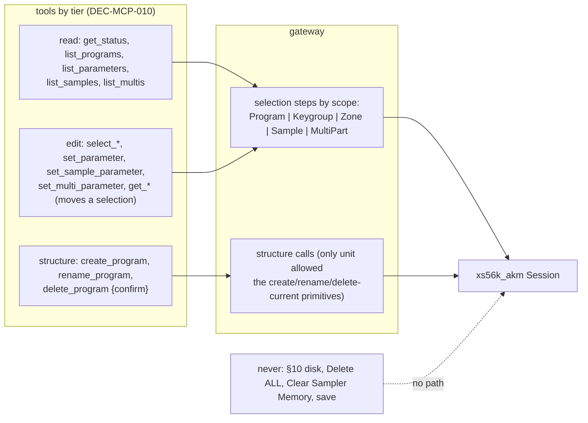
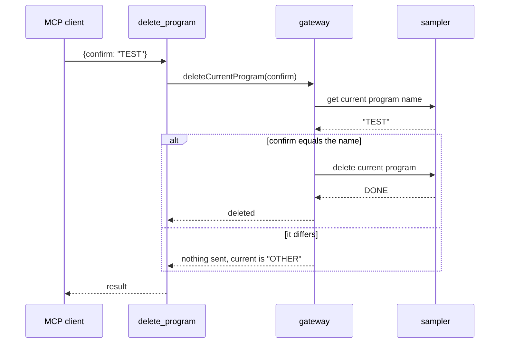

# ADR-MCP-002: MCP Server — Safety Tiers, the Delete Guard and Targets Beyond the Program

## Status
Proposed — drafted in session MCP (2026-10-05) for FTR-MCP-002 (RQ-MCP-013 to RQ-MCP-022) under the owner's delegation
(HOL, Human on the loop): the owner reviews it with the commits of the pull request. It amends ADR-MCP-001 DEC-MCP-007
(the server never creates, deletes, renames or saves) and extends DEC-MCP-006 (the six tools) and DEC-MCP-005 (the
catalogue); the other decisions of ADR-MCP-001 stand. No independent review by a second model was run.

## Context

FTR-MCP-002 asks the server to create, rename and delete programs in memory, to carry more parameters of the keygroup and
the program, and to reach zones, samples and multis. Facts that shape the answer:

- ADR-MCP-001 DEC-MCP-007 made the server edit-only and a `ctest` entry (`mcp_sources_call_no_destructive_primitive`)
  searches the library's sources for the AKM create, delete, rename and save primitives. Structure tools contradict that
  rule as written; the rule's purpose — a model must not be one call from losing data it cannot get back — still holds for
  the disk and for delete-all.
- The AKM layer has all the primitives needed in memory: `createProgramWithKeygroups`, `renameCurrentProgram`,
  `deleteCurrentProgram` (§0A), the sample selection (§0E/&05, &06) and Set and Get items (§0E), the multi selection
  (§0C/&05, &06) and the part items (§0C, `Data1` = part), the zone items (§06). Deleting acts on the **current** program.
- The sampler's selections are global state: the current program, keygroup, zone, sample and multi are each one value held
  by the sampler. An edit is "select, then set, then read back" in one sequence (DEC-MCP-003).
- The observed failure mode of the S5000 is on the disk (§10: commands that left it answering nothing until power-cycled);
  nothing observed makes the in-memory create, rename or delete dangerous to the sampler itself, only to the program deleted.
- The owner's sampler held no program and no sample when the session started: a real run of an edit tool needs the server to
  create its own target.

## Decision

### DEC-MCP-010: Three tiers, declared by each tool; a fourth class is never offered
Every tool is *read* (changes nothing; `readOnlyHint` true), *edit* (overwrites a value in memory; `readOnlyHint` false,
`destructiveHint` false, `idempotentHint` true) or *structure* (creates, renames or deletes an object in memory;
`readOnlyHint` false; `destructiveHint` true only for a tool that can delete, false for create and rename; not idempotent for
create). Descriptions of edit and structure tools carry the memory notice (memory, not disk). **Never offered**: any tool that
saves or loads a file or touches §10, Delete ALL Programs, Delete ALL Multis, Clear Sampler Memory, and any sampler setting
outside the session's own §00 handling. The source-search test of ADR-MCP-001 becomes an allow/deny list: it still fails on
a call to the disk primitives, the delete-all primitives and Clear Sampler Memory, and no longer fails on the create, rename
and delete-current primitives of programs, which only the structure tools of the gateway may call. [RQ-MCP-013, RQ-MCP-014,
RQ-MCP-015, RQ-MCP-016, RQ-MCP-017]

### DEC-MCP-011: Create returns the new program; delete is guarded by the current program's name
`create_program {name, keygroups}` validates the name and the count (the same limits as the AKM primitive), creates, and
answers the program read back (it is current after creation). `rename_program {name}` renames the current program and reads
the name back. `delete_program {confirm}` reads the current program's name from the sampler at the moment of the call, and sends
`deleteCurrentProgram` only when `confirm` equals it; otherwise it sends nothing and answers the current program's name. The
tool never takes a position or selects another program, so a deletion is always of the program the client has just been told
is current. Delete-all is not in the gateway. After a deletion the sampler's current program is whatever it reports; the tool
says so. [RQ-MCP-015, RQ-MCP-016, RQ-MCP-017]

### DEC-MCP-012: The scope of a parameter says what to select; zones are a scope of the program catalogue, samples and multis are catalogues of their own
`ParameterScope` gains `Zone`. A zone parameter's edit is `[select keygroup, select zone, Set, Get]`; a `zone` argument (1 to
the zone count, or "all") joins `keygroup` on `get_parameters` and `set_parameter`, and a program or keygroup parameter refuses
it. The rows added by lot 3 (auxiliary envelope, pitch and amplitude, general options of the keygroup; output, MIDI/tune,
pitch bend and keygroup modulation sources of the program) are `Keygroup` or `Program` rows, groups of their own, with no
new code. Samples and multis do not share the program's target: each has a catalogue of its own (a `ParameterCatalogue`
instance, with scopes `Sample`, `MultiGeneral` and `MultiPart`), and the gateway's edit routine takes the scope's selection
steps from a small function of the scope. [RQ-MCP-018, RQ-MCP-019, RQ-MCP-020, RQ-MCP-021]

### DEC-MCP-013: Separate tools per domain for samples and multis
`list_samples`, `select_sample`, `get_sample_parameters`, `set_sample_parameter` and `list_multis`, `select_multi`,
`get_multi_parameters`, `set_multi_parameter` (with `part`, 1 to 16 or "all"). The program's tools keep their names and gain
`zone`. The alternative of one `target` argument on the generic tools is rejected: a description that names its object
("the current sample") is read correctly by a model at the moment of the call, and the program tools' descriptions stay
short. The tool list grows from 6 to 6 + 3 (program structure) + 8 (samples, multis) = 17; each description is one paragraph.
`list_parameters` stays the one way to learn names and gains an optional `domain` argument (`program`, the default, `sample` or
`multi`), so the number of tools does not grow for the lists. [RQ-MCP-020, RQ-MCP-021]

### DEC-MCP-014: The simulated sampler is corrected before it is trusted, and a real run precedes the next layer
Each structure tool is first run on the simulated sampler in `ctest`, then once on the real S5000 on an object created for
the purpose, with the answers recorded in the observations file and the simulator changed where the real sampler differed (the
discipline of every AKM section). A tool is not documented as hardware-verified before that run; the documentation says "run
on the simulated sampler only" until then. [RQ-MCP-022]

## Consequences

- **Easier.** A client can build its own scratch program, so the owner's real runs need nothing prepared by hand; the catalogue
  grows by rows; samples and multis reuse the catalogue machinery (name resolution, value rules, read-back).
- **Harder.** The tool list is 17 tools, not 6: each description is read on every turn. The gateway's edit routine has one more
  axis (the scope's selection steps).
- **Constrained.** A deletion cannot be undone from the server. The guard makes an accidental deletion require the program's
  name twice (once from the model's last read, once in `confirm`), not impossible.
- **Constrained.** The sampler's current program, keygroup, zone, sample and multi are left as the last call set them; a
  client that edits then relies on `get_status` to know where it stands.
- **Risk.** The source-search test is weaker than before (it allows three primitives in one unit); the test names the unit
  allowed to call them, and a call elsewhere fails it.
- **Risk.** Whether the S5000 keeps its own state sane after a create/delete cycle through the MCP is observed on the real
  sampler only (DEC-MCP-014); the simulator is not evidence.

## Alternatives Considered

- **Keep the server edit-only and have the owner prepare a scratch program by hand.** Safest, and ADR-MCP-001's choice; but it
  blocks every real run on a manual step and leaves the client unable to do the most natural thing ("make me a program").
  Rejected by the owner's brief for this session.
- **Delete by name or position (`delete_program {name}`).** Shorter, but a model that deletes by name acts on something it
  may not know is current. The current-program-plus-confirm form ties the deletion to what the client was last told.
- **A single `confirm: true` flag.** Does not tie the call to an object. Rejected.
- **One generic `target` argument on `get_parameters`/`set_parameter` for sample, multi and zone.** Fewer tools, but the
  description cannot name the object, and a mistaken domain silently selects the wrong state. Zones, which are a refinement
  of a keygroup, do use an argument (`zone`); samples and multis, which are other objects, do not.
- **Save to disk.** Requested as a possibility and refused for this feature: §10 commands are the ones that hung the sampler,
  and a save from a model overwrites a file on a disk the owner cannot see from the server.

## Diagram

### Domain dictionary

| Term | Meaning |
|---|---|
| tier | read, edit or structure: what a tool can do to the sampler's memory |
| structure tool | one that creates, renames or deletes an object in memory |
| scope | where a value lives (program, keygroup, zone, sample, multi general, multi part), which says what to select before a Set or a Get |
| zone | one of a keygroup's sample slots (§06) |
| part | one of the 16 slots of a multi (§0C) |
| delete guard | `confirm` must equal the current program's name read at the moment of the call |
