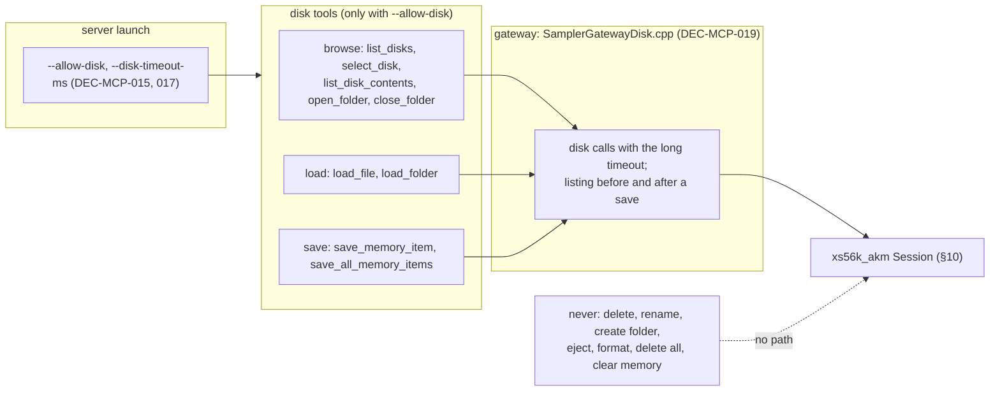
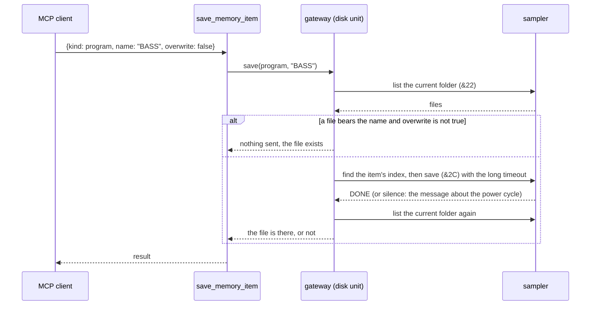

# ADR-MCP-003: MCP Server — Disk Tools (Browse, Load, Save) and Their Guards

## Status
Proposed — drafted in session MCP (2026-10-05) for FTR-MCP-003 (RQ-MCP-023 to RQ-MCP-030) under the owner's delegation (HOL, Human
on the loop), after the owner asked for loading and saving through the server. It amends ADR-MCP-002 DEC-MCP-010 (section 10 was
"never offered"): browsing, loading and saving become offered behind the guards below, and delete, rename, create-folder, eject
and format stay never offered. The other decisions of ADR-MCP-001 and ADR-MCP-002 stand. No independent review by a second model
was run. **DEC-MCP-020 (2026-10-05)** narrows DEC-MCP-017 for the refresh: it needs `--allow-disk-refresh` as well.

## Context

FTR-MCP-003 asks the server to browse the sampler's disks, load files and save memory items. Facts that shape the answer:

- SysEx section 10 acts on the sampler's **own disks**: the server cannot move a file from the computer to the sampler. Loading is
  "load this file of the disk plugged into the sampler".
- The AKM layer has the primitives (`updateDiskList`, `getConnectedDisks`, `selectDisk`, `getFolderCount`, `getAllFolderNames`,
  `openFolder`, `closeFolder`, `getAllFileNames`, `getFileSize`, `loadFile`, `loadFileWithDependents`, `loadFolder`,
  `saveMemoryItem`, `saveAllMemoryItems`) and the destructive ones (`deleteFile`, `deleteSubFolder`, `ejectDisk`, `createFolder`,
  `renameFile`, `renameFolder`). `FTR-AKM-007` RQ-AKM-070 says the six slow commands (`&01`, `&15`, `&2A`, `&2B`, `&2C`, `&2D`)
  must not be sent to the real sampler without an explicit guard, citing the hang.
- The hang (`OBSERVATIONS-RQ-AKM-017-real-sampler-suite.md`, F4 to F7): on the owner's S5000 with no disk attached, the refresh of
  the disk list (`&01`) was accepted and then answered nothing at all, no DONE, no ERROR, no `F0 F7` although Still Alive was on, and
  the sampler answered no SysEx, a fresh discovery included, until it was switched off and on by hand.
- The sampler's current disk and current folder are global state (like the current program): "the disk selection by SysEx is not the
  front panel's"; every file operation acts on the current folder of the selected disk.
- The primitives that load and save take no timeout of their own: the session's command timeout (2 s by default) applies, which is
  short for a disk operation. `CommandOptions::timeout` exists and replaces it for one command.
- A save has an `overwriteExisting` flag with no default and a `saveChildren` flag; with `overwriteExisting` false the sampler skips
  a file that exists, which tells the caller nothing by itself: whether the file was written is read from the listing afterwards.
- The server already has tiers (read, edit, structure; ADR-MCP-002 DEC-MCP-010), launch arguments as its only configuration
  (ADR-MCP-001 DEC-MCP-008) and a source-search test written as an allow list.

## Decision

### DEC-MCP-015: A fourth tier, "disk", offered only when the server is launched with `--allow-disk`
Disk tools carry a tier of their own, declared in their annotations and descriptions: browsing is *read* of the disk (`list_disks`,
`list_disk_contents`: `readOnlyHint` true) or an *edit* of the sampler's disk selection (`select_disk`, `open_folder`,
`close_folder`: `readOnlyHint` false, not destructive); loading is a change of memory (`load_file`, `load_folder`:
`readOnlyHint` false, `destructiveHint` false, `idempotentHint` false); saving writes the disk (`save_memory_item`,
`save_all_memory_items`: `readOnlyHint` false, `destructiveHint` true, since a file can be replaced when `overwrite` is true).
`--allow-disk` is a launch argument (ADR-MCP-001 DEC-MCP-008): without it the disk tools are not built into the tool list, so
`tools/list` does not show them and a call to one is the invalid-params error of any unlisted tool; with it they are. The owner
writes it in the client's server configuration, which is the one place the ports are written too. [RQ-MCP-023]

### DEC-MCP-016: The disk is a navigation, as the programs are a selection
`list_disks` lists the connected disks with their handle, name, type, format and whether they are writable, and sends the refresh of
the disk list (`&01`) **only when `refresh` is true**; `select_disk` takes a name or a handle and selects it (and says if it is not
valid or writable); `list_disk_contents` reports the current path, the sub-folders and the files with their sizes of the current
folder; `open_folder` descends into a sub-folder by name and `close_folder` goes up one level. Loads and saves act on the current
folder, and the answers always say the disk and the path they acted on. The server reads the state from the sampler at each call and
keeps none of its own. [RQ-MCP-024]

### DEC-MCP-017: Slow commands have a timeout of their own and a message that says what a silent sampler means; the server never retries
The primitives of the loads, the saves and the refresh gain a defaulted `CommandOptions` parameter (the existing callers are
unchanged), through which the gateway passes `timeout` and `maxTotalWait` of `--disk-timeout-ms` (default 120000). The wait of the
gateway for such a command is that timeout plus its margin, not the ordinary command timeout. A timeout is answered with a message
that names the wait and says that the sampler may have to be switched off and on, and that nothing was retried; the gateway does
not send another disk command on its own after it. One slow command runs at a time (the requests are serial, ADR-MCP-001
DEC-MCP-003). A load answers what changed in memory (the counts of programs and samples before and after, read with the ordinary
commands). [RQ-MCP-025, RQ-MCP-029]

### DEC-MCP-018: A save does not overwrite by accident, is checked by the listing, and a bulk save is tied to the count
`save_memory_item {kind, name, overwrite?, save_children?}` finds the item's position (the program's index by name, the sample's or
multi's by the names of the list), refuses a disk that is not writable, and, when `overwrite` is not true, lists the current folder
first and refuses if a file bears the item's name (compared without its extension, since the file name rule is not assumed); it sends
the save, then lists the folder again and answers whether a file of that name is there. `save_all_memory_items {kind, confirm,
overwrite?, save_children?}` is sent only when `confirm` equals the number of items of that kind in memory, and answers how many files
the folder gained. `overwrite` and `save_children` default to false and are passed explicitly to the primitive. [RQ-MCP-026,
RQ-MCP-027]

### DEC-MCP-019: The source check allows the disk primitives of browsing, loading and saving in one file, and no other
The disk calls live in `juce/mcp/src/SamplerGatewayDisk.cpp` (members of `SamplerGateway`). `CheckNoDestructiveCalls.cmake` allows
there, and nowhere else, `selectDisk`, `updateDiskList`, `openFolder`, `closeFolder`, `loadFile`, `loadFileWithDependents`,
`loadFolder`, `saveMemoryItem`, `saveAllMemoryItems` (the names that carry a forbidden verb); the delete, rename, create-folder, eject
and format primitives, `deleteAllPrograms`, `deleteAllMultis`, `deleteAllSamples` and Clear Sampler Memory stay forbidden in every
file. A test of the tool list also checks that no tool is named after them. [RQ-MCP-028]

### DEC-MCP-020: The refresh of the disk list is offered only with a launch option of its own, `--allow-disk-refresh`
Decided on 2026-10-05, after the real run (TASK-MCP-023): on the owner's S5000 with its SCSI2SD disk plugged in (S5K, FAT32), the
refresh of the disk list (`&01`) was sent by `list_disks` with `refresh: true`, got no reply in the 120000 ms of the disk timeout, and
the next command got none either: the sampler answered nothing until the owner switched it off and on. The owner says the hang is
linked to the SCSI2SD. The same run showed the refresh is not needed for a connected disk: listing, selecting, browsing and loading
a program (0.3 s) and a 40 MB sample (60 s) all worked without it. So the refresh stops being a per-call choice of the model:
`--allow-disk-refresh` (which needs `--allow-disk`, otherwise a usage error) puts a `refresh` argument in `list_disks`; without it
the schema has no `refresh`, `refresh: true` is refused with an answer that names the option and nothing is sent, and the answer
about an empty list says that the sampler's list is not refreshed by this server. `refresh: false` is accepted as a no-op. The
simulated server takes the option too. [RQ-MCP-031, RQ-MCP-024, RQ-MCP-029]

## Consequences

- **Easier.** A person can bring a sample, a program or a multi into memory through the server and keep what they edited, from a disk
  the sampler already has; the editing tools of FTR-MCP-002 then have material to work on.
- **Harder.** Seven more tools when `--allow-disk` is given (list_disks, select_disk, list_disk_contents, open_folder, close_folder,
  load_file, load_folder, save_memory_item, save_all_memory_items: nine); a client that passes the flag takes the hang risk.
- **Constrained.** A hang is not recoverable from the server: after a timeout the sampler must be switched off and on by hand, and
  the server's session then needs to be reopened (the next call opens a new one, ADR-MCP-001 DEC-MCP-004).
- **Constrained.** A load can add programs and samples whose names collide with the ones in memory; what the sampler does then is not
  known and is observed in the real run.
- **Risk.** The real behaviour of `&15`, `&2A`, `&2B`, `&2C` and `&2D` with a disk plugged in is not known; the simulator is not
  evidence (DEC-MCP-014 of ADR-MCP-002 applies: each tool is run once on the real sampler, one slow command at a time, with the
  owner present).
- **Risk.** The source check allows nine disk primitives in one unit: a call elsewhere fails it, and so does a call to any other.

## Alternatives Considered

- **Always offer the disk tools.** Simplest, but the default configuration would be one tool call from the hang. Rejected for the
  opt-in flag.
- **Offer them behind a per-call `confirm` instead of a flag.** A model can pass a flag as easily as a person; a launch argument is
  the owner's decision, not the client's.
- **Never refresh the disk list.** Avoids the observed hang, but the spec says the list may be stale until a refresh has run once in
  a session. The refresh is offered, off by default, and said to be the risky call.
- **A longer ordinary command timeout for everything.** Would make every failure of a fast command slow. Rejected for the disk-only
  timeout.
- **Save by overwriting by default.** What the sampler does when the flag is set to 1; rejected by the owner's choice (refuse unless
  `overwrite` is explicit).
- **Moving files between the computer and the sampler.** Not in the SysEx specification; out of scope.

## Diagram

### Domain dictionary

| Term | Meaning |
|---|---|
| disk | a drive connected to the sampler (hard disk, floppy, CD-ROM, removable), named by its handle and its name |
| current disk, current folder | the sampler's own selection; every load and save acts on them |
| slow command | `&01` refresh, `&15` load folder, `&2A` and `&2B` load file, `&2C` and `&2D` save: those that may take long or hang |
| load with dependents | a file and the files it depends on (a program and its samples), `&2B` |
| disk tier | the tier of a tool that reads or writes the sampler's disk |
