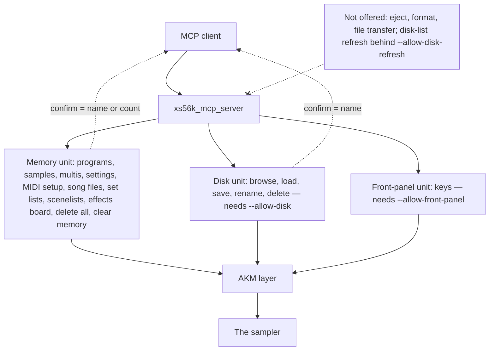

# ADR-MCP-005: MCP Server — The Remaining Sampler Functions, the Confirmation by Count, a Launch Option for the Front Panel and the Order of the Work

## Status
Proposed — drafted in session MCP (2026-10-07) for FTR-MCP-005 (RQ-MCP-046 to RQ-MCP-057), after the owner decided, item by item, what
`ADR-MCP-004` (DEC-MCP-025) had left to him. It amends ADR-MCP-004 DEC-MCP-025 (the list of what is not offered), RQ-MCP-014 and
RQ-MCP-028 (their "never offered" lists); the other decisions of ADR-MCP-001 to ADR-MCP-004 stand. No independent review by a second
model was run on this record.

## Context

`ADR-MCP-004` closed with a list of functions the server did not offer, "each left to the owner with its reason (none is excluded for
good)". On 2026-10-07 the owner answered each item (the owner's words are summarised in the table of FTR-MCP-005): song files, set
lists and scenelists, the sampler's settings and MIDI setup, the effects board, delete all and clear memory, and the front-panel keys
are to be implemented; ejecting a disk is not; the refresh of the disk list stays as it is; formatting is outside the specification.

Facts that shape the answer (read in `juce/akm/include/akm` on 2026-10-07):

- The AKM layer has the primitives for everything the owner accepted: `SystemSetup` (name, clock, play mode, front-panel lock, each
  with a Set and a Get; `clearSamplerMemory` behind a typed confirmation), `MidiConfig` (§04, Set items only), `SongPrimitives` and
  `SceneListPrimitives`, `MultiFxPrimitives`, `FrontPanel`, and the three Delete ALL primitives with typed confirmations.
- **§04 (MIDI setup) has no Get.** The server cannot read a MIDI setting, and so cannot put one back; the same is already true of
  the session's §00 settings (ADR-MCP-004 DEC-MCP-027).
- **A set list has no select** in the AKM layer: count, name, rename and delete only. A song file and a scenelist have a current one.
- `saveMemoryItem` already has the types song file (Smf), set list and scenelist; the disk tools of ADR-MCP-003 do not offer them.
- **The existing confirmation rule** (ADR-MCP-004 DEC-MCP-023) is the exact name of what is deleted. `save_all_memory_items` already
  uses another form where there is no single name: the number of items of that kind.
- **The owner has no EB20 board**, so the effects tools cannot be run on a real board; the simulated sampler models one.
- The disk-list refresh hung the owner's S5000 (SCSI2SD); the owner decided to leave it as it is.
- **A front-panel key can answer "ENT"** to any delete or save screen of the sampler, which bypasses every `confirm` of this server.

## Decision

### DEC-MCP-028: The owner's decisions of 2026-10-07 amend the list of what is not offered
What DEC-MCP-025 listed is now offered, except three items. **Offered** (FTR-MCP-005): the sampler's settings and MIDI setup; song
files, set lists and scenelists, their saving and loading through the disk; delete all programs, all samples, all multis and clear the
sampler's memory; the effects board; the front-panel keys. **Not offered**: ejecting a disk (the owner's decision, not run on the real
sampler by design); formatting a disk and moving files between the computer and the sampler (not in the SysEx specification); the
refresh of the disk list stays behind `--allow-disk-refresh` and should stay off. RQ-MCP-014 and RQ-MCP-028 are amended to say so, and
the source check keeps the three forbidden items forbidden. None of the three is excluded for good: a later decision of the owner
changes the list. [RQ-MCP-055]

### DEC-MCP-029: Delete all and clear memory: the `confirm` is a count, with no launch option
`delete_all_programs`, `delete_all_samples` and `delete_all_multis` take a `confirm` that is the number of items of that kind the
sampler holds now; `clear_sampler_memory` takes the total number of programs, samples and multis it holds now. A missing or wrong
`confirm` sends nothing, and the answer says the number to give; `clear_sampler_memory` called on a memory that holds none of the three sends nothing and says so. This
is the "standard confirmation mechanism" the owner asked for, in the form `save_all_memory_items` already uses where no single name
exists (DEC-MCP-023 extended, not replaced). **No launch option** is added for these tools: the owner asked for the standard
mechanism, and DEC-MCP-025's suggestion of an option of their own is not taken. The annotations declare the four tools destructive.
The primitives are called from the gateway's memory unit only; the source check allows them there and nowhere else. Assumption, to
review: the total counts programs, samples and multis only, not song files, set lists or scenelists. [RQ-MCP-051, RQ-MCP-052, RQ-MCP-057]

### DEC-MCP-030: The sampler's settings in two tools, the MIDI setup in two tools with no read-back
`get_sampler_settings` reads name, clock, play mode and front-panel lock; `set_sampler_setting` takes a setting and a value, checks it,
sends it, reads it back and answers it. The MIDI setup has no Get: `set_midi_setting` (program change, multi select mode and channel,
external APM controller, aftertouch) and `set_midi_filter` (allow or ignore an event on a channel) check the value, send it and answer
what they sent and that **the previous value could not be read and cannot be put back by this server**. Setting the front-panel lock
tells the person how to remove it. Names and exact arguments are fixed in the tasks. [RQ-MCP-046, RQ-MCP-047]

### DEC-MCP-031: Song files, set lists and scenelists: one family of tools per kind, and the disk kinds
Per kind, `list_*`, `select_*` (song file and scenelist only) and `rename_*`, then `delete_*` with the exact name as `confirm`
(DEC-MCP-023). A set list is renamed and deleted by name, resolved to its index by the tool. The disk tools gain the kinds
`song_file`, `set_list` and `scenelist` for `save_memory_item` and `save_all_memory_items`, and `load_file` loads their files;
whether `load_file` needs anything beyond a file name is settled in TASK-MCP-049 against the simulated sampler. The tests need the
simulated sampler to hold such objects; the real run needs the owner to put some on the sampler (the list is in TASK-MCP-055).
[RQ-MCP-048, RQ-MCP-049, RQ-MCP-050]

### DEC-MCP-032: The front-panel keys behind `--allow-front-panel`
A launch option `--allow-front-panel` offers the key tools (press, hold, release, the data wheel, an ASCII key); without it they are
not listed and a call is refused as an unknown tool, like the disk tools without `--allow-disk`. Rationale: a key can answer "ENT" to
a delete or save screen, so no `confirm` of this server guards it; the person must switch it on knowingly. The session's close
releases any key still held. The key tools live in their own unit of the gateway, which the source check allows to call the
front-panel primitives and nothing else may. The README says what a key can do. [RQ-MCP-054, RQ-MCP-057]

### DEC-MCP-033: The effects board is implemented and verified on the simulated sampler only
The effects tools check values against the layout the sampler reports, and say there is no board when it reports none. They are
verified in `ctest` against the simulated sampler, which models a board; the owner has no EB20, so the README lists them among what
has not been run on a real sampler, as it does for every untried item. `clear_sampler_memory` is implemented and tested on the
simulator; it is not run on the real sampler unless the owner decides it (AGENTS.md: never send `&32` to the owner's sampler without
asking). The real run of everything else uses test data the owner puts on the sampler or that the run makes. [RQ-MCP-053, RQ-MCP-056]
*Amended 2026-10-09 (the owner):* every tool of PLAN-MCP-005 is run on the real S5000, `clear_sampler_memory`, the `delete_all_*` tools and every key tool included, each destructive call only with the owner's word at the moment it is sent (TASK-MCP-055, TASK-MCP-058 to TASK-MCP-064). With no board, the effects tools are run for their "no board" answer; their Sets stay verified on the simulated sampler only until a board is installed. [RQ-MCP-056]

### DEC-MCP-034: The order of the work follows the risk, from reading to keys
The order is in PLAN-MCP-005: settings first (a Set and a Get each, no data lost), the MIDI setup (Set only), song files, set lists
and scenelists (list and select, then rename, then deletion, then the disk), delete all, then clear memory (the largest loss, after
the pattern of the other deletions is in place), the effects board (many tools, simulator only), the front-panel keys last (the one
class of tool that bypasses the confirmations), then the README and the closure, then the real run with the owner. Each task adds its
tools to the README table in the same commit, since `mcp_readme_names_every_tool_and_option` fails otherwise, and widens the source
check only for the primitive it adds. [RQ-MCP-043, RQ-MCP-057]

## Consequences

- **Easier.** The server comes close to the aim of the root README: every function of the samplers that the specification offers,
  except what the owner excluded. A client can rename the sampler, set its clock, manage its song files, set lists and scenelists, and
  tidy its memory in one call.
- **Harder.** About 30 more tools, so a client picks among far more of them: every description must say in one line when to use it, and
  the README (RQ-MCP-043) grows in step. The simulated sampler must hold song files, set lists, scenelists and an effects board to
  test them.
- **Constrained.** The MIDI setup cannot be read, so it cannot be put back; the tools say so. The effects tools are untested on a real
  board. A front-panel key bypasses the confirmations; the launch option is the only guard.
- **Risk.** Delete all and clear memory lose everything in memory, with no undo; the guard is the count as `confirm`, which a client can
  read first with the list tools. Clear memory and the keys are not run on the owner's sampler without asking.
- **Risk.** The set-list tools rest on four primitives (count, name, rename, delete) never run on a real sampler with data; the first
  real run uses the owner's test data.

## Alternatives Considered

- **A launch option for delete all and clear memory** (DEC-MCP-025's suggestion). Safer by default, but the owner asked for the
  standard mechanism and every option makes the README harder to follow. Rejected; it can be added with no change to the tools.
- **The exact name as `confirm` for clear memory** ("CLEAR"). A fixed word proves little: a model can write it without looking. The
  count must be read from the sampler first. Rejected.
- **No option for the front-panel keys.** The owner said "possibly with an option of its own"; the keys bypass every other guard, so the
  option is taken.
- **Reading the MIDI setup from the session to put it back.** §04 has no Get; nothing can be read. Not possible.
- **One tool per setting** (name, clock, play mode, lock). Four tools instead of two; the description of each is shorter but the list
  is longer. Rejected for now: the arguments of `set_sampler_setting` name the setting.

## Diagram

### Domain dictionary

| Term | Meaning |
|---|---|
| `confirm` by count | the argument of a delete-all or clear tool: the number of items it will delete, read from the sampler first |
| song file | a MIDI song file of the sampler (§16) |
| set list | a list of song files of the sampler, with no current one in the AKM layer |
| scenelist | a list of scenes of the sampler (§14), one of which is current |
| effects board | the optional EB20 board of the sampler (§12) |
| front-panel unit | the part of the gateway that calls the key primitives, compiled into the tool list only with `--allow-front-panel` |
