# Couverture des sections SysEx — synthèse

> Document de référence, pas un artefact AGNOS (pas d'ID, ignoré par l'index). Généré le
> 2026-09-30 depuis `documents/_index/sysex_spec.items.tsv` et `sysex_spec.kb.md` (Table 4).
> "Lignes spec" = lignes Control + REPLY de `items.tsv` pour la section (560 au total, tout le protocole).

## Vue globale

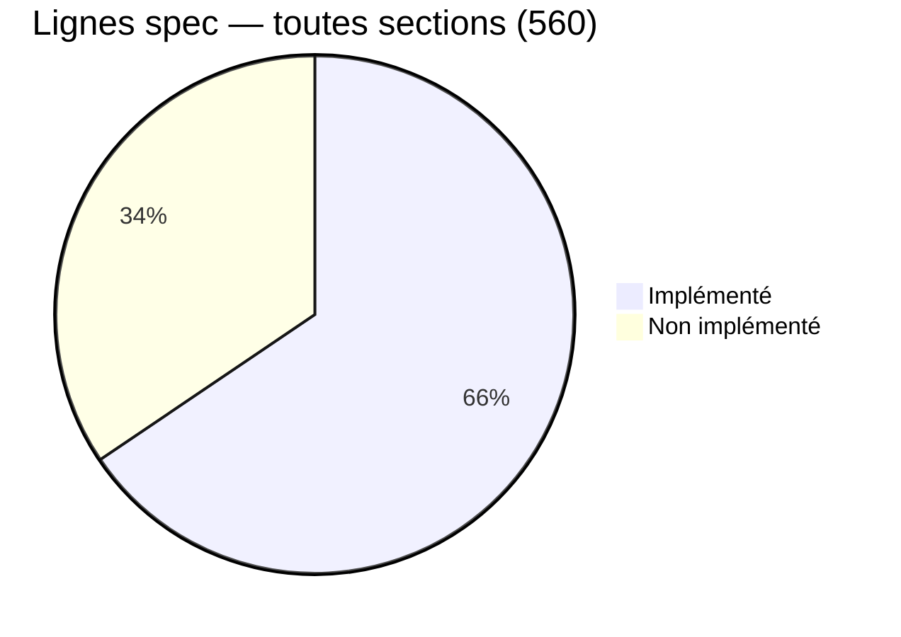

## Implémenté

| Section | Nom | Lignes spec | Statut |
|---|---|---|---|
| §00 | SysEx config | 7 | ✅ Complet |
| §02 | System setup | 27 (4 implémentées) | ⚠️ Partiel — seuls `&00`/`&01` (version OS) ; 14 items non traités, détail plus bas |
| §06 | Keygroup zone | 42 | ✅ Complet |
| §08 | Keygroup | 120 | ✅ Complet |
| §0A | Program | 141 | ✅ Complet |
| §0E | Sample tools | 53 | ✅ Complet |

Couverture confirmée par `generate_akm_items.py --coverage` (`unaccounted: none`) pour §06/§08/§0A/§0E.

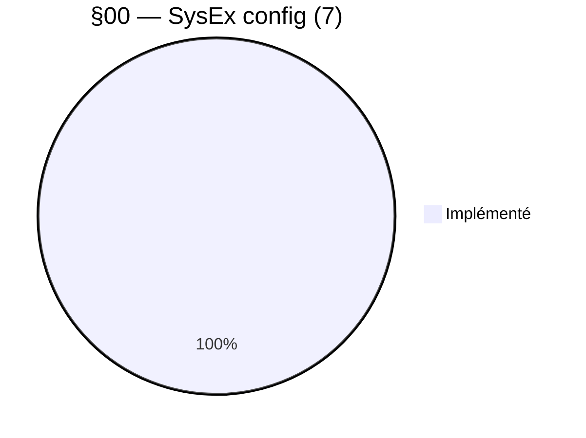

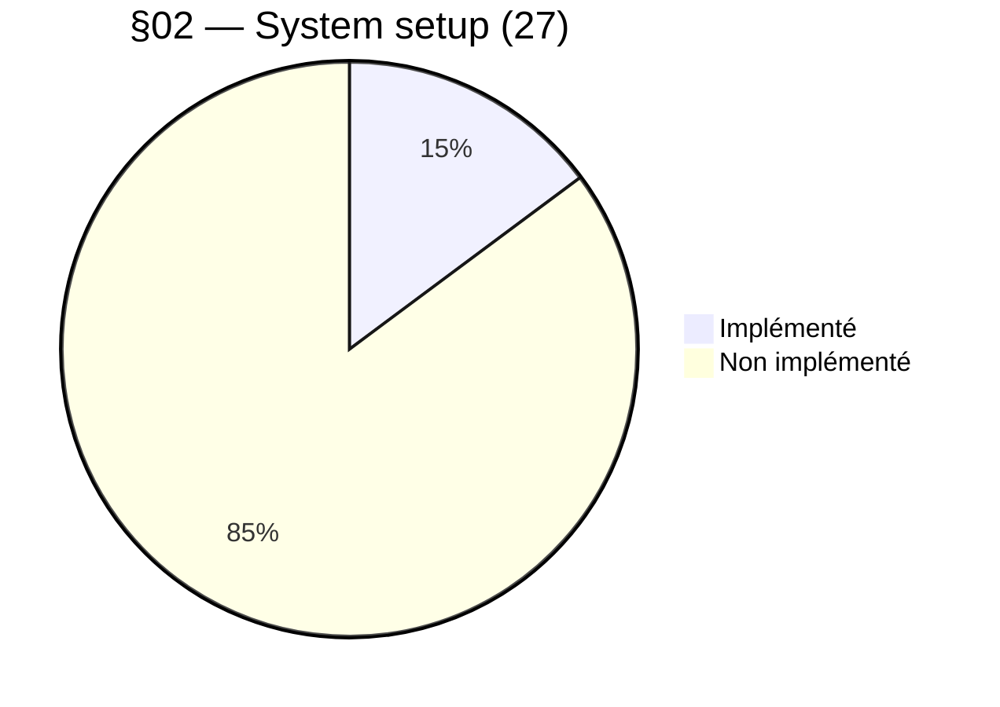

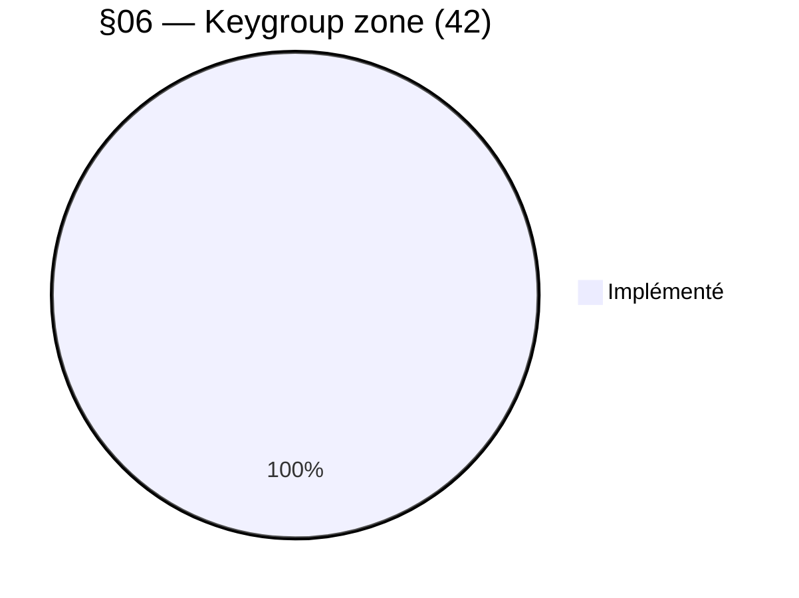

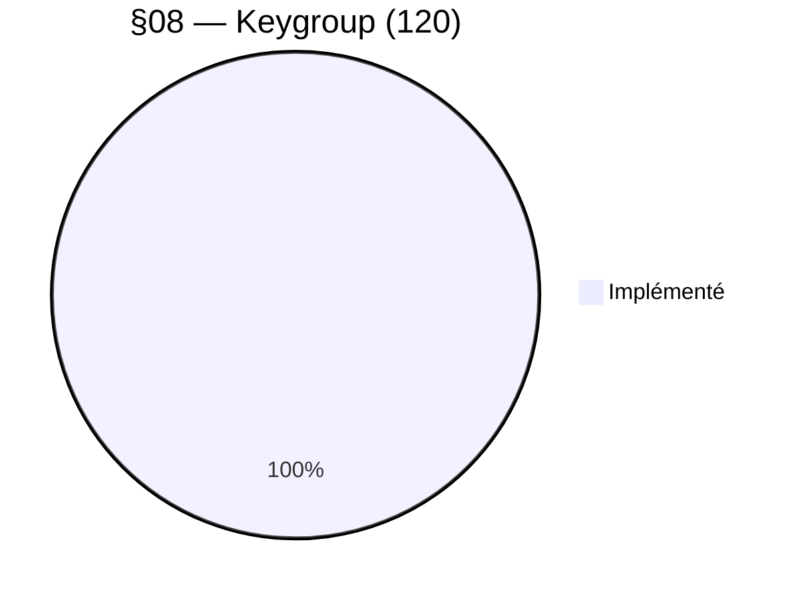

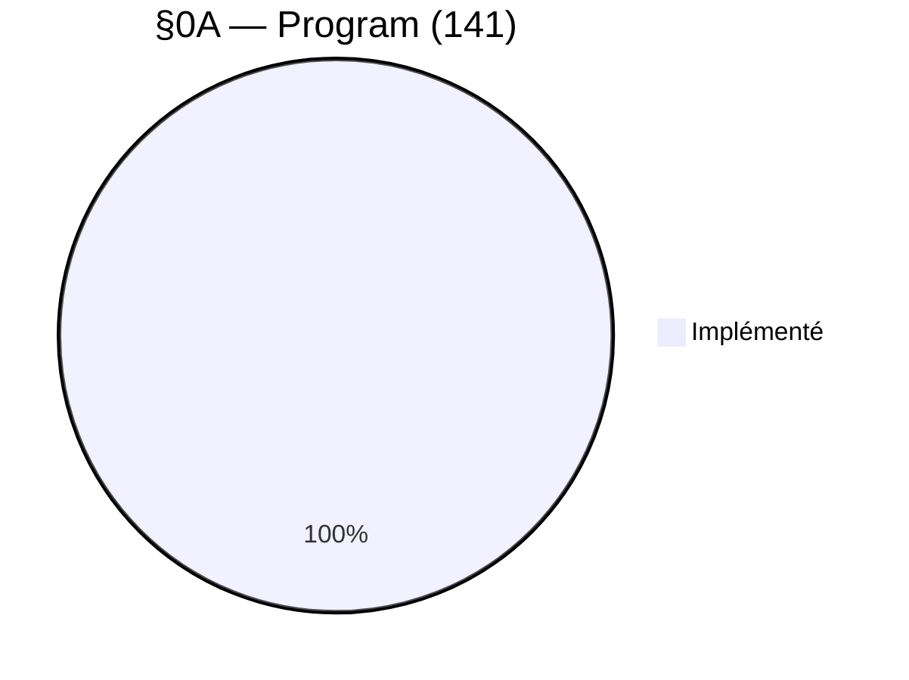

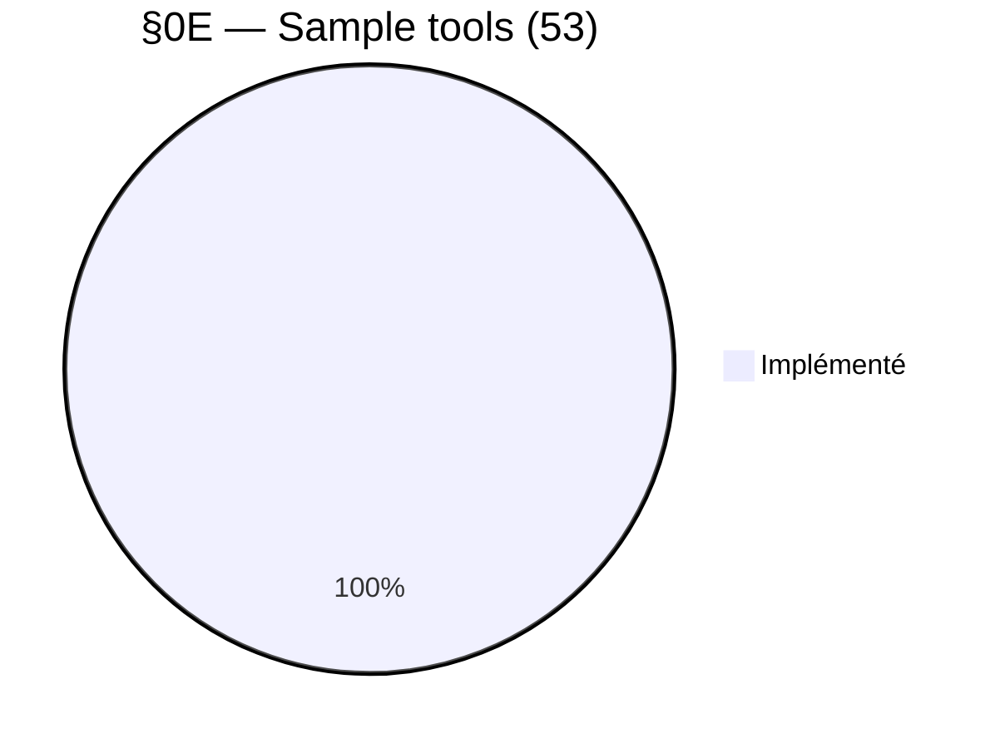

## Jamais implémenté

| Section | Nom | Lignes spec |
|---|---|---|
| §04 | MIDI config | 7 |
| §0C | Multi | 60 |
| §10 | Disk tools | 51 |
| §12 | Multi FX | 18 |
| §14 | Scenelist | 12 |
| §16 | MIDI song files | 18 |
| §20 | Front panel | 4 |
| §2A/2C/2E/32 | Alt by index (program / multi / sample / multi FX) | 0 — réutilise les items des sections cibles, pas d'items propres |
| §38/3A/3C/3E | Blocked = requête groupée (zone / keygroup / program / multi) | 0 — idem |

Pas de camembert pour §2A/2C/2E/32 et §38/3A/3C/3E : 0 ligne propre (0/0), rien à répartir.

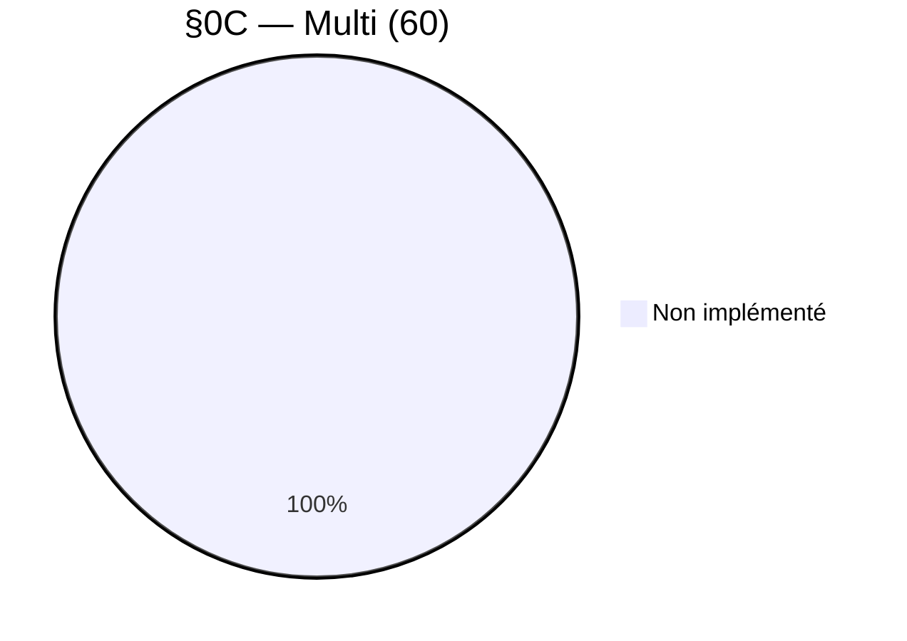

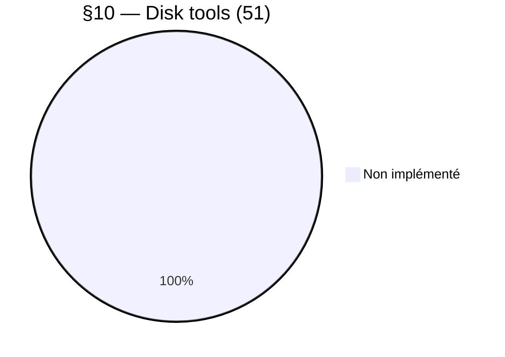

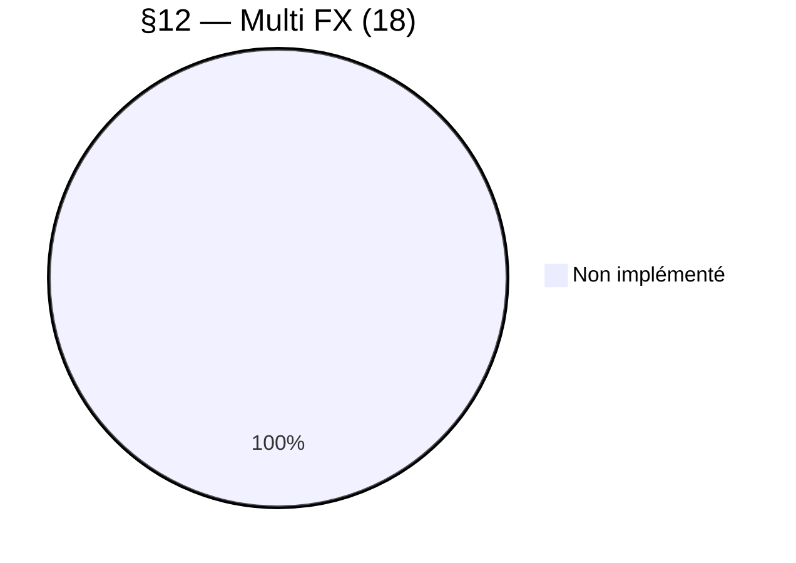

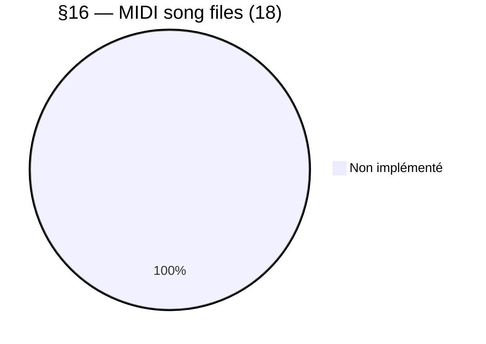

## Détail §02 — les 14 items non traités

| Item(s) | Description |
|---|---|
| `&02`/`&03` | Set/Get nom du sampler |
| `&04` | Get modèle sampler (S5000/S6000) |
| `&05`/`&06` | Get/Set horloge et date |
| `&10`/`&20` | Set/Get Play Mode |
| `&11`/`&21` | Set/Get verrouillage face avant |
| `&30`/`&33`/`&34` | Get mémoire Wave (% libre, total, libre en octets) |
| `&31` | Get mémoire MPKS (multis/programs/keygroups/samples) libre |
| `&32` | ⚠️ Clear Sampler Memory — supprime tous les programs/multis/samples |
