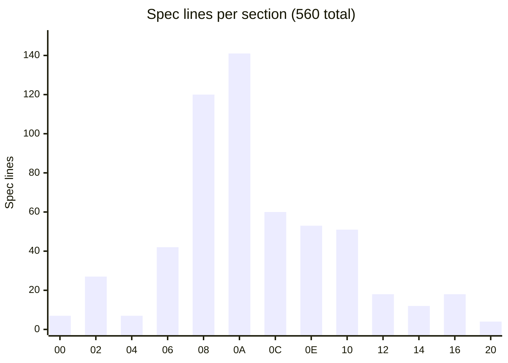
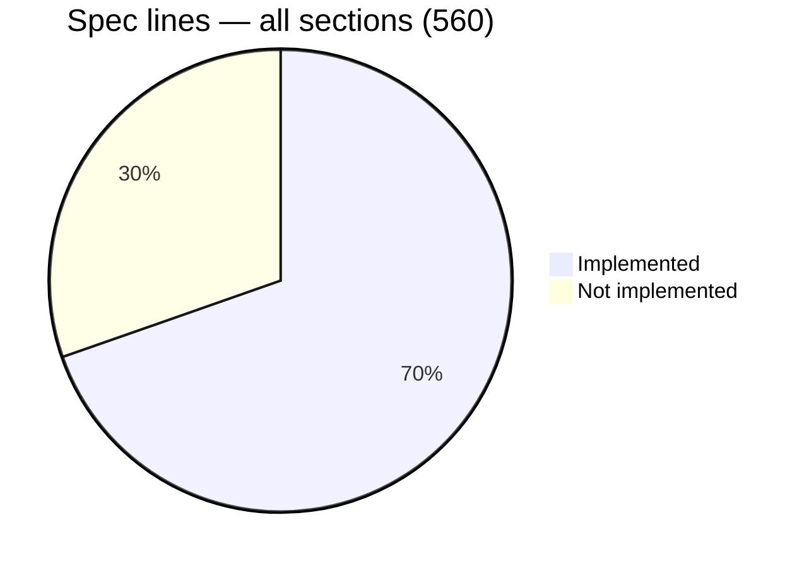

# SysEx Sections Coverage — Summary

> Reference document, not an AGNOS artifact (no ID, ignored by the index). Generated 2026-09-30, updated
> 2026-10-02 from `documents/_index/sysex_spec.items.tsv`, `sysex_spec.kb.md` (Table 4) and
> `generate_akm_items.py --coverage`.
> "Spec lines" = Control + REPLY lines from `items.tsv` for the section (560 total, entire protocol).

## Overview

## Implemented

| Section | Name | Spec lines | Status |
|---|---|---|---|
| §00 | SysEx config | 7 | ✅ Complete |
| §02 | System setup | 27 | ✅ Complete — confirmed on a real S5000, 2026-10-01 (`akm-suite-20261001-223720.log`, `PLAN-AKM-006`) |
| §06 | Keygroup zone | 42 | ✅ Complete |
| §08 | Keygroup | 120 | ✅ Complete |
| §0A | Program | 141 | ✅ Complete |
| §0E | Sample tools | 53 | ✅ Complete |

Coverage confirmed by `generate_akm_items.py --coverage` (`unaccounted: none`) for §00/§02/§06/§08/§0A/§0E.
§02's own `complete: true` flag in `items.json` is flipped by `TASK-AKM-054` (`PLAN-AKM-006`), which also
records the section's errata resolution; the coverage above reflects the catalogue's actual content, not
that flag.

## Never implemented

| Section | Name | Spec lines |
|---|---|---|
| §04 | MIDI config | 7 |
| §0C | Multi | 60 |
| §10 | Disk tools | 51 |
| §12 | Multi FX | 18 |
| §14 | Scenelist | 12 |
| §16 | MIDI song files | 18 |
| §20 | Front panel | 4 |
| §2A/2C/2E/32 | Alt by index (program / multi / sample / multi FX) | 0 — reuses items from target sections, no own items |
| §38/3A/3C/3E | Blocked = batch request (zone / keygroup / program / multi) | 0 — same |
