# SysEx Sections Coverage — Summary

> Reference document, not an AGNOS artifact (no ID, ignored by the index). Generated on 2026-09-30
> from `documents/_index/sysex_spec.items.tsv` and `sysex_spec.kb.md` (Table 4).
> "Spec lines" = Control + REPLY lines from `items.tsv` for the section (560 total, entire protocol).

## Overview

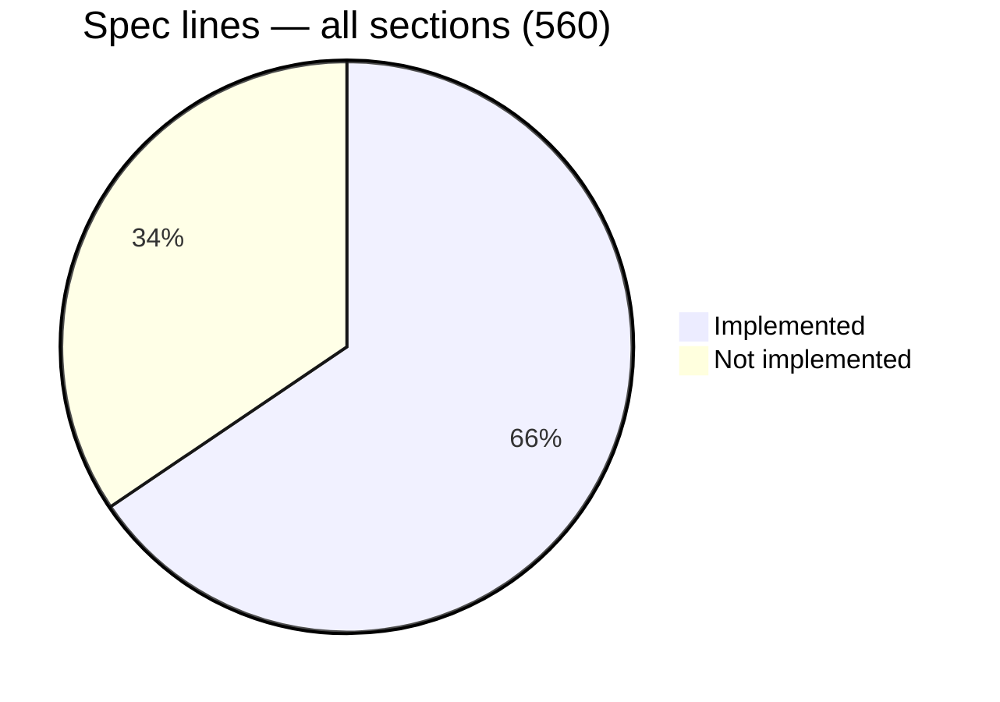

## Implemented

| Section | Name | Spec lines | Status |
|---|---|---|---|
| §00 | SysEx config | 7 | ✅ Complete |
| §02 | System setup | 27 (4 implemented) | ⚠️ Partial — only `&00`/`&01` (OS version); 14 unhandled items, details below |
| §06 | Keygroup zone | 42 | ✅ Complete |
| §08 | Keygroup | 120 | ✅ Complete |
| §0A | Program | 141 | ✅ Complete |
| §0E | Sample tools | 53 | ✅ Complete |

Coverage confirmed by `generate_akm_items.py --coverage` (`unaccounted: none`) for §06/§08/§0A/§0E.

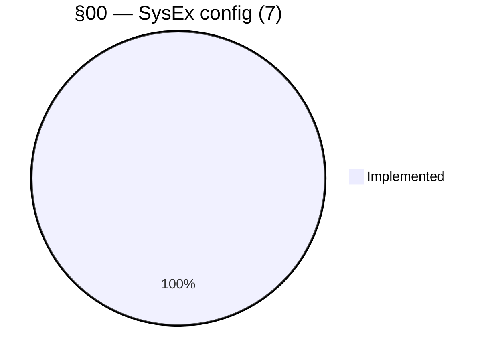

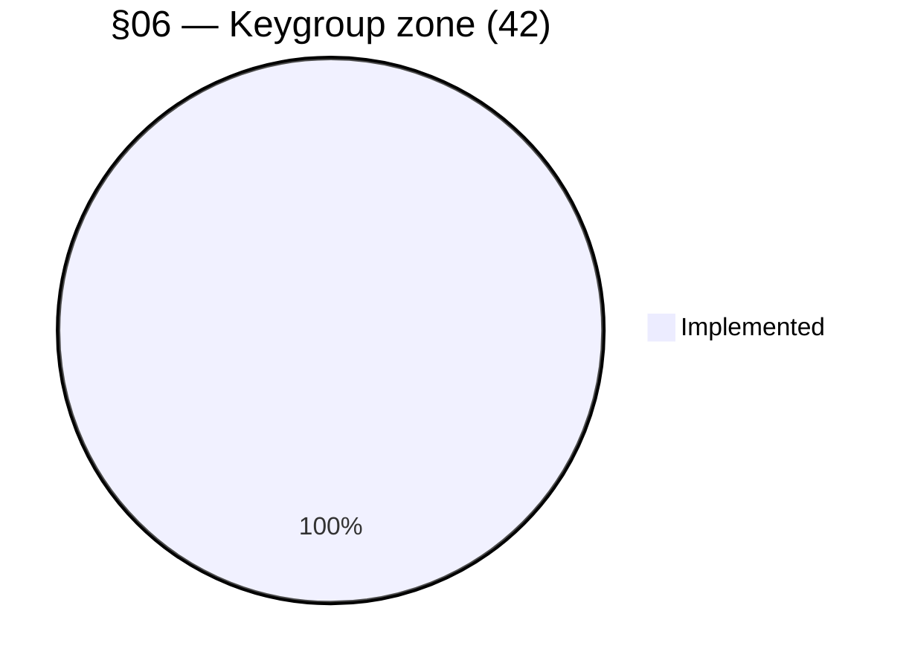

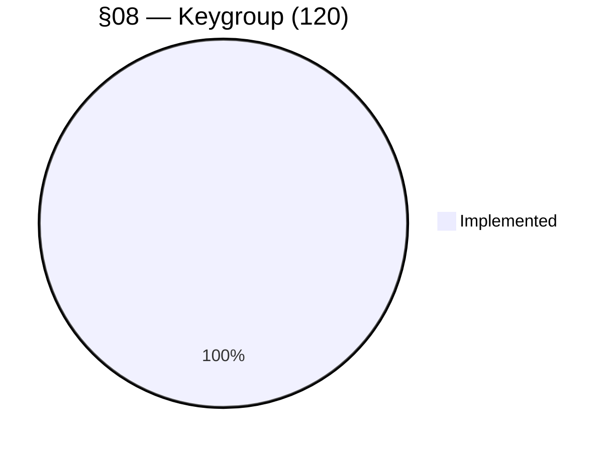

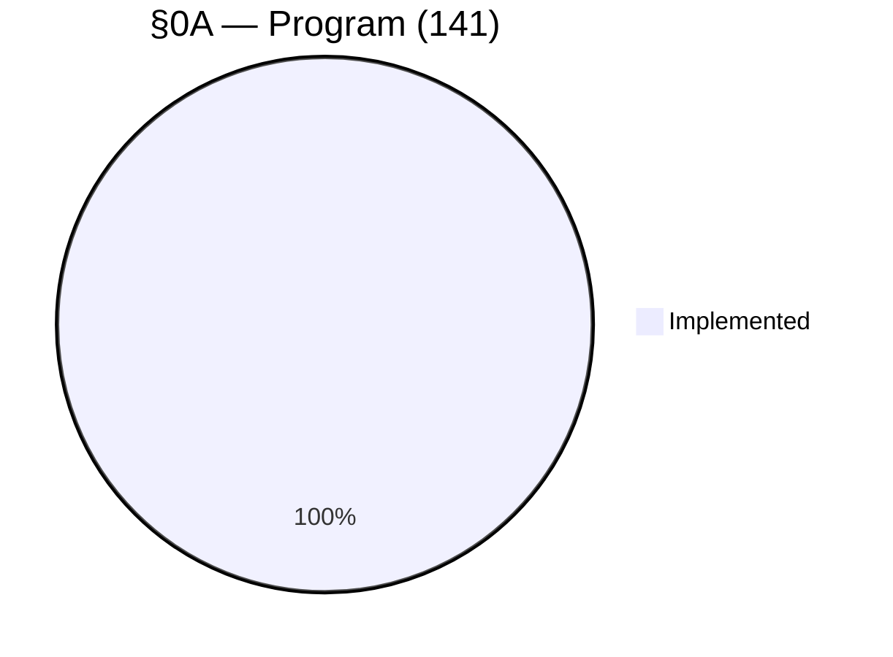

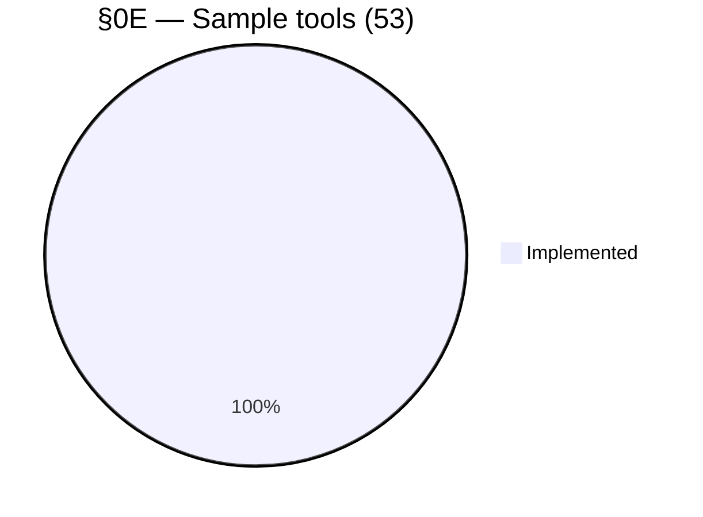

## Never implemented

| Section | Name | Spec lines |
|---|---|---|
| §04 | MIDI config | 7 |
| §0C | Multi | 60 |
| §10 | Disk tools | 51 |
| §12 | Multi FX | 18 |
| §14 | Scenelist | 12 |
| §16 | MIDI song files | 18 |
| §20 | Front panel | 4 |
| §2A/2C/2E/32 | Alt by index (program / multi / sample / multi FX) | 0 — reuses items from target sections, no own items |
| §38/3A/3C/3E | Blocked = batch request (zone / keygroup / program / multi) | 0 — same |

No pie chart for §2A/2C/2E/32 and §38/3A/3C/3E: 0 own lines (0/0), nothing to distribute.

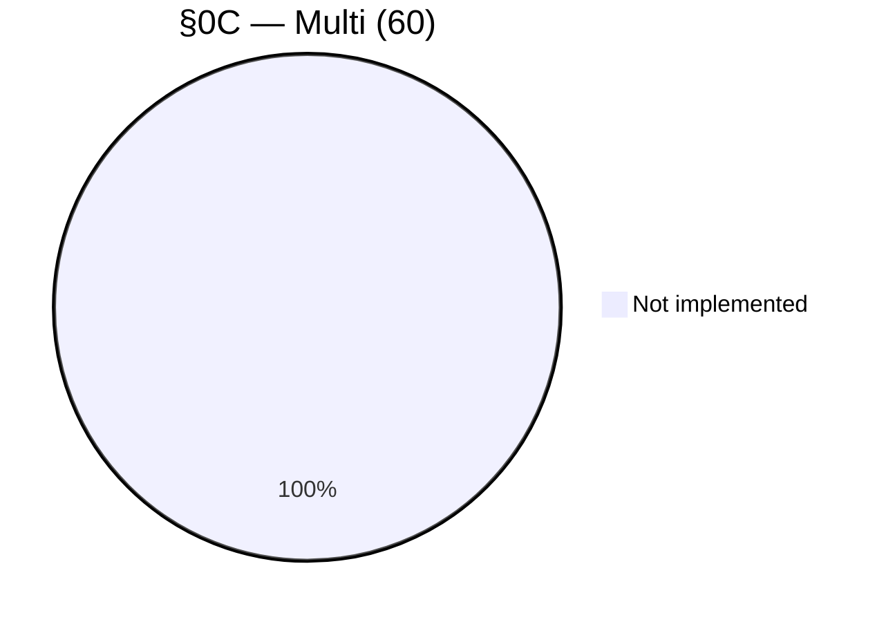

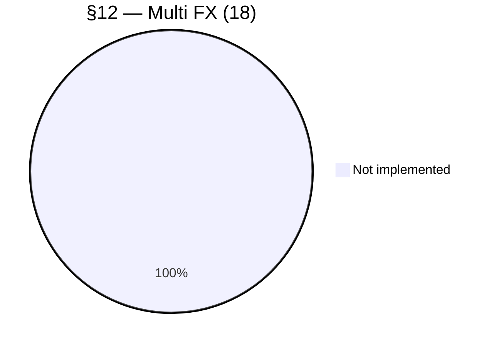

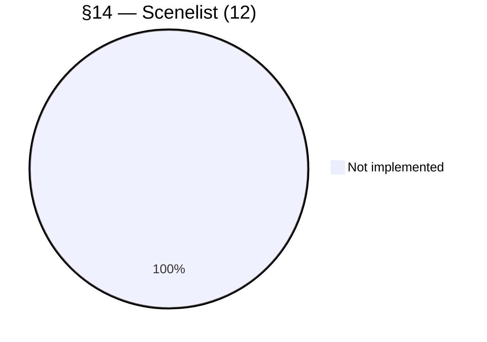

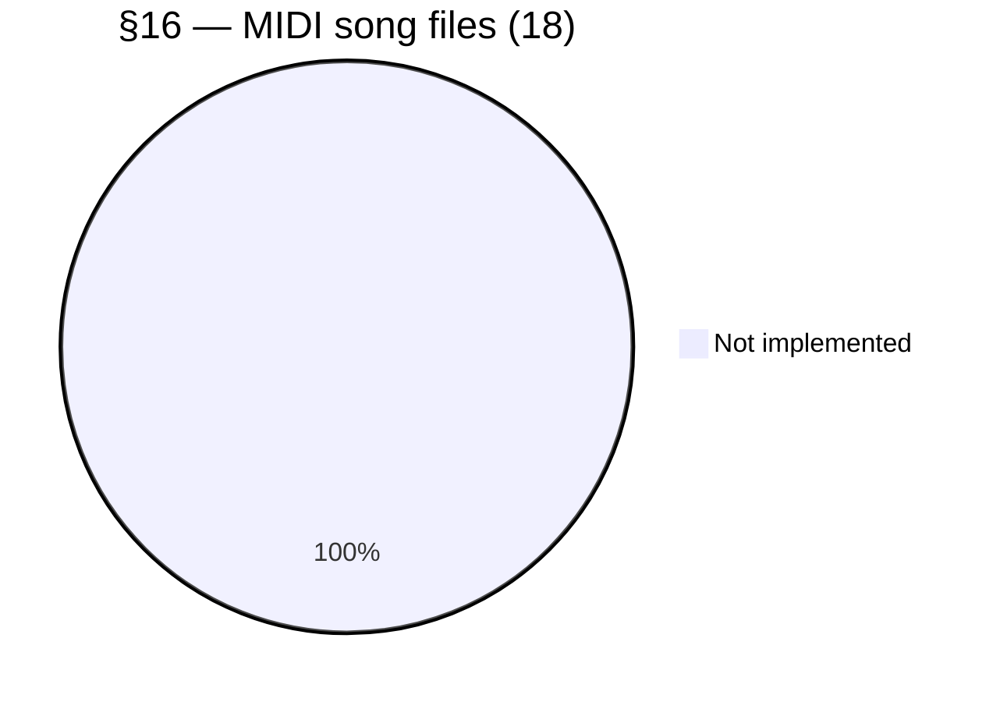

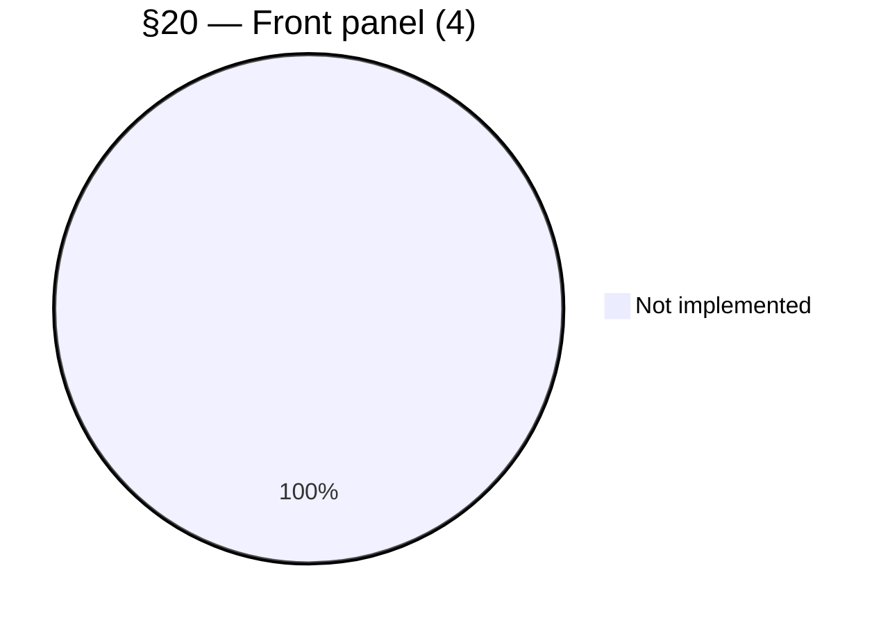

## Detail §02 — the 14 unhandled items

| Item(s) | Description |
|---|---|
| `&02`/`&03` | Set/Get sampler name |
| `&04` | Get sampler model (S5000/S6000) |
| `&05`/`&06` | Get/Set clock and date |
| `&10`/`&20` | Set/Get Play Mode |
| `&11`/`&21` | Set/Get front panel lock |
| `&30`/`&33`/`&34` | Get Wave memory (% free, total, free in bytes) |
| `&31` | Get MPKS memory (multis/programs/keygroups/samples) free |
| `&32` | ⚠️ Clear Sampler Memory — deletes all programs/multis/samples |
